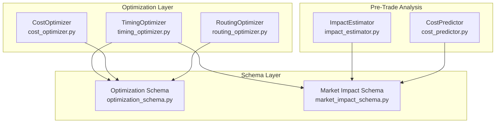
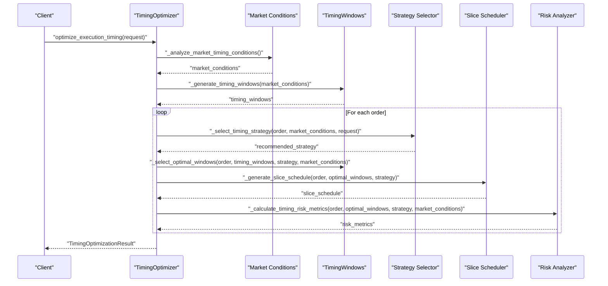
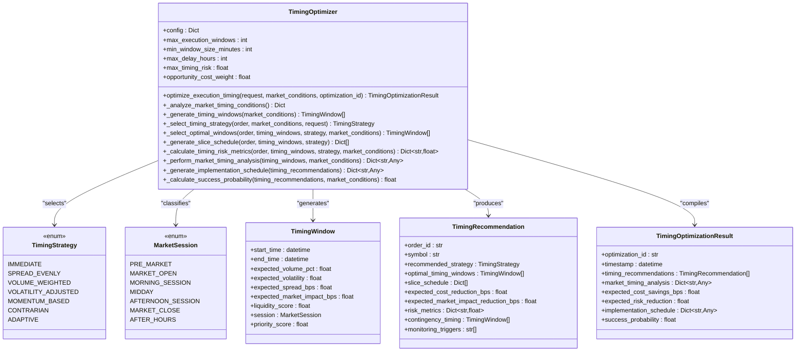
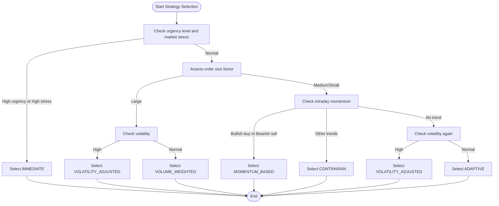
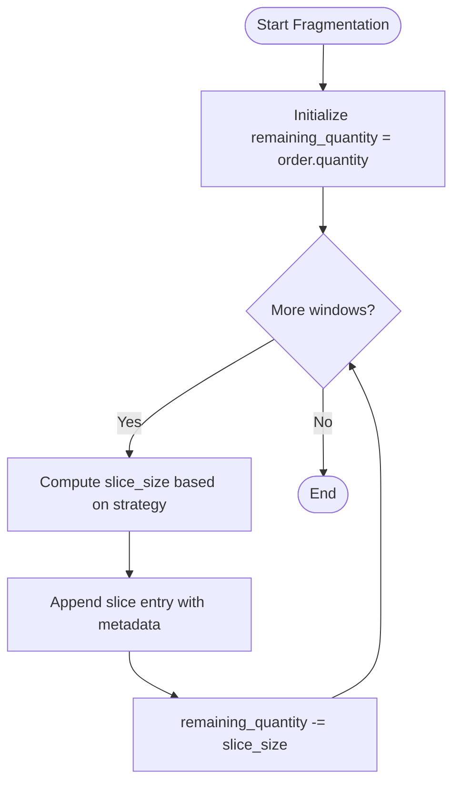
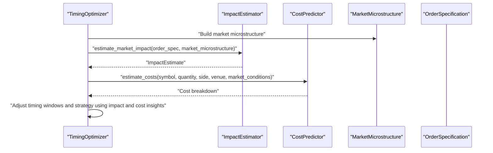
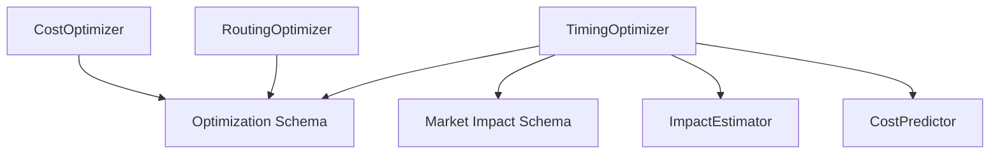

# Timing Optimization

<cite>
**Referenced Files in This Document**
- [timing_optimizer.py](file://FinAgents/agent_pools/transaction_cost_agent_pool/agents/optimization/timing_optimizer.py)
- [cost_optimizer.py](file://FinAgents/agent_pools/transaction_cost_agent_pool/agents/optimization/cost_optimizer.py)
- [routing_optimizer.py](file://FinAgents/agent_pools/transaction_cost_agent_pool/agents/optimization/routing_optimizer.py)
- [optimization_schema.py](file://FinAgents/agent_pools/transaction_cost_agent_pool/schema/optimization_schema.py)
- [market_impact_schema.py](file://FinAgents/agent_pools/transaction_cost_agent_pool/schema/market_impact_schema.py)
- [impact_estimator.py](file://FinAgents/agent_pools/transaction_cost_agent_pool/agents/pre_trade/impact_estimator.py)
- [cost_predictor.py](file://FinAgents/agent_pools/transaction_cost_agent_pool/agents/pre_trade/cost_predictor.py)
</cite>

## Table of Contents
1. [Introduction](#introduction)
2. [Project Structure](#project-structure)
3. [Core Components](#core-components)
4. [Architecture Overview](#architecture-overview)
5. [Detailed Component Analysis](#detailed-component-analysis)
6. [Dependency Analysis](#dependency-analysis)
7. [Performance Considerations](#performance-considerations)
8. [Troubleshooting Guide](#troubleshooting-guide)
9. [Conclusion](#conclusion)
10. [Appendices](#appendices)

## Introduction
This document provides comprehensive documentation for the timing optimization subsystem that executes large orders with minimal market impact through optimal timing and size allocation. It explains implementation shortfall models, volume participation rate optimization, and time-weighted execution strategies. It also documents integration with market volatility analysis, liquidity condition monitoring, and real-time market impact assessment. Configuration parameters for urgency levels, execution horizons, and market regime adaptation are covered, along with examples of timing strategy selection, order fragmentation algorithms, and performance attribution for timing decisions.

## Project Structure
The timing optimization subsystem resides within the transaction cost agent pool and integrates with broader optimization and pre-trade analysis agents. The key modules include:
- Timing optimizer: Generates timing windows, selects strategies, fragments orders, and computes risk metrics.
- Cost optimizer: Provides multi-objective optimization across cost, risk, and market impact.
- Routing optimizer: Allocates venue allocation and monitors routing effectiveness.
- Optimization schemas: Define request/response models and optimization parameters.
- Market impact schemas: Define impact estimation models and microstructure data.
- Impact estimator: Estimates temporary and permanent market impact with scenario analysis.
- Cost predictor: Predicts transaction costs across commission, spread, impact, and fees.

**Diagram sources**
- [timing_optimizer.py:1-982](file://FinAgents/agent_pools/transaction_cost_agent_pool/agents/optimization/timing_optimizer.py#L1-L982)
- [cost_optimizer.py:1-706](file://FinAgents/agent_pools/transaction_cost_agent_pool/agents/optimization/cost_optimizer.py#L1-L706)
- [routing_optimizer.py:1-841](file://FinAgents/agent_pools/transaction_cost_agent_pool/agents/optimization/routing_optimizer.py#L1-L841)
- [optimization_schema.py:1-597](file://FinAgents/agent_pools/transaction_cost_agent_pool/schema/optimization_schema.py#L1-L597)
- [market_impact_schema.py:1-283](file://FinAgents/agent_pools/transaction_cost_agent_pool/schema/market_impact_schema.py#L1-L283)
- [impact_estimator.py:1-724](file://FinAgents/agent_pools/transaction_cost_agent_pool/agents/pre_trade/impact_estimator.py#L1-L724)
- [cost_predictor.py:1-829](file://FinAgents/agent_pools/transaction_cost_agent_pool/agents/pre_trade/cost_predictor.py#L1-L829)

**Section sources**
- [timing_optimizer.py:1-982](file://FinAgents/agent_pools/transaction_cost_agent_pool/agents/optimization/timing_optimizer.py#L1-L982)
- [optimization_schema.py:1-597](file://FinAgents/agent_pools/transaction_cost_agent_pool/schema/optimization_schema.py#L1-L597)

## Core Components
- TimingOptimizer: Core engine that analyzes market timing conditions, generates timing windows, selects optimal strategies, fragments orders, and produces recommendations with risk metrics and contingency plans.
- TimingStrategy: Enumerated strategies including immediate, spread evenly, volume weighted, volatility adjusted, momentum based, contrarian, and adaptive.
- MarketSession: Classifies market periods such as pre-market, market open, morning session, midday, afternoon session, market close, and after-hours.
- TimingWindow: Encapsulates expected volume percent, volatility, spread, market impact, liquidity score, session, and priority score for a time slot.
- TimingRecommendation: Recommendation for a single order including strategy, optimal windows, slice schedule, expected cost and impact reductions, risk metrics, contingency timing, and monitoring triggers.
- TimingOptimizationResult: Aggregated result including optimization ID, timestamp, recommendations, market timing analysis, expected cost savings, risk reduction, implementation schedule, and success probability.

Key configuration parameters exposed by TimingOptimizer include:
- max_execution_windows: Maximum number of timing windows to consider.
- min_window_size_minutes: Minimum window duration in minutes.
- max_delay_hours: Maximum allowable delay from current time.
- max_timing_risk: Upper bound on timing risk.
- opportunity_cost_weight: Weight applied to opportunity cost in risk calculations.

**Section sources**
- [timing_optimizer.py:26-88](file://FinAgents/agent_pools/transaction_cost_agent_pool/agents/optimization/timing_optimizer.py#L26-L88)
- [timing_optimizer.py:102-125](file://FinAgents/agent_pools/transaction_cost_agent_pool/agents/optimization/timing_optimizer.py#L102-L125)
- [timing_optimizer.py:172-246](file://FinAgents/agent_pools/transaction_cost_agent_pool/agents/optimization/timing_optimizer.py#L172-L246)

## Architecture Overview
The timing optimizer orchestrates market timing analysis, strategy selection, and order fragmentation. It integrates with schemas for optimization requests and timing recommendations and leverages market impact and cost models for risk and performance attribution.

**Diagram sources**
- [timing_optimizer.py:172-246](file://FinAgents/agent_pools/transaction_cost_agent_pool/agents/optimization/timing_optimizer.py#L172-L246)
- [timing_optimizer.py:371-427](file://FinAgents/agent_pools/transaction_cost_agent_pool/agents/optimization/timing_optimizer.py#L371-L427)
- [timing_optimizer.py:429-470](file://FinAgents/agent_pools/transaction_cost_agent_pool/agents/optimization/timing_optimizer.py#L429-L470)
- [timing_optimizer.py:504-551](file://FinAgents/agent_pools/transaction_cost_agent_pool/agents/optimization/timing_optimizer.py#L504-L551)
- [timing_optimizer.py:616-669](file://FinAgents/agent_pools/transaction_cost_agent_pool/agents/optimization/timing_optimizer.py#L616-L669)

## Detailed Component Analysis

### TimingOptimizer
The TimingOptimizer performs:
- Market timing condition analysis: Determines current session, volatility, liquidity, and stress levels.
- Timing window generation: Creates 30-minute windows from current time until market close, scoring each by expected volume, volatility, spread, market impact, and liquidity.
- Strategy selection: Chooses among IMMEDIATE, SPREAD_EVENLY, VOLUME_WEIGHTED, VOLATILITY_ADJUSTED, MOMENTUM_BASED, CONTRARIAN, and ADAPTIVE based on urgency, order size, volatility, and momentum.
- Slice scheduling: Distributes order quantity across selected windows, favoring volume-weighted distribution for certain strategies.
- Risk metrics: Computes timing risk, opportunity cost risk, execution risk, market impact risk, and an overall risk score.
- Contingency planning: Identifies backup windows and monitoring triggers tailored to strategy and market conditions.
- Market timing analysis: Produces optimal and suboptimal periods, intraday cost curves, liquidity profiles, volatility forecasts, and risk assessments.
- Implementation schedule: Provides immediate actions, scheduled executions, monitoring checkpoints, and contingency triggers.
- Success probability: Estimates success probability considering market stress and volatility.

**Diagram sources**
- [timing_optimizer.py:90-125](file://FinAgents/agent_pools/transaction_cost_agent_pool/agents/optimization/timing_optimizer.py#L90-L125)
- [timing_optimizer.py:172-246](file://FinAgents/agent_pools/transaction_cost_agent_pool/agents/optimization/timing_optimizer.py#L172-L246)
- [timing_optimizer.py:26-88](file://FinAgents/agent_pools/transaction_cost_agent_pool/agents/optimization/timing_optimizer.py#L26-L88)

**Section sources**
- [timing_optimizer.py:90-982](file://FinAgents/agent_pools/transaction_cost_agent_pool/agents/optimization/timing_optimizer.py#L90-L982)

### Strategy Selection Logic
The strategy selection considers:
- Urgency level: High urgency or high stress favors IMMEDIATE.
- Order size: Large orders prefer VOLATILITY_ADJUSTED or VOLUME_WEIGHTED depending on volatility.
- Momentum: MOMENTUM_BASED for trending conditions; CONTRARIAN for counter-trend setups.
- Volatility: VOLATILITY_ADJUSTED in high-volatility regimes.
- Default: ADAPTIVE otherwise.

**Diagram sources**
- [timing_optimizer.py:429-470](file://FinAgents/agent_pools/transaction_cost_agent_pool/agents/optimization/timing_optimizer.py#L429-L470)

**Section sources**
- [timing_optimizer.py:429-470](file://FinAgents/agent_pools/transaction_cost_agent_pool/agents/optimization/timing_optimizer.py#L429-L470)

### Order Fragmentation Algorithms
Fragmentation distributes the order quantity across selected timing windows:
- Volume-weighted distribution: Uses expected volume percent to allocate slices for VOLUME_WEIGHTED strategy.
- Equal distribution: Uniform slices for other strategies.
- Last slice: Remaining quantity is assigned to the final slice.
- Slice metadata includes execution time, end time, quantity, percentage of order, expected cost, expected volume percent, market session, and priority.

**Diagram sources**
- [timing_optimizer.py:504-551](file://FinAgents/agent_pools/transaction_cost_agent_pool/agents/optimization/timing_optimizer.py#L504-L551)

**Section sources**
- [timing_optimizer.py:504-551](file://FinAgents/agent_pools/transaction_cost_agent_pool/agents/optimization/timing_optimizer.py#L504-L551)

### Risk Metrics and Success Probability
Risk metrics include:
- Timing risk: Estimated from volatility and execution duration.
- Opportunity cost risk: Weighted timing risk.
- Execution risk: Based on average liquidity across selected windows.
- Market impact risk: Strategy-dependent risk assessment.
- Overall risk score: Normalized weighted combination.

Success probability considers:
- Base probability adjusted by market stress and volatility penalties and strategy bonus.

**Section sources**
- [timing_optimizer.py:616-669](file://FinAgents/agent_pools/transaction_cost_agent_pool/agents/optimization/timing_optimizer.py#L616-L669)
- [timing_optimizer.py:877-904](file://FinAgents/agent_pools/transaction_cost_agent_pool/agents/optimization/timing_optimizer.py#L877-L904)

### Integration with Market Impact and Volatility
The timing optimizer integrates with market impact and volatility via:
- Market microstructure inputs: Bid-ask spread, effective spread, daily volume, recent volume, intraday volatility, liquidity regime, time of day, and day of week.
- Impact models: Square-root and linear models estimate temporary and permanent impact components with confidence intervals and scenario analysis.
- Cost models: Hybrid and tiered models predict commission, spread, market impact, and fees with risk adjustments.

**Diagram sources**
- [impact_estimator.py:325-461](file://FinAgents/agent_pools/transaction_cost_agent_pool/agents/pre_trade/impact_estimator.py#L325-L461)
- [cost_predictor.py:409-587](file://FinAgents/agent_pools/transaction_cost_agent_pool/agents/pre_trade/cost_predictor.py#L409-L587)
- [market_impact_schema.py:83-122](file://FinAgents/agent_pools/transaction_cost_agent_pool/schema/market_impact_schema.py#L83-L122)

**Section sources**
- [impact_estimator.py:325-724](file://FinAgents/agent_pools/transaction_cost_agent_pool/agents/pre_trade/impact_estimator.py#L325-L724)
- [cost_predictor.py:409-829](file://FinAgents/agent_pools/transaction_cost_agent_pool/agents/pre_trade/cost_predictor.py#L409-L829)
- [market_impact_schema.py:45-122](file://FinAgents/agent_pools/transaction_cost_agent_pool/schema/market_impact_schema.py#L45-L122)

### Implementation Schedule and Monitoring
The implementation schedule includes:
- Immediate actions: Set up algorithms, configure monitoring, prepare contingency plans.
- Scheduled executions: Sorted slice execution times with order and quantity details.
- Monitoring checkpoints: Key time points for validating market conditions and algorithm parameters.
- Contingency triggers: Alerts for volatility spikes, volume drops, stress indicator increases, and technical issues.

**Section sources**
- [timing_optimizer.py:817-875](file://FinAgents/agent_pools/transaction_cost_agent_pool/agents/optimization/timing_optimizer.py#L817-L875)

## Dependency Analysis
The timing optimizer depends on:
- Optimization schemas for request/response models and optimization parameters.
- Market impact schemas for order specifications and market microstructure.
- Impact estimator and cost predictor for pre-trade analysis and risk-adjusted cost estimates.

**Diagram sources**
- [timing_optimizer.py:17-23](file://FinAgents/agent_pools/transaction_cost_agent_pool/agents/optimization/timing_optimizer.py#L17-L23)
- [optimization_schema.py:17-23](file://FinAgents/agent_pools/transaction_cost_agent_pool/schema/optimization_schema.py#L17-L23)
- [market_impact_schema.py:17-23](file://FinAgents/agent_pools/transaction_cost_agent_pool/schema/market_impact_schema.py#L17-L23)
- [impact_estimator.py:29-38](file://FinAgents/agent_pools/transaction_cost_agent_pool/agents/pre_trade/impact_estimator.py#L29-L38)
- [cost_predictor.py:30-43](file://FinAgents/agent_pools/transaction_cost_agent_pool/agents/pre_trade/cost_predictor.py#L30-L43)

**Section sources**
- [timing_optimizer.py:17-23](file://FinAgents/agent_pools/transaction_cost_agent_pool/agents/optimization/timing_optimizer.py#L17-L23)
- [optimization_schema.py:17-23](file://FinAgents/agent_pools/transaction_cost_agent_pool/schema/optimization_schema.py#L17-L23)
- [market_impact_schema.py:17-23](file://FinAgents/agent_pools/transaction_cost_agent_pool/schema/market_impact_schema.py#L17-L23)
- [impact_estimator.py:29-38](file://FinAgents/agent_pools/transaction_cost_agent_pool/agents/pre_trade/impact_estimator.py#L29-L38)
- [cost_predictor.py:30-43](file://FinAgents/agent_pools/transaction_cost_agent_pool/agents/pre_trade/cost_predictor.py#L30-L43)

## Performance Considerations
- Window generation: The optimizer creates 30-minute windows from the current hour until market close; tune max_execution_windows and min_window_size_minutes to balance granularity and computational load.
- Strategy selection: Heuristics are efficient but can be extended with ML models for dynamic adaptation.
- Risk metrics: Timing risk scales with volatility and duration; consider parallelization for batch processing multiple orders.
- Monitoring triggers: Implement lightweight alerting mechanisms to react to volatility spikes and liquidity drops without excessive overhead.

## Troubleshooting Guide
Common issues and resolutions:
- No timing windows returned: Verify current time is within market hours and that min_window_size_minutes allows at least one viable window.
- High timing risk warnings: Reduce execution duration or select less volatile windows; consider VOLATILITY_ADJUSTED strategy.
- Low liquidity windows: Increase minimum allocation thresholds or choose alternative venues via routing optimizer.
- Strategy mismatch: Ensure urgency_level and market conditions align with selected strategy; review strategy selection logic.

**Section sources**
- [timing_optimizer.py:284-352](file://FinAgents/agent_pools/transaction_cost_agent_pool/agents/optimization/timing_optimizer.py#L284-L352)
- [timing_optimizer.py:616-669](file://FinAgents/agent_pools/transaction_cost_agent_pool/agents/optimization/timing_optimizer.py#L616-L669)

## Conclusion
The timing optimization subsystem provides a robust framework for minimizing transaction costs and market impact through intelligent timing and order fragmentation. By integrating market volatility and liquidity analysis, it enables adaptive strategies tailored to urgency, order size, and market regimes. The system’s modular design supports seamless extension with advanced models and real-time monitoring for continuous improvement.

## Appendices

### Configuration Parameters Reference
- TimingOptimizer configuration keys:
  - max_execution_windows: Number of timing windows to consider.
  - min_window_size_minutes: Minimum window duration.
  - max_delay_hours: Maximum allowable delay from current time.
  - max_timing_risk: Upper bound on timing risk.
  - opportunity_cost_weight: Weight for opportunity cost in risk calculations.

**Section sources**
- [timing_optimizer.py:114-125](file://FinAgents/agent_pools/transaction_cost_agent_pool/agents/optimization/timing_optimizer.py#L114-L125)

### Examples of Timing Strategy Selection
- IMMEDIATE: Selected under high urgency or high market stress.
- VOLUME_WEIGHTED: Preferred for large orders in normal volatility to follow historical volume patterns.
- VOLATILITY_ADJUSTED: Chosen in high-volatility environments to avoid costly windows.
- MOMENTUM_BASED: Used when momentum aligns with order side.
- CONTRARIAN: Applied when momentum is counter to order side.
- ADAPTIVE: Default strategy when none of the above conditions apply.

**Section sources**
- [timing_optimizer.py:429-470](file://FinAgents/agent_pools/transaction_cost_agent_pool/agents/optimization/timing_optimizer.py#L429-L470)

### Performance Attribution for Timing Decisions
- Expected cost savings: Derived from weighted average cost of selected windows versus immediate execution baseline.
- Expected market impact reduction: Computed from weighted average impact of selected windows versus baseline.
- Risk reduction: Quantified by comparing overall risk scores across recommendations.
- Success probability: Estimated considering market stress, volatility, and strategy quality.

**Section sources**
- [timing_optimizer.py:553-614](file://FinAgents/agent_pools/transaction_cost_agent_pool/agents/optimization/timing_optimizer.py#L553-L614)
- [timing_optimizer.py:800-815](file://FinAgents/agent_pools/transaction_cost_agent_pool/agents/optimization/timing_optimizer.py#L800-L815)
- [timing_optimizer.py:877-904](file://FinAgents/agent_pools/transaction_cost_agent_pool/agents/optimization/timing_optimizer.py#L877-L904)