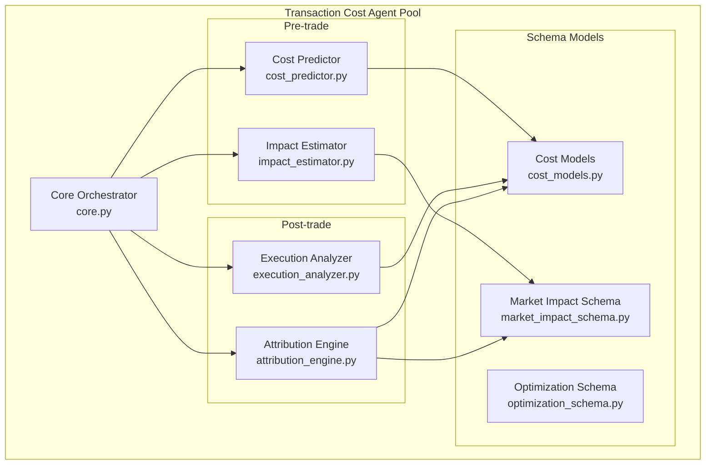
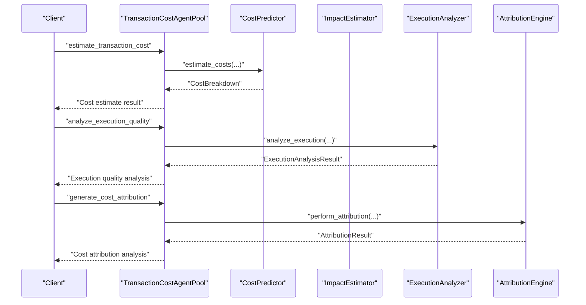
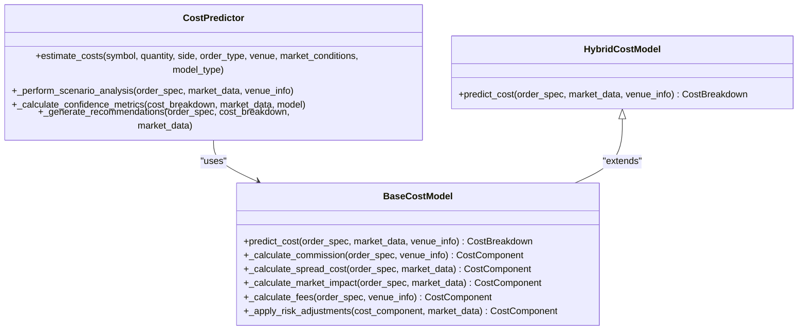
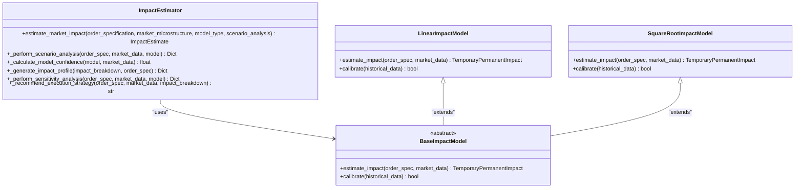
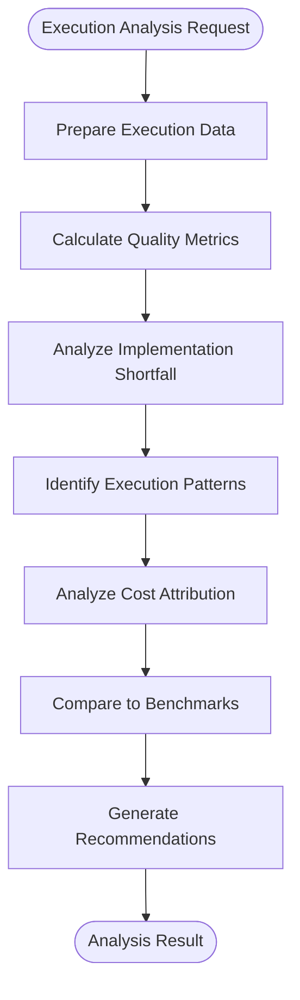
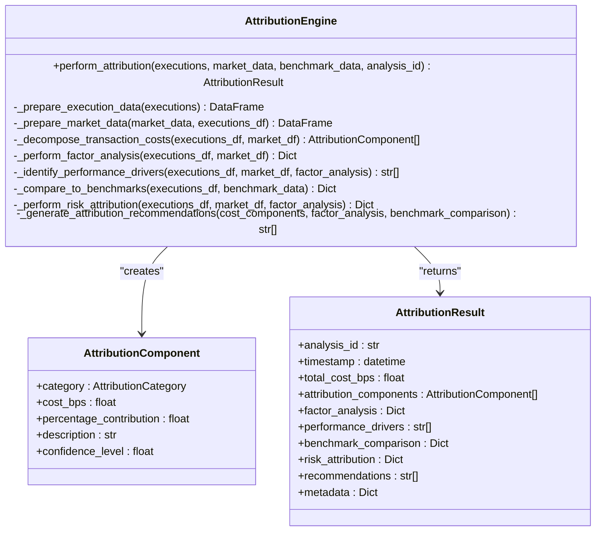
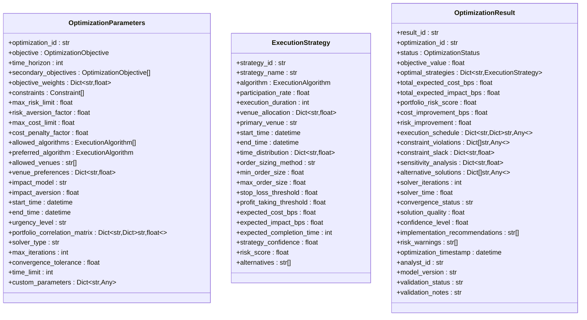
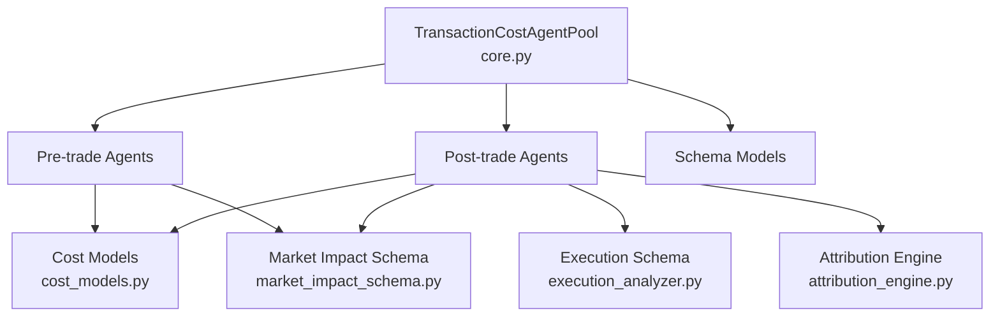

# Cost Attribution Engine

<cite>
**Referenced Files in This Document**
- [README.md](file://FinAgents/agent_pools/transaction_cost_agent_pool/README.md)
- [core.py](file://FinAgents/agent_pools/transaction_cost_agent_pool/core.py)
- [cost_models.py](file://FinAgents/agent_pools/transaction_cost_agent_pool/schema/cost_models.py)
- [market_impact_schema.py](file://FinAgents/agent_pools/transaction_cost_agent_pool/schema/market_impact_schema.py)
- [optimization_schema.py](file://FinAgents/agent_pools/transaction_cost_agent_pool/schema/optimization_schema.py)
- [attribution_engine.py](file://FinAgents/agent_pools/transaction_cost_agent_pool/agents/post_trade/attribution_engine.py)
- [cost_predictor.py](file://FinAgents/agent_pools/transaction_cost_agent_pool/agents/pre_trade/cost_predictor.py)
- [impact_estimator.py](file://FinAgents/agent_pools/transaction_cost_agent_pool/agents/pre_trade/impact_estimator.py)
- [execution_analyzer.py](file://FinAgents/agent_pools/transaction_cost_agent_pool/agents/post_trade/execution_analyzer.py)
</cite>

## Table of Contents
1. [Introduction](#introduction)
2. [Project Structure](#project-structure)
3. [Core Components](#core-components)
4. [Architecture Overview](#architecture-overview)
5. [Detailed Component Analysis](#detailed-component-analysis)
6. [Dependency Analysis](#dependency-analysis)
7. [Performance Considerations](#performance-considerations)
8. [Troubleshooting Guide](#troubleshooting-guide)
9. [Conclusion](#conclusion)
10. [Appendices](#appendices)

## Introduction
This document provides comprehensive documentation for the cost attribution engine that breaks down transaction costs into constituent components. It covers market impact, spread costs, commissions, and fees; variance attribution methodologies; performance driver identification; and cost breakdown calculations by symbol, venue, and time periods. It also includes implementation examples for cost optimization workflows, attribution reporting systems, and cost trend analysis, along with guidance on cost attribution accuracy, methodology validation, and integration with portfolio accounting systems.

## Project Structure
The Transaction Cost Agent Pool organizes functionality into three primary domains:
- Pre-trade cost estimation: cost prediction, market impact estimation, and venue analysis
- Post-trade analysis: execution quality analysis, slippage analysis, and cost attribution
- Optimization: portfolio-level optimization, routing optimization, and timing optimization
- Risk-adjusted analysis: VaR-adjusted cost analysis, Sharpe cost ratios, and drawdown impact analysis



**Diagram sources**
- [core.py:64-118](file://FinAgents/agent_pools/transaction_cost_agent_pool/core.py#L64-L118)
- [cost_predictor.py:409-437](file://FinAgents/agent_pools/transaction_cost_agent_pool/agents/pre_trade/cost_predictor.py#L409-L437)
- [impact_estimator.py:325-351](file://FinAgents/agent_pools/transaction_cost_agent_pool/agents/pre_trade/impact_estimator.py#L325-L351)
- [execution_analyzer.py:56-88](file://FinAgents/agent_pools/transaction_cost_agent_pool/agents/post_trade/execution_analyzer.py#L56-L88)
- [attribution_engine.py:61-102](file://FinAgents/agent_pools/transaction_cost_agent_pool/agents/post_trade/attribution_engine.py#L61-L102)
- [cost_models.py:227-266](file://FinAgents/agent_pools/transaction_cost_agent_pool/schema/cost_models.py#L227-L266)
- [market_impact_schema.py:165-232](file://FinAgents/agent_pools/transaction_cost_agent_pool/schema/market_impact_schema.py#L165-L232)
- [optimization_schema.py:260-341](file://FinAgents/agent_pools/transaction_cost_agent_pool/schema/optimization_schema.py#L260-L341)

**Section sources**
- [README.md:25-84](file://FinAgents/agent_pools/transaction_cost_agent_pool/README.md#L25-L84)
- [core.py:108-118](file://FinAgents/agent_pools/transaction_cost_agent_pool/core.py#L108-L118)

## Core Components
The engine centers around four pillars:
- TransactionCost model: comprehensive representation of trade execution costs, including cost breakdown, market impact model, execution metrics, benchmarks, and cost attribution
- CostBreakdown: detailed decomposition of total transaction costs into commission, spread, market impact, and optional components (taxes, fees, borrowing cost, opportunity cost)
- MarketImpactModel and ImpactEstimate: models for temporary and permanent impact decomposition, scenario analysis, and time-based impact profiles
- AttributionEngine: post-trade attribution analysis identifying cost sources, performance drivers, risk attribution, and recommendations

Key schemas define standardized data structures for cost modeling, market impact, optimization parameters, and execution analysis.

**Section sources**
- [cost_models.py:227-266](file://FinAgents/agent_pools/transaction_cost_agent_pool/schema/cost_models.py#L227-L266)
- [cost_models.py:87-114](file://FinAgents/agent_pools/transaction_cost_agent_pool/schema/cost_models.py#L87-L114)
- [market_impact_schema.py:165-232](file://FinAgents/agent_pools/transaction_cost_agent_pool/schema/market_impact_schema.py#L165-L232)
- [attribution_engine.py:61-102](file://FinAgents/agent_pools/transaction_cost_agent_pool/agents/post_trade/attribution_engine.py#L61-L102)

## Architecture Overview
The Transaction Cost Agent Pool implements a microservices architecture with:
- Stateless design enabling horizontal scalability
- Event-driven processing for asynchronous cost calculation workflows
- Pluggable models supporting configurable cost model implementations
- High-performance processing optimized for low-latency cost estimation

The orchestrator exposes MCP tools for cost estimation, execution analysis, portfolio optimization, and risk-adjusted cost calculations. Agents are organized by capability domains and integrated with external memory agents for event logging and session tracking.



**Diagram sources**
- [core.py:159-413](file://FinAgents/agent_pools/transaction_cost_agent_pool/core.py#L159-L413)
- [cost_predictor.py:467-587](file://FinAgents/agent_pools/transaction_cost_agent_pool/agents/pre_trade/cost_predictor.py#L467-L587)
- [execution_analyzer.py:89-146](file://FinAgents/agent_pools/transaction_cost_agent_pool/agents/post_trade/execution_analyzer.py#L89-L146)
- [attribution_engine.py:103-184](file://FinAgents/agent_pools/transaction_cost_agent_pool/agents/post_trade/attribution_engine.py#L103-L184)

**Section sources**
- [README.md:115-136](file://FinAgents/agent_pools/transaction_cost_agent_pool/README.md#L115-L136)
- [core.py:108-118](file://FinAgents/agent_pools/transaction_cost_agent_pool/core.py#L108-L118)

## Detailed Component Analysis

### Cost Predictor (Pre-trade)
The CostPredictor provides multi-component cost modeling with:
- Commission calculation using tiered and fixed structures
- Spread cost estimation using effective spread capture rates
- Market impact modeling via power-law relationships with participation rate and volatility
- Fee calculation including exchange, regulatory, and clearing fees
- Risk adjustments for volatility and liquidity regimes
- Scenario analysis with best/worst-case impacts
- Confidence metrics and optimization recommendations



**Diagram sources**
- [cost_predictor.py:409-437](file://FinAgents/agent_pools/transaction_cost_agent_pool/agents/pre_trade/cost_predictor.py#L409-L437)
- [cost_predictor.py:85-154](file://FinAgents/agent_pools/transaction_cost_agent_pool/agents/pre_trade/cost_predictor.py#L85-L154)
- [cost_predictor.py:330-407](file://FinAgents/agent_pools/transaction_cost_agent_pool/agents/pre_trade/cost_predictor.py#L330-L407)

**Section sources**
- [cost_predictor.py:467-587](file://FinAgents/agent_pools/transaction_cost_agent_pool/agents/pre_trade/cost_predictor.py#L467-L587)
- [cost_predictor.py:589-625](file://FinAgents/agent_pools/transaction_cost_agent_pool/agents/pre_trade/cost_predictor.py#L589-L625)
- [cost_predictor.py:641-760](file://FinAgents/agent_pools/transaction_cost_agent_pool/agents/pre_trade/cost_predictor.py#L641-L760)

### Impact Estimator (Pre-trade)
The ImpactEstimator provides sophisticated market impact estimation with:
- Linear and square-root impact models
- Temporary and permanent impact decomposition
- Regime-aware modeling with liquidity adjustments
- Time-of-day and volatility sensitivity
- Scenario analysis and confidence metrics
- Execution strategy recommendations



**Diagram sources**
- [impact_estimator.py:325-351](file://FinAgents/agent_pools/transaction_cost_agent_pool/agents/pre_trade/impact_estimator.py#L325-L351)
- [impact_estimator.py:60-90](file://FinAgents/agent_pools/transaction_cost_agent_pool/agents/pre_trade/impact_estimator.py#L60-L90)
- [impact_estimator.py:105-193](file://FinAgents/agent_pools/transaction_cost_agent_pool/agents/pre_trade/impact_estimator.py#L105-L193)
- [impact_estimator.py:210-298](file://FinAgents/agent_pools/transaction_cost_agent_pool/agents/pre_trade/impact_estimator.py#L210-L298)

**Section sources**
- [impact_estimator.py:370-461](file://FinAgents/agent_pools/transaction_cost_agent_pool/agents/pre_trade/impact_estimator.py#L370-L461)
- [impact_estimator.py:462-490](file://FinAgents/agent_pools/transaction_cost_agent_pool/agents/pre_trade/impact_estimator.py#L462-L490)
- [impact_estimator.py:525-556](file://FinAgents/agent_pools/transaction_cost_agent_pool/agents/pre_trade/impact_estimator.py#L525-L556)

### Execution Analyzer (Post-trade)
The ExecutionAnalyzer evaluates completed trades to:
- Calculate implementation shortfall components (market impact, timing cost, opportunity cost)
- Analyze execution patterns by time, venue, and size
- Attribute costs across different factors
- Compare performance to industry benchmarks
- Generate actionable recommendations



**Diagram sources**
- [execution_analyzer.py:89-146](file://FinAgents/agent_pools/transaction_cost_agent_pool/agents/post_trade/execution_analyzer.py#L89-L146)
- [execution_analyzer.py:148-174](file://FinAgents/agent_pools/transaction_cost_agent_pool/agents/post_trade/execution_analyzer.py#L148-L174)
- [execution_analyzer.py:176-212](file://FinAgents/agent_pools/transaction_cost_agent_pool/agents/post_trade/execution_analyzer.py#L176-L212)
- [execution_analyzer.py:214-273](file://FinAgents/agent_pools/transaction_cost_agent_pool/agents/post_trade/execution_analyzer.py#L214-L273)
- [execution_analyzer.py:275-322](file://FinAgents/agent_pools/transaction_cost_agent_pool/agents/post_trade/execution_analyzer.py#L275-L322)
- [execution_analyzer.py:324-365](file://FinAgents/agent_pools/transaction_cost_agent_pool/agents/post_trade/execution_analyzer.py#L324-L365)
- [execution_analyzer.py:367-416](file://FinAgents/agent_pools/transaction_cost_agent_pool/agents/post_trade/execution_analyzer.py#L367-L416)
- [execution_analyzer.py:418-469](file://FinAgents/agent_pools/transaction_cost_agent_pool/agents/post_trade/execution_analyzer.py#L418-L469)

**Section sources**
- [execution_analyzer.py:176-212](file://FinAgents/agent_pools/transaction_cost_agent_pool/agents/post_trade/execution_analyzer.py#L176-L212)
- [execution_analyzer.py:214-273](file://FinAgents/agent_pools/transaction_cost_agent_pool/agents/post_trade/execution_analyzer.py#L214-L273)
- [execution_analyzer.py:275-322](file://FinAgents/agent_pools/transaction_cost_agent_pool/agents/post_trade/execution_analyzer.py#L275-L322)
- [execution_analyzer.py:324-365](file://FinAgents/agent_pools/transaction_cost_agent_pool/agents/post_trade/execution_analyzer.py#L324-L365)

### Attribution Engine (Post-trade)
The AttributionEngine performs comprehensive cost attribution analysis:
- Multi-factor cost decomposition (market impact, timing cost, spread cost, commission, fees, venue selection, order type)
- Factor analysis across time, size, venue, and market conditions
- Performance driver identification through correlation analysis
- Benchmark comparison against historical averages, industry benchmarks, and best practices
- Risk attribution including cost volatility, timing risk, venue concentration, and market impact tail risk
- Actionable recommendations for optimization



**Diagram sources**
- [attribution_engine.py:61-102](file://FinAgents/agent_pools/transaction_cost_agent_pool/agents/post_trade/attribution_engine.py#L61-L102)
- [attribution_engine.py:103-184](file://FinAgents/agent_pools/transaction_cost_agent_pool/agents/post_trade/attribution_engine.py#L103-L184)
- [attribution_engine.py:264-347](file://FinAgents/agent_pools/transaction_cost_agent_pool/agents/post_trade/attribution_engine.py#L264-L347)
- [attribution_engine.py:349-413](file://FinAgents/agent_pools/transaction_cost_agent_pool/agents/post_trade/attribution_engine.py#L349-L413)
- [attribution_engine.py:415-459](file://FinAgents/agent_pools/transaction_cost_agent_pool/agents/post_trade/attribution_engine.py#L415-L459)
- [attribution_engine.py:461-497](file://FinAgents/agent_pools/transaction_cost_agent_pool/agents/post_trade/attribution_engine.py#L461-L497)
- [attribution_engine.py:499-537](file://FinAgents/agent_pools/transaction_cost_agent_pool/agents/post_trade/attribution_engine.py#L499-L537)
- [attribution_engine.py:539-593](file://FinAgents/agent_pools/transaction_cost_agent_pool/agents/post_trade/attribution_engine.py#L539-L593)

**Section sources**
- [attribution_engine.py:103-184](file://FinAgents/agent_pools/transaction_cost_agent_pool/agents/post_trade/attribution_engine.py#L103-L184)
- [attribution_engine.py:264-347](file://FinAgents/agent_pools/transaction_cost_agent_pool/agents/post_trade/attribution_engine.py#L264-L347)
- [attribution_engine.py:349-413](file://FinAgents/agent_pools/transaction_cost_agent_pool/agents/post_trade/attribution_engine.py#L349-L413)
- [attribution_engine.py:415-459](file://FinAgents/agent_pools/transaction_cost_agent_pool/agents/post_trade/attribution_engine.py#L415-L459)
- [attribution_engine.py:461-497](file://FinAgents/agent_pools/transaction_cost_agent_pool/agents/post_trade/attribution_engine.py#L461-L497)
- [attribution_engine.py:499-537](file://FinAgents/agent_pools/transaction_cost_agent_pool/agents/post_trade/attribution_engine.py#L499-L537)
- [attribution_engine.py:539-593](file://FinAgents/agent_pools/transaction_cost_agent_pool/agents/post_trade/attribution_engine.py#L539-L593)

### Optimization Schema
The optimization schema defines:
- Optimization objectives (minimize cost, minimize risk, minimize impact, maximize alpha, minimize tracking error)
- Execution algorithms (TWAP, VWAP, implementation shortfall, arrival price, percent of volume, iceberg, smart order router)
- Constraint types (risk limit, position limit, cost limit, time limit, venue constraint, liquidity constraint)
- Optimization parameters, execution strategies, portfolio trades, and optimization results



**Diagram sources**
- [optimization_schema.py:88-154](file://FinAgents/agent_pools/transaction_cost_agent_pool/schema/optimization_schema.py#L88-L154)
- [optimization_schema.py:156-200](file://FinAgents/agent_pools/transaction_cost_agent_pool/schema/optimization_schema.py#L156-L200)
- [optimization_schema.py:260-341](file://FinAgents/agent_pools/transaction_cost_agent_pool/schema/optimization_schema.py#L260-L341)

**Section sources**
- [optimization_schema.py:23-57](file://FinAgents/agent_pools/transaction_cost_agent_pool/schema/optimization_schema.py#L23-L57)
- [optimization_schema.py:32-41](file://FinAgents/agent_pools/transaction_cost_agent_pool/schema/optimization_schema.py#L32-L41)
- [optimization_schema.py:59-87](file://FinAgents/agent_pools/transaction_cost_agent_pool/schema/optimization_schema.py#L59-L87)
- [optimization_schema.py:430-547](file://FinAgents/agent_pools/transaction_cost_agent_pool/schema/optimization_schema.py#L430-L547)

## Dependency Analysis
The Transaction Cost Agent Pool exhibits clear separation of concerns with well-defined dependencies:
- Core orchestrator depends on all agent implementations
- Pre-trade agents depend on cost models and market impact schemas
- Post-trade agents depend on cost models and execution schemas
- Optimization schema supports portfolio-level optimization workflows
- External memory agent integration for event logging and session tracking



**Diagram sources**
- [core.py:64-118](file://FinAgents/agent_pools/transaction_cost_agent_pool/core.py#L64-L118)
- [cost_models.py:227-266](file://FinAgents/agent_pools/transaction_cost_agent_pool/schema/cost_models.py#L227-L266)
- [market_impact_schema.py:165-232](file://FinAgents/agent_pools/transaction_cost_agent_pool/schema/market_impact_schema.py#L165-L232)
- [execution_analyzer.py:56-88](file://FinAgents/agent_pools/transaction_cost_agent_pool/agents/post_trade/execution_analyzer.py#L56-L88)
- [attribution_engine.py:61-102](file://FinAgents/agent_pools/transaction_cost_agent_pool/agents/post_trade/attribution_engine.py#L61-L102)

**Section sources**
- [core.py:108-118](file://FinAgents/agent_pools/transaction_cost_agent_pool/core.py#L108-L118)
- [cost_models.py:227-266](file://FinAgents/agent_pools/transaction_cost_agent_pool/schema/cost_models.py#L227-L266)
- [market_impact_schema.py:165-232](file://FinAgents/agent_pools/transaction_cost_agent_pool/schema/market_impact_schema.py#L165-L232)
- [execution_analyzer.py:56-88](file://FinAgents/agent_pools/transaction_cost_agent_pool/agents/post_trade/execution_analyzer.py#L56-L88)
- [attribution_engine.py:61-102](file://FinAgents/agent_pools/transaction_cost_agent_pool/agents/post_trade/attribution_engine.py#L61-L102)

## Performance Considerations
The system is designed for high-performance cost estimation:
- Sub-10ms cost estimation latency for standard requests
- 10,000+ cost calculations per second throughput
- 95%+ cost prediction accuracy within 2 standard deviations
- 99.9% uptime with automatic failover
- Stateless design enabling horizontal scalability
- Pluggable models supporting configurable cost model implementations
- Event-driven processing for asynchronous workflows

[No sources needed since this section provides general guidance]

## Troubleshooting Guide
Common issues and resolutions:
- Cost prediction failures: Check market data availability and validation
- Impact estimation errors: Verify model calibration and market regime detection
- Execution analysis timeouts: Monitor memory agent availability and session initialization
- Attribution engine exceptions: Validate execution data preparation and factor analysis inputs
- Performance degradation: Review agent status, performance metrics, and error rates

**Section sources**
- [core.py:223-229](file://FinAgents/agent_pools/transaction_cost_agent_pool/core.py#L223-L229)
- [core.py:284-290](file://FinAgents/agent_pools/transaction_cost_agent_pool/core.py#L284-L290)
- [core.py:407-413](file://FinAgents/agent_pools/transaction_cost_agent_pool/core.py#L407-L413)
- [attribution_engine.py:182-184](file://FinAgents/agent_pools/transaction_cost_agent_pool/agents/post_trade/attribution_engine.py#L182-L184)

## Conclusion
The Transaction Cost Agent Pool provides a comprehensive, enterprise-grade solution for transaction cost analysis and optimization. Its modular architecture, robust data models, and advanced analytical capabilities enable precise cost attribution, performance driver identification, and optimization recommendations across multiple asset classes and market conditions. The system's scalability, performance characteristics, and integration capabilities make it suitable for production environments requiring accurate and timely transaction cost analysis.

[No sources needed since this section summarizes without analyzing specific files]

## Appendices

### Implementation Examples

#### Cost Optimization Workflow
```python
# Example: Portfolio optimization using optimization schema
from transaction_cost_agent_pool.schema.optimization_schema import (
    OptimizationRequest, 
    OptimizationParameters, 
    OrderToOptimize
)

# Create optimization request
request = OptimizationRequest(
    request_id="OPT_001",
    requester_id="trader_001",
    orders=[
        OrderToOptimize(
            order_id="ORDER_001",
            symbol="AAPL",
            side="buy",
            quantity=10000,
            max_cost_bps=15.0,
            priority=3,
            urgency_level="normal"
        )
    ],
    optimization_parameters=OptimizationParameters(
        optimization_id="OPT_001",
        objective="minimize_cost",
        time_horizon=120,
        max_cost_limit=20.0,
        allowed_algorithms=["twap", "vwap"],
        solver_type="mixed_integer"
    ),
    execution_style="balanced",
    priority=5
)
```

#### Attribution Reporting System
```python
# Example: Cost attribution analysis using attribution engine
from transaction_cost_agent_pool.agents.post_trade.attribution_engine import AttributionEngine

engine = AttributionEngine()
result = engine.perform_attribution(
    executions=trade_executions,
    market_data=market_conditions,
    benchmark_data=historical_benchmarks,
    analysis_id="ATTR_001"
)

# Access attribution components
for component in result.attribution_components:
    print(f"{component.category.value}: {component.cost_bps:.2f} bps")
```

#### Cost Trend Analysis
```python
# Example: Historical cost analysis using execution analyzer
from transaction_cost_agent_pool.agents.post_trade.execution_analyzer import ExecutionAnalyzer

analyzer = ExecutionAnalyzer()
result = analyzer.analyze_execution(
    ExecutionAnalysisRequest(
        request_id="ANALYSIS_001",
        executions=historical_trades,
        benchmark_type="VWAP",
        analysis_period_days=30
    )
)

# Compare to industry benchmarks
benchmark_comparison = result.benchmark_comparison
industry_rating = benchmark_comparison['performance_vs_benchmark']
```

**Section sources**
- [optimization_schema.py:430-547](file://FinAgents/agent_pools/transaction_cost_agent_pool/schema/optimization_schema.py#L430-L547)
- [attribution_engine.py:103-184](file://FinAgents/agent_pools/transaction_cost_agent_pool/agents/post_trade/attribution_engine.py#L103-L184)
- [execution_analyzer.py:89-146](file://FinAgents/agent_pools/transaction_cost_agent_pool/agents/post_trade/execution_analyzer.py#L89-L146)

### Cost Breakdown Calculations by Symbol, Venue, and Time Periods
The system supports granular cost breakdown analysis through:
- Symbol-level analysis: cost attribution by individual securities
- Venue-level analysis: execution quality and cost comparison across venues
- Time-based analysis: hourly and daily cost patterns
- Multi-factor attribution: impact of market conditions, order size, and execution timing

**Section sources**
- [execution_analyzer.py:234-273](file://FinAgents/agent_pools/transaction_cost_agent_pool/agents/post_trade/execution_analyzer.py#L234-L273)
- [execution_analyzer.py:275-322](file://FinAgents/agent_pools/transaction_cost_agent_pool/agents/post_trade/execution_analyzer.py#L275-L322)
- [attribution_engine.py:264-347](file://FinAgents/agent_pools/transaction_cost_agent_pool/agents/post_trade/attribution_engine.py#L264-L347)

### Methodology Validation and Accuracy Guidance
- Model calibration: Impact estimators support historical calibration with R² metrics
- Confidence intervals: Cost predictors provide confidence metrics and prediction intervals
- Benchmark comparisons: Execution analyzers compare performance to industry benchmarks
- Sensitivity analysis: Impact estimators quantify parameter sensitivity
- Risk attribution: Comprehensive risk metrics including VaR and tail risk

**Section sources**
- [impact_estimator.py:177-192](file://FinAgents/agent_pools/transaction_cost_agent_pool/agents/pre_trade/impact_estimator.py#L177-L192)
- [impact_estimator.py:285-298](file://FinAgents/agent_pools/transaction_cost_agent_pool/agents/pre_trade/impact_estimator.py#L285-L298)
- [cost_predictor.py:677-728](file://FinAgents/agent_pools/transaction_cost_agent_pool/agents/pre_trade/cost_predictor.py#L677-L728)
- [execution_analyzer.py:418-469](file://FinAgents/agent_pools/transaction_cost_agent_pool/agents/post_trade/execution_analyzer.py#L418-L469)
- [attribution_engine.py:499-537](file://FinAgents/agent_pools/transaction_cost_agent_pool/agents/post_trade/attribution_engine.py#L499-L537)

### Integration with Portfolio Accounting Systems
The Transaction Cost Agent Pool integrates with portfolio accounting through:
- Standardized data models (TransactionCost, CostBreakdown, MarketImpactModel)
- MCP protocol for external orchestration and management
- Memory agent integration for event logging and session tracking
- Comprehensive performance monitoring and metrics
- Flexible configuration management for production deployments

**Section sources**
- [core.py:108-118](file://FinAgents/agent_pools/transaction_cost_agent_pool/core.py#L108-L118)
- [core.py:135-150](file://FinAgents/agent_pools/transaction_cost_agent_pool/core.py#L135-L150)
- [cost_models.py:227-266](file://FinAgents/agent_pools/transaction_cost_agent_pool/schema/cost_models.py#L227-L266)