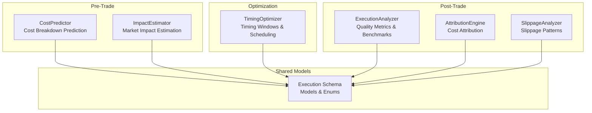
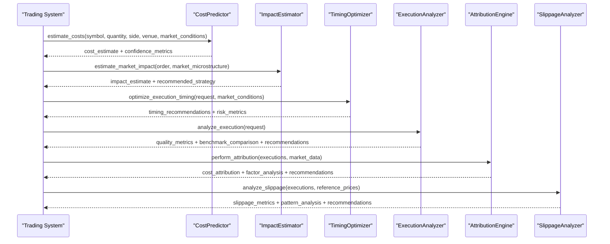
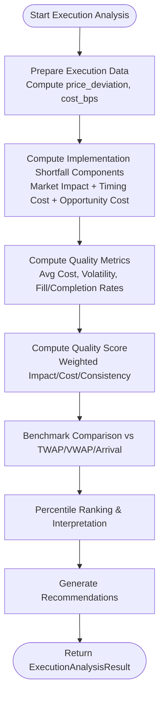
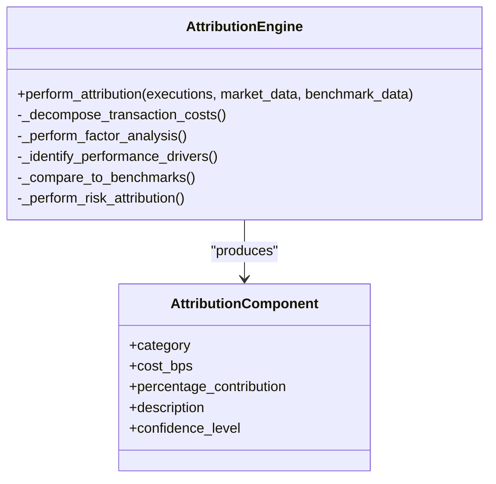
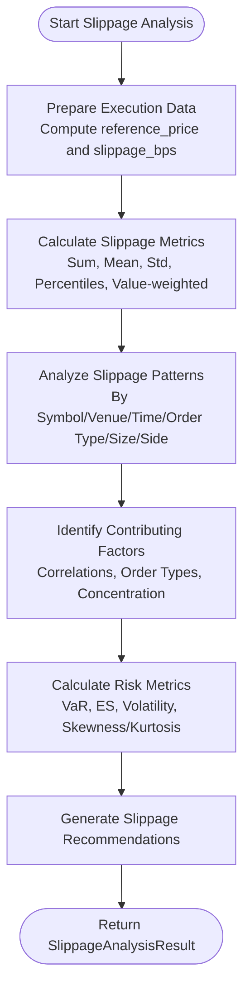
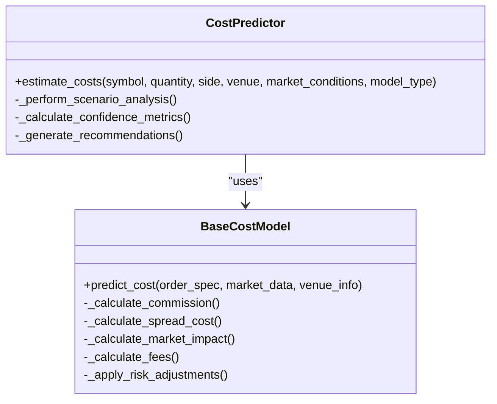
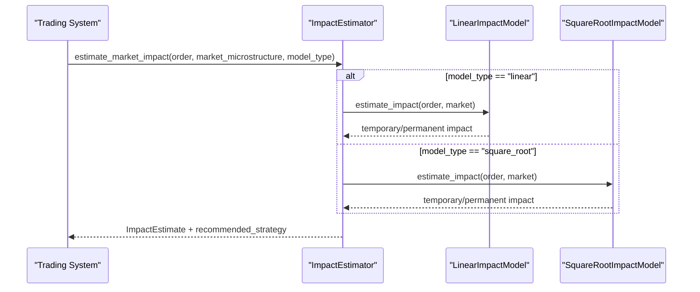
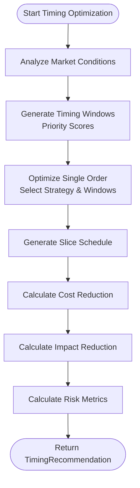
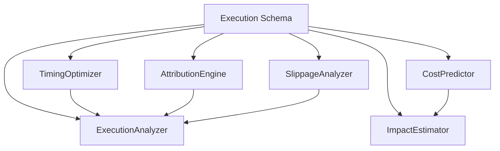

# Execution Quality Analysis

<cite>
**Referenced Files in This Document**
- [execution_analyzer.py](file://FinAgents/agent_pools/transaction_cost_agent_pool/agents/post_trade/execution_analyzer.py)
- [execution_schema.py](file://FinAgents/agent_pools/transaction_cost_agent_pool/schema/execution_schema.py)
- [attribution_engine.py](file://FinAgents/agent_pools/transaction_cost_agent_pool/agents/post_trade/attribution_engine.py)
- [slippage_analyzer.py](file://FinAgents/agent_pools/transaction_cost_agent_pool/agents/post_trade/slippage_analyzer.py)
- [cost_predictor.py](file://FinAgents/agent_pools/transaction_cost_agent_pool/agents/pre_trade/cost_predictor.py)
- [impact_estimator.py](file://FinAgents/agent_pools/transaction_cost_agent_pool/agents/pre_trade/impact_estimator.py)
- [timing_optimizer.py](file://FinAgents/agent_pools/transaction_cost_agent_pool/agents/optimization/timing_optimizer.py)
</cite>

## Table of Contents
1. [Introduction](#introduction)
2. [Project Structure](#project-structure)
3. [Core Components](#core-components)
4. [Architecture Overview](#architecture-overview)
5. [Detailed Component Analysis](#detailed-component-analysis)
6. [Dependency Analysis](#dependency-analysis)
7. [Performance Considerations](#performance-considerations)
8. [Troubleshooting Guide](#troubleshooting-guide)
9. [Conclusion](#conclusion)

## Introduction
This document explains the execution quality analysis capabilities implemented in the repository. It covers post-trade analysis of execution quality, pre-trade cost prediction and market impact estimation, and optimization of execution timing. The system computes implementation shortfall components (market impact, timing cost, opportunity cost), quality metrics (cost basis points, fill rates, completion rates), and benchmark comparisons against TWAP, VWAP, and arrival price models. It also documents quality scoring algorithms, threshold-based assessments, and integration patterns with trading execution systems.

## Project Structure
The execution quality analysis is implemented primarily within the transaction cost agent pool:
- Post-trade analysis agents: execution analyzer, attribution engine, slippage analyzer
- Pre-trade modeling agents: cost predictor, market impact estimator
- Optimization agent: timing optimizer
- Shared schemas define data models for execution quality metrics and benchmark comparisons

**Diagram sources**
- [execution_analyzer.py:56-147](file://FinAgents/agent_pools/transaction_cost_agent_pool/agents/post_trade/execution_analyzer.py#L56-L147)
- [execution_schema.py:1-444](file://FinAgents/agent_pools/transaction_cost_agent_pool/schema/execution_schema.py#L1-L444)
- [attribution_engine.py:61-185](file://FinAgents/agent_pools/transaction_cost_agent_pool/agents/post_trade/attribution_engine.py#L61-L185)
- [slippage_analyzer.py:39-146](file://FinAgents/agent_pools/transaction_cost_agent_pool/agents/post_trade/slippage_analyzer.py#L39-L146)
- [cost_predictor.py:409-588](file://FinAgents/agent_pools/transaction_cost_agent_pool/agents/pre_trade/cost_predictor.py#L409-L588)
- [impact_estimator.py:325-461](file://FinAgents/agent_pools/transaction_cost_agent_pool/agents/pre_trade/impact_estimator.py#L325-L461)
- [timing_optimizer.py:90-246](file://FinAgents/agent_pools/transaction_cost_agent_pool/agents/optimization/timing_optimizer.py#L90-L246)

**Section sources**
- [execution_analyzer.py:1-147](file://FinAgents/agent_pools/transaction_cost_agent_pool/agents/post_trade/execution_analyzer.py#L1-L147)
- [execution_schema.py:1-444](file://FinAgents/agent_pools/transaction_cost_agent_pool/schema/execution_schema.py#L1-L444)

## Core Components
- ExecutionAnalyzer: Computes implementation shortfall components, quality metrics, and benchmark comparisons; generates recommendations and percentile rankings.
- AttributionEngine: Performs multi-factor cost decomposition, identifies performance drivers, and compares to benchmarks.
- SlippageAnalyzer: Measures and attributes slippage across symbols, venues, time periods, and order types; calculates risk metrics and provides recommendations.
- CostPredictor: Predicts transaction costs across commission, spread, market impact, and fees; provides confidence intervals and scenario analysis.
- ImpactEstimator: Estimates market impact using linear and square-root models; generates time-profiled impact and recommends execution strategies.
- TimingOptimizer: Generates optimal timing windows, schedules slices, and assesses timing risk; integrates with execution strategies.

**Section sources**
- [execution_analyzer.py:176-212](file://FinAgents/agent_pools/transaction_cost_agent_pool/agents/post_trade/execution_analyzer.py#L176-L212)
- [attribution_engine.py:264-347](file://FinAgents/agent_pools/transaction_cost_agent_pool/agents/post_trade/attribution_engine.py#L264-L347)
- [slippage_analyzer.py:198-233](file://FinAgents/agent_pools/transaction_cost_agent_pool/agents/post_trade/slippage_analyzer.py#L198-L233)
- [cost_predictor.py:467-588](file://FinAgents/agent_pools/transaction_cost_agent_pool/agents/pre_trade/cost_predictor.py#L467-L588)
- [impact_estimator.py:370-461](file://FinAgents/agent_pools/transaction_cost_agent_pool/agents/pre_trade/impact_estimator.py#L370-L461)
- [timing_optimizer.py:172-246](file://FinAgents/agent_pools/transaction_cost_agent_pool/agents/optimization/timing_optimizer.py#L172-L246)

## Architecture Overview
The system orchestrates pre-trade predictions, optimization, and post-trade analysis to evaluate execution quality comprehensively.

**Diagram sources**
- [cost_predictor.py:467-588](file://FinAgents/agent_pools/transaction_cost_agent_pool/agents/pre_trade/cost_predictor.py#L467-L588)
- [impact_estimator.py:370-461](file://FinAgents/agent_pools/transaction_cost_agent_pool/agents/pre_trade/impact_estimator.py#L370-L461)
- [timing_optimizer.py:172-246](file://FinAgents/agent_pools/transaction_cost_agent_pool/agents/optimization/timing_optimizer.py#L172-L246)
- [execution_analyzer.py:89-147](file://FinAgents/agent_pools/transaction_cost_agent_pool/agents/post_trade/execution_analyzer.py#L89-L147)
- [attribution_engine.py:103-181](file://FinAgents/agent_pools/transaction_cost_agent_pool/agents/post_trade/attribution_engine.py#L103-L181)
- [slippage_analyzer.py:80-146](file://FinAgents/agent_pools/transaction_cost_agent_pool/agents/post_trade/slippage_analyzer.py#L80-L146)

## Detailed Component Analysis

### ExecutionAnalyzer: Implementation Shortfall and Quality Metrics
- Implementation shortfall components:
  - Market impact: average absolute price deviation vs benchmark
  - Timing cost: cross-symbol variability of price deviation
  - Opportunity cost: estimated from execution delays (derived from price deviation)
- Quality metrics:
  - average_cost_bps, cost_volatility_bps
  - fill_rate, completion_rate
  - quality_score computed from normalized impact, cost, and consistency
- Benchmark comparisons:
  - Compares against TWAP, VWAP, and arrival price using simplified industry benchmarks
  - Provides percentile ranking and performance interpretation
- Recommendations:
  - Derived from quality metrics, pattern analysis, and cost attribution

**Diagram sources**
- [execution_analyzer.py:148-212](file://FinAgents/agent_pools/transaction_cost_agent_pool/agents/post_trade/execution_analyzer.py#L148-L212)
- [execution_analyzer.py:418-469](file://FinAgents/agent_pools/transaction_cost_agent_pool/agents/post_trade/execution_analyzer.py#L418-L469)
- [execution_analyzer.py:477-497](file://FinAgents/agent_pools/transaction_cost_agent_pool/agents/post_trade/execution_analyzer.py#L477-L497)

**Section sources**
- [execution_analyzer.py:176-212](file://FinAgents/agent_pools/transaction_cost_agent_pool/agents/post_trade/execution_analyzer.py#L176-L212)
- [execution_analyzer.py:418-469](file://FinAgents/agent_pools/transaction_cost_agent_pool/agents/post_trade/execution_analyzer.py#L418-L469)
- [execution_analyzer.py:471-497](file://FinAgents/agent_pools/transaction_cost_agent_pool/agents/post_trade/execution_analyzer.py#L471-L497)

### AttributionEngine: Cost Attribution and Factor Analysis
- Cost decomposition:
  - Market impact, commission/fees, timing cost, venue selection, order type impact
- Factor analysis:
  - Time-of-day, order size, venue, and market conditions
- Performance drivers:
  - Correlation analysis and significance thresholds
- Benchmark comparison:
  - Historical average, industry average, theoretical optimal, best practice
- Risk attribution:
  - Cost volatility, timing risk, venue and size concentration, tail risk

**Diagram sources**
- [attribution_engine.py:103-181](file://FinAgents/agent_pools/transaction_cost_agent_pool/agents/post_trade/attribution_engine.py#L103-L181)
- [attribution_engine.py:264-347](file://FinAgents/agent_pools/transaction_cost_agent_pool/agents/post_trade/attribution_engine.py#L264-L347)

**Section sources**
- [attribution_engine.py:264-347](file://FinAgents/agent_pools/transaction_cost_agent_pool/agents/post_trade/attribution_engine.py#L264-L347)
- [attribution_engine.py:349-413](file://FinAgents/agent_pools/transaction_cost_agent_pool/agents/post_trade/attribution_engine.py#L349-L413)
- [attribution_engine.py:415-459](file://FinAgents/agent_pools/transaction_cost_agent_pool/agents/post_trade/attribution_engine.py#L415-L459)
- [attribution_engine.py:461-497](file://FinAgents/agent_pools/transaction_cost_agent_pool/agents/post_trade/attribution_engine.py#L461-L497)
- [attribution_engine.py:499-537](file://FinAgents/agent_pools/transaction_cost_agent_pool/agents/post_trade/attribution_engine.py#L499-L537)

### SlippageAnalyzer: Slippage Measurement and Optimization Insights
- Slippage metrics:
  - Total, average, median, volatility; value-weighted; percentiles; positive/negative slippage rates
- Pattern analysis:
  - By symbol, venue, time, order type, volume, side
- Contributing factors:
  - Correlation analysis, order type differences, venue concentration, time concentration, extreme events
- Risk metrics:
  - VaR, Expected Shortfall, max/min, skewness/kurtosis, tracking error
- Recommendations:
  - Based on slippage levels, volatility, time/venue patterns, order type usage, and extreme event rates

**Diagram sources**
- [slippage_analyzer.py:147-197](file://FinAgents/agent_pools/transaction_cost_agent_pool/agents/post_trade/slippage_analyzer.py#L147-L197)
- [slippage_analyzer.py:198-233](file://FinAgents/agent_pools/transaction_cost_agent_pool/agents/post_trade/slippage_analyzer.py#L198-L233)
- [slippage_analyzer.py:235-321](file://FinAgents/agent_pools/transaction_cost_agent_pool/agents/post_trade/slippage_analyzer.py#L235-L321)
- [slippage_analyzer.py:323-383](file://FinAgents/agent_pools/transaction_cost_agent_pool/agents/post_trade/slippage_analyzer.py#L323-L383)
- [slippage_analyzer.py:385-412](file://FinAgents/agent_pools/transaction_cost_agent_pool/agents/post_trade/slippage_analyzer.py#L385-L412)
- [slippage_analyzer.py:414-496](file://FinAgents/agent_pools/transaction_cost_agent_pool/agents/post_trade/slippage_analyzer.py#L414-L496)

**Section sources**
- [slippage_analyzer.py:198-233](file://FinAgents/agent_pools/transaction_cost_agent_pool/agents/post_trade/slippage_analyzer.py#L198-L233)
- [slippage_analyzer.py:235-321](file://FinAgents/agent_pools/transaction_cost_agent_pool/agents/post_trade/slippage_analyzer.py#L235-L321)
- [slippage_analyzer.py:323-383](file://FinAgents/agent_pools/transaction_cost_agent_pool/agents/post_trade/slippage_analyzer.py#L323-L383)
- [slippage_analyzer.py:385-412](file://FinAgents/agent_pools/transaction_cost_agent_pool/agents/post_trade/slippage_analyzer.py#L385-L412)
- [slippage_analyzer.py:414-496](file://FinAgents/agent_pools/transaction_cost_agent_pool/agents/post_trade/slippage_analyzer.py#L414-L496)

### CostPredictor: Pre-Trade Cost Estimation and Confidence
- Multi-component cost modeling:
  - Commission (tiered), spread (effective), market impact (power law), fees (exchange/regulatory/clearing)
- Risk adjustments:
  - Volatility and liquidity regime adjustments
- Scenario analysis:
  - Best/worst case under regime shifts
- Confidence metrics:
  - Weighted component confidences, market-hours/data-quality adjustments, confidence intervals

**Diagram sources**
- [cost_predictor.py:409-588](file://FinAgents/agent_pools/transaction_cost_agent_pool/agents/pre_trade/cost_predictor.py#L409-L588)
- [cost_predictor.py:85-154](file://FinAgents/agent_pools/transaction_cost_agent_pool/agents/pre_trade/cost_predictor.py#L85-L154)

**Section sources**
- [cost_predictor.py:467-588](file://FinAgents/agent_pools/transaction_cost_agent_pool/agents/pre_trade/cost_predictor.py#L467-L588)
- [cost_predictor.py:677-728](file://FinAgents/agent_pools/transaction_cost_agent_pool/agents/pre_trade/cost_predictor.py#L677-L728)
- [cost_predictor.py:730-760](file://FinAgents/agent_pools/transaction_cost_agent_pool/agents/pre_trade/cost_predictor.py#L730-L760)

### ImpactEstimator: Market Impact Modeling and Strategy Recommendation
- Models:
  - Linear and square-root impact models with regime/time adjustments
- Estimation:
  - Temporary/permanent impact decomposition, confidence intervals
- Scenario analysis:
  - Best/worst case under high/low liquidity regimes
- Sensitivity analysis:
  - Volume and volatility sensitivity
- Recommended strategy:
  - Based on participation rate and market conditions

**Diagram sources**
- [impact_estimator.py:325-461](file://FinAgents/agent_pools/transaction_cost_agent_pool/agents/pre_trade/impact_estimator.py#L325-L461)
- [impact_estimator.py:105-176](file://FinAgents/agent_pools/transaction_cost_agent_pool/agents/pre_trade/impact_estimator.py#L105-L176)
- [impact_estimator.py:210-284](file://FinAgents/agent_pools/transaction_cost_agent_pool/agents/pre_trade/impact_estimator.py#L210-L284)

**Section sources**
- [impact_estimator.py:370-461](file://FinAgents/agent_pools/transaction_cost_agent_pool/agents/pre_trade/impact_estimator.py#L370-L461)
- [impact_estimator.py:462-491](file://FinAgents/agent_pools/transaction_cost_agent_pool/agents/pre_trade/impact_estimator.py#L462-L491)
- [impact_estimator.py:525-557](file://FinAgents/agent_pools/transaction_cost_agent_pool/agents/pre_trade/impact_estimator.py#L525-L557)
- [impact_estimator.py:558-592](file://FinAgents/agent_pools/transaction_cost_agent_pool/agents/pre_trade/impact_estimator.py#L558-L592)
- [impact_estimator.py:624-646](file://FinAgents/agent_pools/transaction_cost_agent_pool/agents/pre_trade/impact_estimator.py#L624-L646)

### TimingOptimizer: Optimal Timing Windows and Risk Assessment
- Timing windows:
  - Generated across remaining trading hours with expected volume, volatility, spread, and market impact
  - Priority score balances liquidity, volume, and cost
- Strategy selection:
  - Adaptive, volume-weighted, volatility-adjusted, momentum-based, contrarian, immediate
- Slice scheduling:
  - Distributes order quantity across selected windows based on strategy
- Risk metrics:
  - Timing risk, opportunity cost risk, execution risk, market impact risk, overall risk score

**Diagram sources**
- [timing_optimizer.py:172-246](file://FinAgents/agent_pools/transaction_cost_agent_pool/agents/optimization/timing_optimizer.py#L172-L246)
- [timing_optimizer.py:284-353](file://FinAgents/agent_pools/transaction_cost_agent_pool/agents/optimization/timing_optimizer.py#L284-L353)
- [timing_optimizer.py:371-427](file://FinAgents/agent_pools/transaction_cost_agent_pool/agents/optimization/timing_optimizer.py#L371-L427)
- [timing_optimizer.py:553-615](file://FinAgents/agent_pools/transaction_cost_agent_pool/agents/optimization/timing_optimizer.py#L553-L615)
- [timing_optimizer.py:616-669](file://FinAgents/agent_pools/transaction_cost_agent_pool/agents/optimization/timing_optimizer.py#L616-L669)

**Section sources**
- [timing_optimizer.py:172-246](file://FinAgents/agent_pools/transaction_cost_agent_pool/agents/optimization/timing_optimizer.py#L172-L246)
- [timing_optimizer.py:284-353](file://FinAgents/agent_pools/transaction_cost_agent_pool/agents/optimization/timing_optimizer.py#L284-L353)
- [timing_optimizer.py:371-427](file://FinAgents/agent_pools/transaction_cost_agent_pool/agents/optimization/timing_optimizer.py#L371-L427)
- [timing_optimizer.py:553-615](file://FinAgents/agent_pools/transaction_cost_agent_pool/agents/optimization/timing_optimizer.py#L553-L615)
- [timing_optimizer.py:616-669](file://FinAgents/agent_pools/transaction_cost_agent_pool/agents/optimization/timing_optimizer.py#L616-L669)

## Dependency Analysis
- Shared models:
  - Execution schema defines enums, data models, and benchmark types used across agents
- Agent interdependencies:
  - Post-trade agents consume shared models and may rely on pre-trade estimates for context
  - Optimization agent uses market conditions and pre-trade estimates to inform timing decisions
- Coupling and cohesion:
  - Agents are cohesive around specific tasks (pre-trade prediction, optimization, post-trade analysis)
  - Cohesion is maintained via shared schemas; coupling is minimized through clear interfaces

**Diagram sources**
- [execution_schema.py:1-444](file://FinAgents/agent_pools/transaction_cost_agent_pool/schema/execution_schema.py#L1-L444)
- [execution_analyzer.py:56-147](file://FinAgents/agent_pools/transaction_cost_agent_pool/agents/post_trade/execution_analyzer.py#L56-L147)
- [attribution_engine.py:61-185](file://FinAgents/agent_pools/transaction_cost_agent_pool/agents/post_trade/attribution_engine.py#L61-L185)
- [slippage_analyzer.py:39-146](file://FinAgents/agent_pools/transaction_cost_agent_pool/agents/post_trade/slippage_analyzer.py#L39-L146)
- [cost_predictor.py:409-588](file://FinAgents/agent_pools/transaction_cost_agent_pool/agents/pre_trade/cost_predictor.py#L409-L588)
- [impact_estimator.py:325-461](file://FinAgents/agent_pools/transaction_cost_agent_pool/agents/pre_trade/impact_estimator.py#L325-L461)
- [timing_optimizer.py:90-246](file://FinAgents/agent_pools/transaction_cost_agent_pool/agents/optimization/timing_optimizer.py#L90-L246)

**Section sources**
- [execution_schema.py:1-444](file://FinAgents/agent_pools/transaction_cost_agent_pool/schema/execution_schema.py#L1-L444)

## Performance Considerations
- Data completeness and quality:
  - Confidence metrics incorporate data quality adjustments; missing or sparse data reduces confidence
- Computational complexity:
  - Groupby operations and correlation analyses scale with execution volume; consider chunking for large datasets
- Real-time responsiveness:
  - Timing windows and risk metrics depend on current market conditions; ensure timely updates
- Model calibration:
  - Impact estimators maintain calibration dates and R²; periodic re-calibration improves accuracy

[No sources needed since this section provides general guidance]

## Troubleshooting Guide
- Low confidence in cost estimates:
  - Review component confidences and adjust market-hours/data-quality parameters
  - See confidence calculation and adjustments
- High slippage volatility:
  - Investigate time-of-day and venue concentration; consider adaptive timing strategies
- Poor execution quality score:
  - Examine market impact and timing cost contributions; review venue and order-type allocations
- Timing risk concerns:
  - Monitor timing risk, opportunity cost risk, and execution risk; adjust strategy selection accordingly

**Section sources**
- [cost_predictor.py:677-728](file://FinAgents/agent_pools/transaction_cost_agent_pool/agents/pre_trade/cost_predictor.py#L677-L728)
- [slippage_analyzer.py:385-412](file://FinAgents/agent_pools/transaction_cost_agent_pool/agents/post_trade/slippage_analyzer.py#L385-L412)
- [execution_analyzer.py:477-497](file://FinAgents/agent_pools/transaction_cost_agent_pool/agents/post_trade/execution_analyzer.py#L477-L497)
- [timing_optimizer.py:616-669](file://FinAgents/agent_pools/transaction_cost_agent_pool/agents/optimization/timing_optimizer.py#L616-L669)

## Conclusion
The execution quality analysis system provides a comprehensive toolkit for evaluating and optimizing trading execution. It combines pre-trade cost and impact modeling with optimization of execution timing and detailed post-trade analysis of implementation shortfall, cost attribution, and slippage. The shared schema ensures consistent data models across agents, while benchmark comparisons and quality scoring enable threshold-based assessments and actionable recommendations.