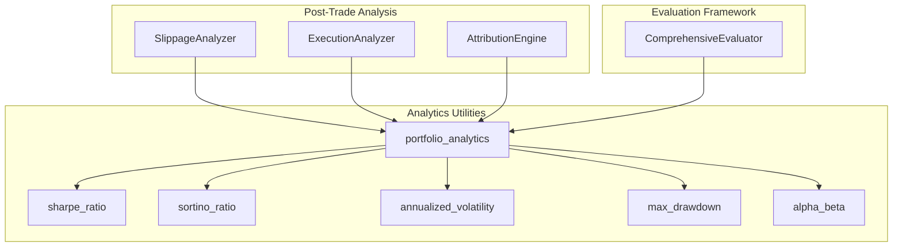
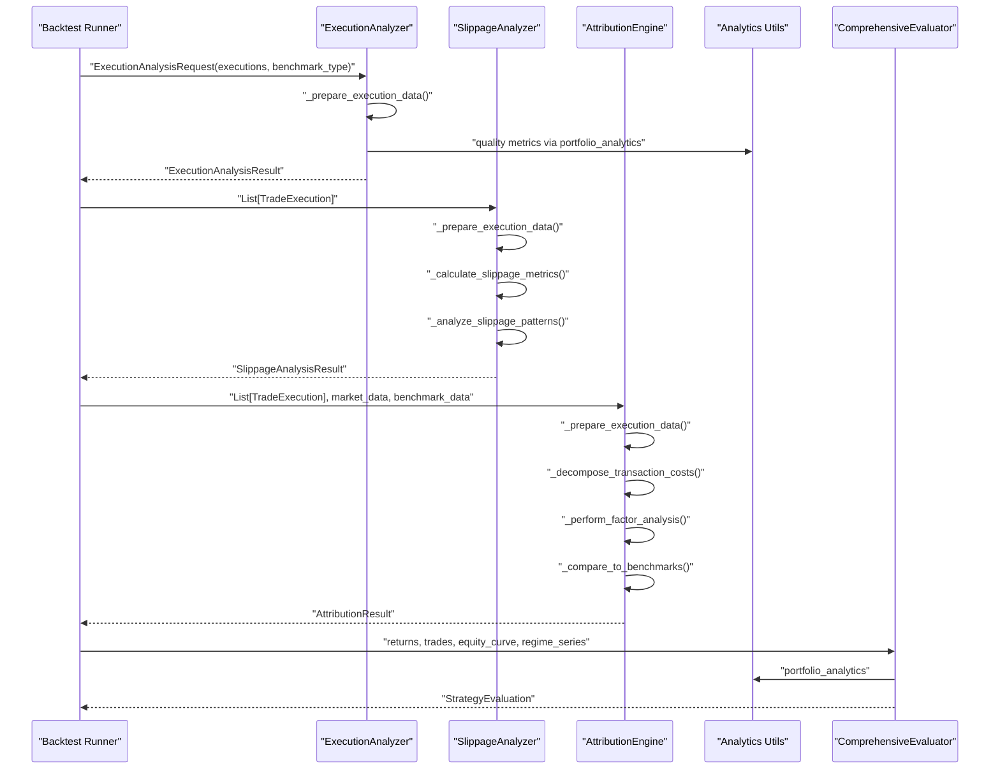
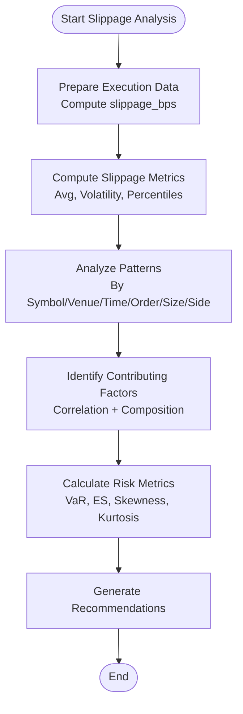
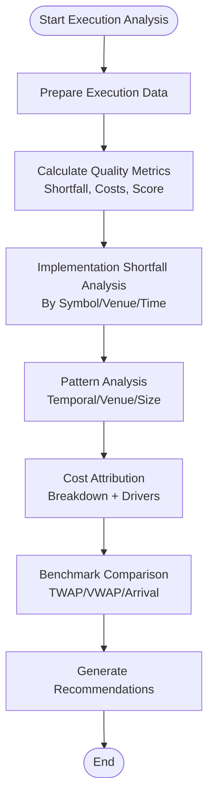
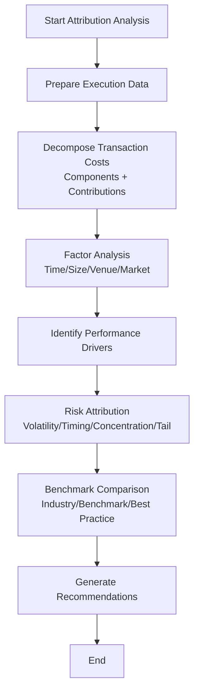
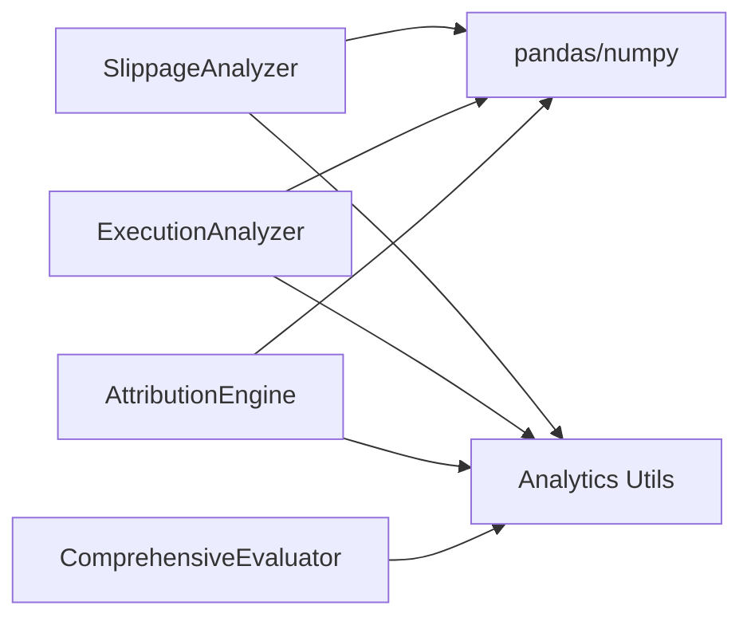

# Post-Trade Analysis

<cite>
**Referenced Files in This Document**
- [attribution_engine.py](file://FinAgents/agent_pools/transaction_cost_agent_pool/agents/post_trade/attribution_engine.py)
- [execution_analyzer.py](file://FinAgents/agent_pools/transaction_cost_agent_pool/agents/post_trade/execution_analyzer.py)
- [slippage_analyzer.py](file://FinAgents/agent_pools/transaction_cost_agent_pool/agents/post_trade/slippage_analyzer.py)
- [evaluation_framework.py](file://backend/analytics/evaluation_framework.py)
- [portfolio_analytics.py](file://backend/analytics/portfolio_analytics.py)
- [sharpe.py](file://backend/analytics/sharpe.py)
- [sortino.py](file://backend/analytics/sortino.py)
- [volatility.py](file://backend/analytics/volatility.py)
- [max_drawdown.py](file://backend/analytics/max_drawdown.py)
- [alpha_beta.py](file://backend/analytics/alpha_beta.py)
- [run_backtest_fixed.py](file://examples/run_backtest_fixed.py)
</cite>

## Table of Contents
1. [Introduction](#introduction)
2. [Project Structure](#project-structure)
3. [Core Components](#core-components)
4. [Architecture Overview](#architecture-overview)
5. [Detailed Component Analysis](#detailed-component-analysis)
6. [Dependency Analysis](#dependency-analysis)
7. [Performance Considerations](#performance-considerations)
8. [Troubleshooting Guide](#troubleshooting-guide)
9. [Conclusion](#conclusion)
10. [Appendices](#appendices)

## Introduction
This document describes the post-trade analysis subsystem for measuring and attributing execution quality, slippage, and transaction costs. It explains benchmark comparisons (TWAP, VWAP, arrival price), slippage measurement techniques, and performance attribution engines for cost breakdown analysis. It also provides implementation examples for historical trade analysis and outlines integration patterns with backtesting frameworks and performance reporting systems.

## Project Structure
The post-trade analysis capability is implemented across three primary modules:
- Slippage Analyzer: measures and attributes slippage across symbols, venues, time buckets, order types, and volumes.
- Execution Analyzer: evaluates execution quality via implementation shortfall and benchmark comparisons (TWAP, VWAP, arrival).
- Attribution Engine: decomposes transaction costs into categories (market impact, timing, spread, commission, fees, opportunity cost, venue selection, order type, execution timing) and compares against benchmarks.

These modules integrate with backend analytics utilities that compute Sharpe, Sortino, volatility, max drawdown, alpha, and beta, and with a comprehensive evaluation framework that supports regime-aware strategy evaluation and reporting.



**Diagram sources**
- [slippage_analyzer.py:39-616](file://FinAgents/agent_pools/transaction_cost_agent_pool/agents/post_trade/slippage_analyzer.py#L39-L616)
- [execution_analyzer.py:56-559](file://FinAgents/agent_pools/transaction_cost_agent_pool/agents/post_trade/execution_analyzer.py#L56-L559)
- [attribution_engine.py:61-673](file://FinAgents/agent_pools/transaction_cost_agent_pool/agents/post_trade/attribution_engine.py#L61-L673)
- [portfolio_analytics.py:14-42](file://backend/analytics/portfolio_analytics.py#L14-L42)
- [sharpe.py:8-33](file://backend/analytics/sharpe.py#L8-L33)
- [sortino.py:9-41](file://backend/analytics/sortino.py#L9-L41)
- [volatility.py:9-28](file://backend/analytics/volatility.py#L9-L28)
- [max_drawdown.py:8-32](file://backend/analytics/max_drawdown.py#L8-L32)
- [alpha_beta.py:9-42](file://backend/analytics/alpha_beta.py#L9-L42)
- [evaluation_framework.py:507-796](file://backend/analytics/evaluation_framework.py#L507-L796)

**Section sources**
- [slippage_analyzer.py:39-616](file://FinAgents/agent_pools/transaction_cost_agent_pool/agents/post_trade/slippage_analyzer.py#L39-L616)
- [execution_analyzer.py:56-559](file://FinAgents/agent_pools/transaction_cost_agent_pool/agents/post_trade/execution_analyzer.py#L56-L559)
- [attribution_engine.py:61-673](file://FinAgents/agent_pools/transaction_cost_agent_pool/agents/post_trade/attribution_engine.py#L61-L673)
- [portfolio_analytics.py:14-42](file://backend/analytics/portfolio_analytics.py#L14-L42)
- [evaluation_framework.py:507-796](file://backend/analytics/evaluation_framework.py#L507-L796)

## Core Components
- SlippageAnalyzer
  - Computes total, average, median, and percentile slippage; volatility; value-weighted slippage; and extreme slippage rates.
  - Attributes slippage by symbol, venue, time bucket, order type, volume percentile, and side.
  - Identifies contributing factors via correlation analysis and pattern comparisons.
  - Calculates risk metrics (VaR, expected shortfall, max/min slippage, skewness, kurtosis, tracking error).
  - Generates recommendations for timing, venue selection, order type usage, and order sizing.

- ExecutionAnalyzer
  - Calculates implementation shortfall components: market impact, timing cost, opportunity cost, and fees/commissions.
  - Provides quality metrics: average cost bps, cost volatility, fill/completion rates, and a composite quality score.
  - Analyzes patterns by symbol, venue, and time; attributes cost breakdown and identifies performance drivers.
  - Benchmarks performance against TWAP/VWAP/Arrival standards and provides percentile ranking.

- AttributionEngine
  - Decomposes transaction costs into categories and computes percentage contributions.
  - Performs factor analysis across time, size, venue, and market conditions.
  - Identifies performance drivers and risk attribution (cost volatility, timing risk, venue/size concentration, tail risk).
  - Compares performance to benchmarks (historical, industry, theoretical optimal, best practice, venue-specific, recent vs earlier).
  - Produces recommendations for optimization.

- Analytics Utilities
  - Sharpe, Sortino, volatility, max drawdown, alpha, and beta are used by the evaluation framework and can be applied to post-trade returns for broader performance reporting.

- Evaluation Framework
  - Computes comprehensive performance metrics and regime attribution.
  - Supports strategy comparison and ranking, stability and consistency analysis, and risk scoring.
  - Exports evaluation reports in JSON or text formats.

**Section sources**
- [slippage_analyzer.py:39-616](file://FinAgents/agent_pools/transaction_cost_agent_pool/agents/post_trade/slippage_analyzer.py#L39-L616)
- [execution_analyzer.py:56-559](file://FinAgents/agent_pools/transaction_cost_agent_pool/agents/post_trade/execution_analyzer.py#L56-L559)
- [attribution_engine.py:61-673](file://FinAgents/agent_pools/transaction_cost_agent_pool/agents/post_trade/attribution_engine.py#L61-L673)
- [portfolio_analytics.py:14-42](file://backend/analytics/portfolio_analytics.py#L14-L42)
- [evaluation_framework.py:507-796](file://backend/analytics/evaluation_framework.py#L507-L796)

## Architecture Overview
The post-trade analysis subsystem is composed of three specialized analyzers that share common data preparation and analytics utilities. The evaluation framework consumes aggregated returns and trades to produce regime-aware strategy performance and recommendations.



**Diagram sources**
- [execution_analyzer.py:89-147](file://FinAgents/agent_pools/transaction_cost_agent_pool/agents/post_trade/execution_analyzer.py#L89-L147)
- [slippage_analyzer.py:80-146](file://FinAgents/agent_pools/transaction_cost_agent_pool/agents/post_trade/slippage_analyzer.py#L80-L146)
- [attribution_engine.py:103-185](file://FinAgents/agent_pools/transaction_cost_agent_pool/agents/post_trade/attribution_engine.py#L103-L185)
- [portfolio_analytics.py:14-42](file://backend/analytics/portfolio_analytics.py#L14-L42)
- [evaluation_framework.py:534-636](file://backend/analytics/evaluation_framework.py#L534-L636)

## Detailed Component Analysis

### SlippageAnalyzer
- Data preparation
  - Uses benchmark or reference prices to compute slippage in price and bps terms.
  - Adds time buckets, slippage categories, and volume percentiles for granular analysis.
- Metrics
  - Total, average, median, and percentile slippage; value-weighted slippage; positive/negative slippage rates; extreme slippage rate.
- Patterns
  - Aggregates by symbol, venue, time bucket, order type, volume percentile, and side to reveal hotspots.
- Risk metrics
  - VaR (95/99), expected shortfall, max/min slippage, skewness/kurtosis, tracking error.
- Recommendations
  - Targets timing, venue, order type, and order size inefficiencies; flags excessive volatility and extreme events.



**Diagram sources**
- [slippage_analyzer.py:147-413](file://FinAgents/agent_pools/transaction_cost_agent_pool/agents/post_trade/slippage_analyzer.py#L147-L413)

**Section sources**
- [slippage_analyzer.py:39-616](file://FinAgents/agent_pools/transaction_cost_agent_pool/agents/post_trade/slippage_analyzer.py#L39-L616)

### ExecutionAnalyzer
- Quality metrics
  - Implementation shortfall components: market impact, timing cost, opportunity cost, fees/commissions.
  - Composite quality score based on impact, cost, and consistency.
- Benchmark comparisons
  - Compares against TWAP, VWAP, and arrival benchmarks; provides percentile ranking.
- Pattern analysis
  - Temporal, venue, size, and volatility patterns to identify optimization opportunities.
- Recommendations
  - Actionable suggestions for timing, venue selection, order type usage, and cost reduction.



**Diagram sources**
- [execution_analyzer.py:148-470](file://FinAgents/agent_pools/transaction_cost_agent_pool/agents/post_trade/execution_analyzer.py#L148-L470)

**Section sources**
- [execution_analyzer.py:56-559](file://FinAgents/agent_pools/transaction_cost_agent_pool/agents/post_trade/execution_analyzer.py#L56-L559)

### AttributionEngine
- Cost decomposition
  - Market impact, commission/fees, timing cost, venue selection, order type impact.
- Factor analysis
  - Time, size, venue, and market condition factors; cross-correlations.
- Performance drivers and risk attribution
  - Identifies key drivers; quantifies cost volatility, timing risk, venue/size concentration, tail risk.
- Benchmark comparison
  - Historical, industry, theoretical optimal, best practice, venue-specific, recent vs earlier.
- Recommendations
  - Practical guidance for order splitting, venue optimization, order type selection, and timing strategies.



**Diagram sources**
- [attribution_engine.py:103-594](file://FinAgents/agent_pools/transaction_cost_agent_pool/agents/post_trade/attribution_engine.py#L103-L594)

**Section sources**
- [attribution_engine.py:61-673](file://FinAgents/agent_pools/transaction_cost_agent_pool/agents/post_trade/attribution_engine.py#L61-L673)

### Performance Attribution Engines for Cost Breakdown Analysis
- Market impact: estimated from price impact vs benchmark.
- Timing cost: estimated from price impact standard deviation.
- Commission and fees: residual after market impact.
- Venue selection: variance in cost_bps across venues.
- Order type: difference between market and limit orders.
- Opportunity cost: estimated component of delayed execution.

These engines provide percentage contributions and confidence levels to guide prioritization of interventions.

**Section sources**
- [attribution_engine.py:264-347](file://FinAgents/agent_pools/transaction_cost_agent_pool/agents/post_trade/attribution_engine.py#L264-L347)
- [execution_analyzer.py:176-212](file://FinAgents/agent_pools/transaction_cost_agent_pool/agents/post_trade/execution_analyzer.py#L176-L212)

### Benchmark Comparisons (TWAP, VWAP, Arrival Price)
- TWAP/VWAP/Arrival are supported as benchmark types in execution analysis.
- The analyzer compares realized execution costs to industry benchmarks and provides percentile rankings.
- The evaluation framework optionally compares strategy returns to a benchmark and computes alpha.

**Section sources**
- [execution_analyzer.py:418-470](file://FinAgents/agent_pools/transaction_cost_agent_pool/agents/post_trade/execution_analyzer.py#L418-L470)
- [evaluation_framework.py:588-602](file://backend/analytics/evaluation_framework.py#L588-L602)

### Slippage Measurement Techniques and Attribution Methodologies
- Slippage computation: executed price minus reference price, scaled to bps.
- Attribution by dimensions: symbol, venue, time, order type, volume percentile, side.
- Contributing factors: correlation analysis and composition checks.
- Risk metrics: VaR, expected shortfall, distribution moments, tracking error.

**Section sources**
- [slippage_analyzer.py:147-413](file://FinAgents/agent_pools/transaction_cost_agent_pool/agents/post_trade/slippage_analyzer.py#L147-L413)

### Historical Trade Analysis and Optimization Feedback Loops
- Historical trade datasets can be ingested by analyzers to compute metrics and identify persistent inefficiencies.
- The evaluation framework aggregates returns and trades to assess overall performance and regime sensitivity.
- Backtesting integration enables automated optimization feedback loops: evaluate performance, adjust prompts/instructions, re-run.

```mermaid
sequenceDiagram
participant Data as "Historical Trades"
participant EA as "ExecutionAnalyzer"
participant SL as "SlippageAnalyzer"
participant AE as "AttributionEngine"
participant Eval as "ComprehensiveEvaluator"
participant Loop as "Backtest Runner"
Loop->>Data : "Load trades and returns"
Data-->>EA : "Executions + Benchmark Prices"
EA-->>Loop : "Quality Metrics + Recommendations"
Data-->>SL : "Executions"
SL-->>Loop : "Slippage Metrics + Patterns"
Data-->>AE : "Executions + Market Data"
AE-->>Loop : "Cost Attribution + Benchmarks"
Data-->>Eval : "Returns + Trades + Equity Curve"
Eval-->>Loop : "Strategy Evaluation + Recommendations"
Loop->>Loop : "Optimize prompts/instructions based on feedback"
```

**Diagram sources**
- [run_backtest_fixed.py:13-66](file://examples/run_backtest_fixed.py#L13-L66)
- [execution_analyzer.py:89-147](file://FinAgents/agent_pools/transaction_cost_agent_pool/agents/post_trade/execution_analyzer.py#L89-L147)
- [slippage_analyzer.py:80-146](file://FinAgents/agent_pools/transaction_cost_agent_pool/agents/post_trade/slippage_analyzer.py#L80-L146)
- [attribution_engine.py:103-185](file://FinAgents/agent_pools/transaction_cost_agent_pool/agents/post_trade/attribution_engine.py#L103-L185)
- [evaluation_framework.py:534-636](file://backend/analytics/evaluation_framework.py#L534-L636)

**Section sources**
- [run_backtest_fixed.py:13-66](file://examples/run_backtest_fixed.py#L13-L66)
- [evaluation_framework.py:507-796](file://backend/analytics/evaluation_framework.py#L507-L796)

### Integration Patterns with Backtesting and Reporting Systems
- Backtesting pipeline: orchestrator runs multi-year backtests, collects performance metrics, and triggers optimization when thresholds are not met.
- Reporting: evaluation framework exports JSON or formatted text reports with overall scores, regime breakdowns, and recommendations.
- Real-time ingestion: analyzers accept lists of executions and return structured results suitable for dashboards and alerts.

**Section sources**
- [run_backtest_fixed.py:13-66](file://examples/run_backtest_fixed.py#L13-L66)
- [evaluation_framework.py:702-791](file://backend/analytics/evaluation_framework.py#L702-L791)

## Dependency Analysis
- Internal dependencies
  - SlippageAnalyzer and ExecutionAnalyzer depend on pandas/numpy for data manipulation and statistics.
  - AttributionEngine depends on pandas/numpy and enumerations for categorization.
  - All analyzers rely on shared analytics utilities for Sharpe, Sortino, volatility, max drawdown, alpha, and beta.
- External integration points
  - Backtesting runner feeds analyzers with historical executions and returns.
  - Evaluation framework integrates analytics utilities to compute portfolio-level metrics.



**Diagram sources**
- [slippage_analyzer.py:1-20](file://FinAgents/agent_pools/transaction_cost_agent_pool/agents/post_trade/slippage_analyzer.py#L1-L20)
- [execution_analyzer.py:1-20](file://FinAgents/agent_pools/transaction_cost_agent_pool/agents/post_trade/execution_analyzer.py#L1-L20)
- [attribution_engine.py:1-20](file://FinAgents/agent_pools/transaction_cost_agent_pool/agents/post_trade/attribution_engine.py#L1-L20)
- [portfolio_analytics.py:5-11](file://backend/analytics/portfolio_analytics.py#L5-L11)
- [evaluation_framework.py:40-50](file://backend/analytics/evaluation_framework.py#L40-L50)

**Section sources**
- [slippage_analyzer.py:1-20](file://FinAgents/agent_pools/transaction_cost_agent_pool/agents/post_trade/slippage_analyzer.py#L1-L20)
- [execution_analyzer.py:1-20](file://FinAgents/agent_pools/transaction_cost_agent_pool/agents/post_trade/execution_analyzer.py#L1-L20)
- [attribution_engine.py:1-20](file://FinAgents/agent_pools/transaction_cost_agent_pool/agents/post_trade/attribution_engine.py#L1-L20)
- [portfolio_analytics.py:5-11](file://backend/analytics/portfolio_analytics.py#L5-L11)
- [evaluation_framework.py:40-50](file://backend/analytics/evaluation_framework.py#L40-L50)

## Performance Considerations
- Data preparation efficiency: vectorized pandas operations minimize overhead for large historical datasets.
- Caching: attribution and analysis caches can reduce repeated computations for repeated queries.
- Confidence thresholds: attribution engines apply confidence levels to avoid acting on noisy signals.
- Parallelism: analyzers can be invoked concurrently for different segments (symbols, venues, time windows).

## Troubleshooting Guide
- Empty or insufficient data
  - Analyzers check for empty inputs and raise errors or return neutral results when data is inadequate.
- Missing benchmark data
  - ExecutionAnalyzer falls back to industry benchmarks; AttributionEngine can still compute components without market data.
- Numerical instabilities
  - Analytics utilities guard against zero variance and division by zero; evaluation framework handles edge cases in calculations.

**Section sources**
- [execution_analyzer.py:144-147](file://FinAgents/agent_pools/transaction_cost_agent_pool/agents/post_trade/execution_analyzer.py#L144-L147)
- [slippage_analyzer.py:143-146](file://FinAgents/agent_pools/transaction_cost_agent_pool/agents/post_trade/slippage_analyzer.py#L143-L146)
- [attribution_engine.py:182-185](file://FinAgents/agent_pools/transaction_cost_agent_pool/agents/post_trade/attribution_engine.py#L182-L185)
- [portfolio_analytics.py:23-24](file://backend/analytics/portfolio_analytics.py#L23-L24)
- [evaluation_framework.py:200-202](file://backend/analytics/evaluation_framework.py#L200-L202)

## Conclusion
The post-trade analysis subsystem provides a comprehensive toolkit for measuring execution quality, attributing transaction costs, and identifying optimization opportunities. By combining slippage analysis, execution quality metrics, and cost attribution with regime-aware evaluation and benchmark comparisons, teams can continuously improve trading performance and operational efficiency.

## Appendices
- Example usage
  - SlippageAnalyzer, ExecutionAnalyzer, and AttributionEngine include test harnesses demonstrating typical invocation patterns and result interpretation.
- Export formats
  - Evaluation framework supports JSON and text export for reporting and integration with dashboards.

**Section sources**
- [slippage_analyzer.py:596-616](file://FinAgents/agent_pools/transaction_cost_agent_pool/agents/post_trade/slippage_analyzer.py#L596-L616)
- [execution_analyzer.py:500-559](file://FinAgents/agent_pools/transaction_cost_agent_pool/agents/post_trade/execution_analyzer.py#L500-L559)
- [attribution_engine.py:596-673](file://FinAgents/agent_pools/transaction_cost_agent_pool/agents/post_trade/attribution_engine.py#L596-L673)
- [evaluation_framework.py:702-791](file://backend/analytics/evaluation_framework.py#L702-L791)