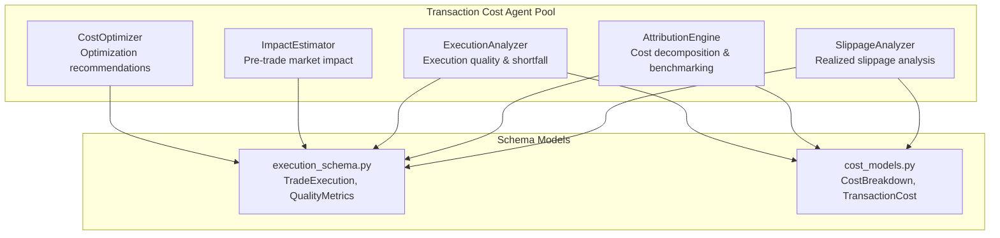
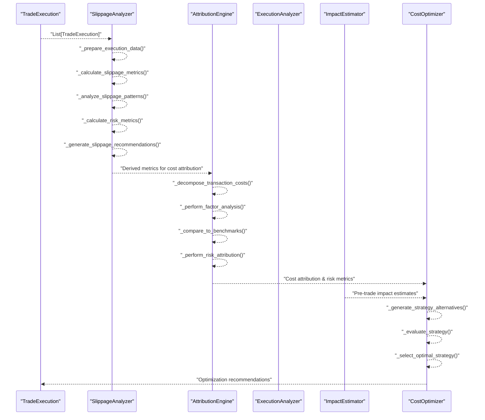
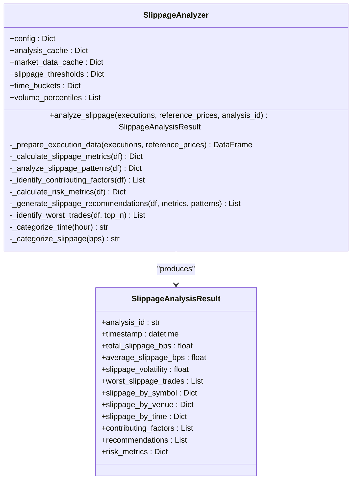
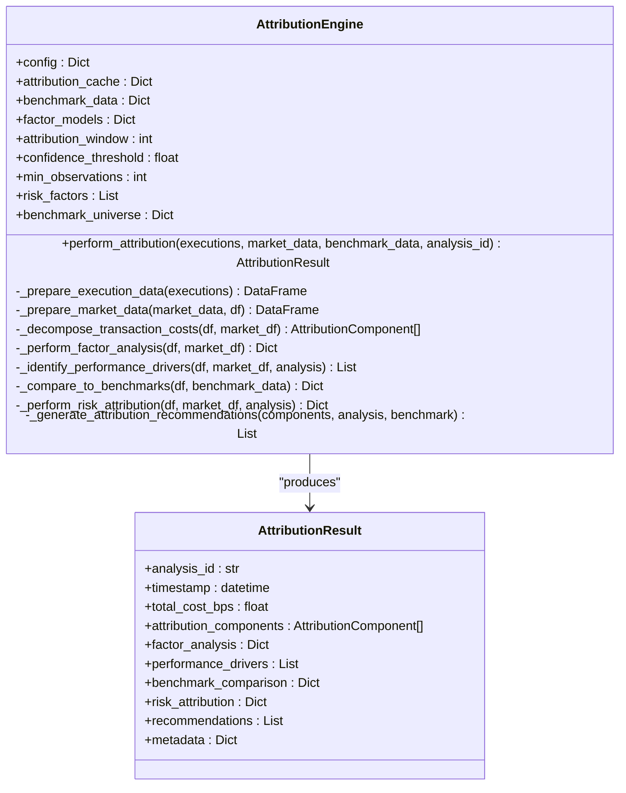
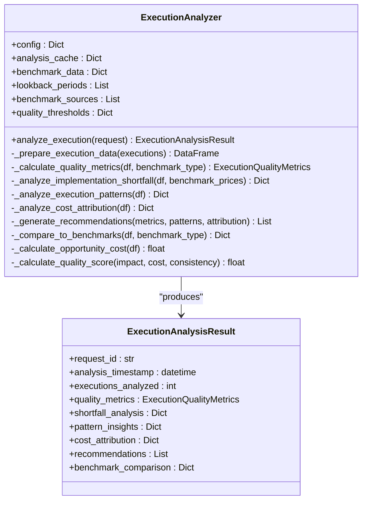
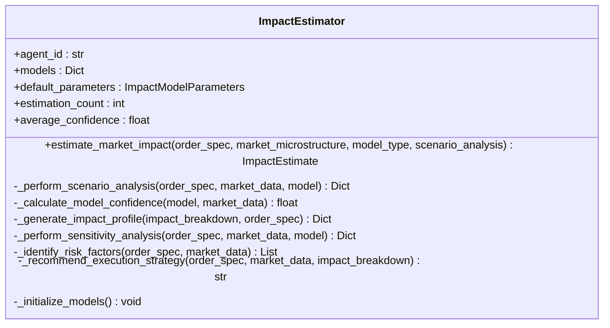
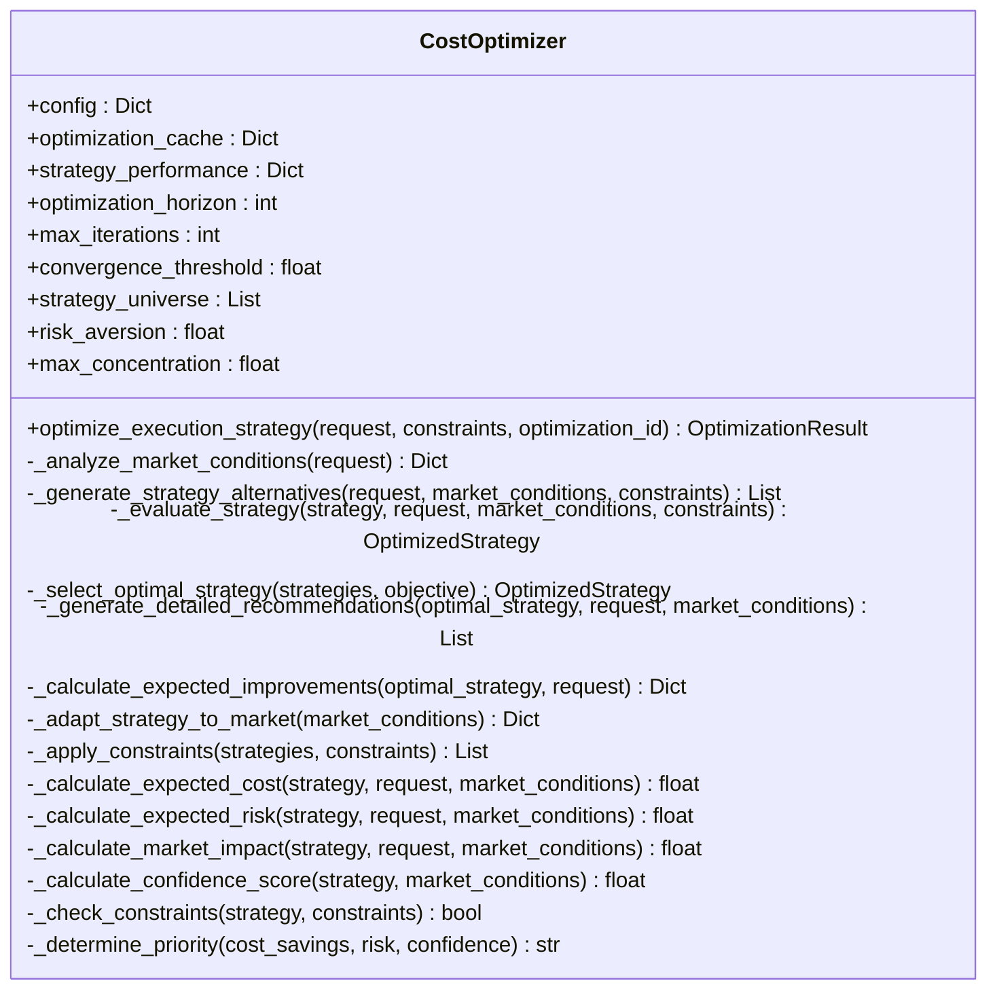
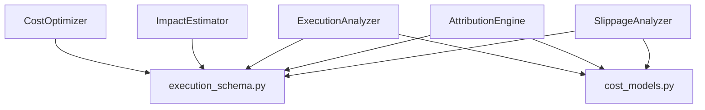

# Slippage Attribution

<cite>
**Referenced Files in This Document**
- [slippage_analyzer.py](file://FinAgents/agent_pools/transaction_cost_agent_pool/agents/post_trade/slippage_analyzer.py)
- [attribution_engine.py](file://FinAgents/agent_pools/transaction_cost_agent_pool/agents/post_trade/attribution_engine.py)
- [execution_analyzer.py](file://FinAgents/agent_pools/transaction_cost_agent_pool/agents/post_trade/execution_analyzer.py)
- [execution_schema.py](file://FinAgents/agent_pools/transaction_cost_agent_pool/schema/execution_schema.py)
- [cost_models.py](file://FinAgents/agent_pools/transaction_cost_agent_pool/schema/cost_models.py)
- [impact_estimator.py](file://FinAgents/agent_pools/transaction_cost_agent_pool/agents/pre_trade/impact_estimator.py)
- [cost_optimizer.py](file://FinAgents/agent_pools/transaction_cost_agent_pool/agents/optimization/cost_optimizer.py)
</cite>

## Table of Contents
1. [Introduction](#introduction)
2. [Project Structure](#project-structure)
3. [Core Components](#core-components)
4. [Architecture Overview](#architecture-overview)
5. [Detailed Component Analysis](#detailed-component-analysis)
6. [Dependency Analysis](#dependency-analysis)
7. [Performance Considerations](#performance-considerations)
8. [Troubleshooting Guide](#troubleshooting-guide)
9. [Conclusion](#conclusion)
10. [Appendices](#appendices)

## Introduction
This document provides comprehensive documentation for the slippage measurement and attribution systems within the agentic trading application. It explains slippage calculation methodologies, including realized versus expected slippage analysis, and details multi-dimensional slippage breakdown by symbol, venue, time period, and execution characteristics. It also covers statistical analysis techniques for slippage volatility measurement and pattern recognition, and provides implementation examples for historical slippage analysis, regression analysis of slippage drivers, and automated slippage monitoring systems. Guidance is included for setting slippage benchmarks, detecting outliers, and benchmarking performance against industry standards.

## Project Structure
The slippage and attribution capabilities are implemented as specialized agents within the transaction cost agent pool. The core components include:
- Post-trade slippage analyzer: computes realized slippage and identifies contributing factors.
- Attribution engine: decomposes transaction costs into attributable components and compares performance against benchmarks.
- Execution analyzer: evaluates execution quality and provides implementation shortfall analysis.
- Pre-trade impact estimator: predicts market impact to inform pre-trade expectations.
- Optimization agent: recommends strategies to minimize transaction costs and slippage.

**Diagram sources**
- [slippage_analyzer.py:39-146](file://FinAgents/agent_pools/transaction_cost_agent_pool/agents/post_trade/slippage_analyzer.py#L39-L146)
- [attribution_engine.py:61-185](file://FinAgents/agent_pools/transaction_cost_agent_pool/agents/post_trade/attribution_engine.py#L61-L185)
- [execution_analyzer.py:56-147](file://FinAgents/agent_pools/transaction_cost_agent_pool/agents/post_trade/execution_analyzer.py#L56-L147)
- [execution_schema.py:79-267](file://FinAgents/agent_pools/transaction_cost_agent_pool/schema/execution_schema.py#L79-L267)
- [cost_models.py:87-267](file://FinAgents/agent_pools/transaction_cost_agent_pool/schema/cost_models.py#L87-L267)

**Section sources**
- [slippage_analyzer.py:1-616](file://FinAgents/agent_pools/transaction_cost_agent_pool/agents/post_trade/slippage_analyzer.py#L1-L616)
- [attribution_engine.py:1-673](file://FinAgents/agent_pools/transaction_cost_agent_pool/agents/post_trade/attribution_engine.py#L1-L673)
- [execution_analyzer.py:1-559](file://FinAgents/agent_pools/transaction_cost_agent_pool/agents/post_trade/execution_analyzer.py#L1-L559)
- [execution_schema.py:1-444](file://FinAgents/agent_pools/transaction_cost_agent_pool/schema/execution_schema.py#L1-L444)
- [cost_models.py:1-406](file://FinAgents/agent_pools/transaction_cost_agent_pool/schema/cost_models.py#L1-L406)

## Core Components
- SlippageAnalyzer: Computes realized slippage, volatility, and multi-dimensional patterns; generates recommendations and identifies worst trades.
- AttributionEngine: Decomposes transaction costs into market impact, timing cost, commission/fees, venue selection, and order type impacts; compares to benchmarks.
- ExecutionAnalyzer: Calculates implementation shortfall, cost breakdown, and quality metrics; provides benchmark comparisons.
- ImpactEstimator: Predicts market impact using linear and square-root models; supports scenario and sensitivity analysis.
- CostOptimizer: Recommends optimal execution strategies to minimize costs and slippage under constraints.

**Section sources**
- [slippage_analyzer.py:39-146](file://FinAgents/agent_pools/transaction_cost_agent_pool/agents/post_trade/slippage_analyzer.py#L39-L146)
- [attribution_engine.py:61-185](file://FinAgents/agent_pools/transaction_cost_agent_pool/agents/post_trade/attribution_engine.py#L61-L185)
- [execution_analyzer.py:56-147](file://FinAgents/agent_pools/transaction_cost_agent_pool/agents/post_trade/execution_analyzer.py#L56-L147)
- [impact_estimator.py:325-461](file://FinAgents/agent_pools/transaction_cost_agent_pool/agents/pre_trade/impact_estimator.py#L325-L461)
- [cost_optimizer.py:65-175](file://FinAgents/agent_pools/transaction_cost_agent_pool/agents/optimization/cost_optimizer.py#L65-L175)

## Architecture Overview
The slippage and attribution pipeline integrates post-trade analysis with pre-trade impact estimation and optimization recommendations. The flow below illustrates how realized slippage is computed, cost components are attributed, and optimization suggestions are generated.

**Diagram sources**
- [slippage_analyzer.py:80-146](file://FinAgents/agent_pools/transaction_cost_agent_pool/agents/post_trade/slippage_analyzer.py#L80-L146)
- [attribution_engine.py:103-185](file://FinAgents/agent_pools/transaction_cost_agent_pool/agents/post_trade/attribution_engine.py#L103-L185)
- [execution_analyzer.py:89-147](file://FinAgents/agent_pools/transaction_cost_agent_pool/agents/post_trade/execution_analyzer.py#L89-L147)
- [impact_estimator.py:370-461](file://FinAgents/agent_pools/transaction_cost_agent_pool/agents/pre_trade/impact_estimator.py#L370-L461)
- [cost_optimizer.py:103-175](file://FinAgents/agent_pools/transaction_cost_agent_pool/agents/optimization/cost_optimizer.py#L103-L175)

## Detailed Component Analysis

### SlippageAnalyzer
The SlippageAnalyzer computes realized slippage from executed trades and provides multi-dimensional breakdowns and risk metrics. It supports:
- Realized slippage calculation using benchmark prices.
- Metrics: total, average, median, volatility, percentiles, value-weighted slippage, positive/negative slippage rates, extreme slippage rate.
- Patterns: by symbol, venue, time bucket, order type, volume percentile, side.
- Risk metrics: VaR, expected shortfall, skewness, kurtosis, tracking error.
- Recommendations: based on time-of-day, venue, order type, and volume effects.
- Worst trade identification.

**Diagram sources**
- [slippage_analyzer.py:39-146](file://FinAgents/agent_pools/transaction_cost_agent_pool/agents/post_trade/slippage_analyzer.py#L39-L146)
- [slippage_analyzer.py:22-37](file://FinAgents/agent_pools/transaction_cost_agent_pool/agents/post_trade/slippage_analyzer.py#L22-L37)

**Section sources**
- [slippage_analyzer.py:80-146](file://FinAgents/agent_pools/transaction_cost_agent_pool/agents/post_trade/slippage_analyzer.py#L80-L146)
- [slippage_analyzer.py:147-616](file://FinAgents/agent_pools/transaction_cost_agent_pool/agents/post_trade/slippage_analyzer.py#L147-L616)

### AttributionEngine
The AttributionEngine decomposes transaction costs into attributable components and compares performance against benchmarks:
- Cost decomposition: market impact, commission/fees, timing cost, venue selection, order type impact.
- Factor analysis: time-of-day, order size, venue, market conditions.
- Performance drivers: correlation analysis and significance thresholds.
- Benchmark comparison: industry average, best practice, venue-specific, recent vs. earlier periods.
- Risk attribution: cost volatility, timing risk, venue and size concentration, market impact tail risk, VaR.

**Diagram sources**
- [attribution_engine.py:61-185](file://FinAgents/agent_pools/transaction_cost_agent_pool/agents/post_trade/attribution_engine.py#L61-L185)
- [attribution_engine.py:46-59](file://FinAgents/agent_pools/transaction_cost_agent_pool/agents/post_trade/attribution_engine.py#L46-L59)

**Section sources**
- [attribution_engine.py:103-185](file://FinAgents/agent_pools/transaction_cost_agent_pool/agents/post_trade/attribution_engine.py#L103-L185)
- [attribution_engine.py:264-594](file://FinAgents/agent_pools/transaction_cost_agent_pool/agents/post_trade/attribution_engine.py#L264-L594)

### ExecutionAnalyzer
The ExecutionAnalyzer evaluates execution quality and provides implementation shortfall analysis:
- Quality metrics: implementation shortfall, market impact, timing cost, opportunity cost, average cost, cost volatility, fill rate, completion rate, quality score.
- Shortfall analysis: by symbol, venue, time period.
- Pattern analysis: temporal, venue, size, volatility patterns.
- Cost attribution: market impact, spread cost, commission, fees, timing cost; variance attribution and performance drivers.
- Benchmark comparison: industry benchmarks (TWAP, VWAP, Arrival) with percentile ranking.

**Diagram sources**
- [execution_analyzer.py:56-147](file://FinAgents/agent_pools/transaction_cost_agent_pool/agents/post_trade/execution_analyzer.py#L56-L147)
- [execution_analyzer.py:29-139](file://FinAgents/agent_pools/transaction_cost_agent_pool/agents/post_trade/execution_analyzer.py#L29-L139)

**Section sources**
- [execution_analyzer.py:89-147](file://FinAgents/agent_pools/transaction_cost_agent_pool/agents/post_trade/execution_analyzer.py#L89-L147)
- [execution_analyzer.py:148-559](file://FinAgents/agent_pools/transaction_cost_agent_pool/agents/post_trade/execution_analyzer.py#L148-L559)

### ImpactEstimator
The ImpactEstimator provides pre-trade market impact estimation using parametric models:
- Linear and square-root impact models with regime and time adjustments.
- Scenario analysis (best/worst case) and sensitivity analysis.
- Impact profile across time horizons (immediate, short-term, medium-term, long-term).
- Risk factors and recommended execution strategies.

**Diagram sources**
- [impact_estimator.py:325-461](file://FinAgents/agent_pools/transaction_cost_agent_pool/agents/pre_trade/impact_estimator.py#L325-L461)

**Section sources**
- [impact_estimator.py:370-461](file://FinAgents/agent_pools/transaction_cost_agent_pool/agents/pre_trade/impact_estimator.py#L370-L461)
- [impact_estimator.py:105-324](file://FinAgents/agent_pools/transaction_cost_agent_pool/agents/pre_trade/impact_estimator.py#L105-L324)

### CostOptimizer
The CostOptimizer recommends optimal execution strategies to minimize transaction costs and slippage:
- Strategy universe: TWAP, VWAP, POV, Implementation Shortfall, Adaptive.
- Evaluation: expected cost, risk, market impact, confidence.
- Constraints: cost, market impact, fill rate, venue/order-type restrictions.
- Recommendations: order-by-order execution guidance with confidence and special instructions.

**Diagram sources**
- [cost_optimizer.py:65-175](file://FinAgents/agent_pools/transaction_cost_agent_pool/agents/optimization/cost_optimizer.py#L65-L175)

**Section sources**
- [cost_optimizer.py:103-175](file://FinAgents/agent_pools/transaction_cost_agent_pool/agents/optimization/cost_optimizer.py#L103-L175)
- [cost_optimizer.py:207-303](file://FinAgents/agent_pools/transaction_cost_agent_pool/agents/optimization/cost_optimizer.py#L207-L303)

## Dependency Analysis
The slippage and attribution agents depend on shared schema models for trade execution and cost breakdowns. The data flow emphasizes:
- TradeExecution and related models define the input data structure for analysis.
- CostBreakdown and TransactionCost models support cost decomposition and attribution.
- ImpactEstimator and CostOptimizer integrate pre-trade and optimization perspectives.

**Diagram sources**
- [execution_schema.py:79-267](file://FinAgents/agent_pools/transaction_cost_agent_pool/schema/execution_schema.py#L79-L267)
- [cost_models.py:87-267](file://FinAgents/agent_pools/transaction_cost_agent_pool/schema/cost_models.py#L87-L267)
- [slippage_analyzer.py:15-16](file://FinAgents/agent_pools/transaction_cost_agent_pool/agents/post_trade/slippage_analyzer.py#L15-L16)
- [attribution_engine.py:16-17](file://FinAgents/agent_pools/transaction_cost_agent_pool/agents/post_trade/attribution_engine.py#L16-L17)
- [execution_analyzer.py:16-17](file://FinAgents/agent_pools/transaction_cost_agent_pool/agents/post_trade/execution_analyzer.py#L16-L17)

**Section sources**
- [execution_schema.py:1-444](file://FinAgents/agent_pools/transaction_cost_agent_pool/schema/execution_schema.py#L1-L444)
- [cost_models.py:1-406](file://FinAgents/agent_pools/transaction_cost_agent_pool/schema/cost_models.py#L1-L406)

## Performance Considerations
- SlippageAnalyzer leverages vectorized pandas operations for efficient computation of metrics and patterns across large datasets.
- AttributionEngine performs groupby aggregations and correlation computations; caching of market data improves repeated runs.
- ExecutionAnalyzer uses correlation analysis and aggregation to derive cost attribution and benchmark comparisons.
- ImpactEstimator’s scenario and sensitivity analyses add computational overhead; consider configurable sampling and confidence thresholds.
- CostOptimizer balances strategy generation and evaluation; iteration limits and convergence thresholds prevent excessive computation.

[No sources needed since this section provides general guidance]

## Troubleshooting Guide
Common issues and resolutions:
- Missing reference prices: SlippageAnalyzer falls back to benchmark price if reference prices are not provided.
- Empty or invalid execution data: All analyzers include validation and logging; ensure TradeExecution fields are populated.
- Low observation counts: AttributionEngine and ExecutionAnalyzer require sufficient observations; adjust min_observations and confidence thresholds.
- Outliers in slippage: SlippageAnalyzer flags extreme slippage events; use percentile thresholds and worst trade identification to investigate.
- Benchmark discrepancies: AttributionEngine and ExecutionAnalyzer compare against industry benchmarks; verify benchmark configurations and data completeness.

**Section sources**
- [slippage_analyzer.py:147-196](file://FinAgents/agent_pools/transaction_cost_agent_pool/agents/post_trade/slippage_analyzer.py#L147-L196)
- [attribution_engine.py:461-497](file://FinAgents/agent_pools/transaction_cost_agent_pool/agents/post_trade/attribution_engine.py#L461-L497)
- [execution_analyzer.py:418-469](file://FinAgents/agent_pools/transaction_cost_agent_pool/agents/post_trade/execution_analyzer.py#L418-L469)

## Conclusion
The slippage measurement and attribution system provides a comprehensive toolkit for analyzing realized slippage, decomposing transaction costs, and generating actionable recommendations. By combining post-trade analysis with pre-trade impact estimation and optimization strategies, the system enables continuous monitoring, benchmarking, and improvement of execution quality.

[No sources needed since this section summarizes without analyzing specific files]

## Appendices

### Implementation Examples

- Historical slippage analysis
  - Use SlippageAnalyzer.analyze_slippage with a list of TradeExecution objects to compute realized slippage metrics, patterns, and risk metrics.
  - Example invocation path: [slippage_analyzer.py:80-146](file://FinAgents/agent_pools/transaction_cost_agent_pool/agents/post_trade/slippage_analyzer.py#L80-L146)

- Regression analysis of slippage drivers
  - Correlation analysis is performed in SlippageAnalyzer._identify_contributing_factors and AttributionEngine._perform_factor_analysis to identify significant drivers.
  - Example paths:
    - [slippage_analyzer.py:323-384](file://FinAgents/agent_pools/transaction_cost_agent_pool/agents/post_trade/slippage_analyzer.py#L323-L384)
    - [attribution_engine.py:349-414](file://FinAgents/agent_pools/transaction_cost_agent_pool/agents/post_trade/attribution_engine.py#L349-L414)

- Automated slippage monitoring systems
  - Periodically run SlippageAnalyzer.analyze_slippage on recent executions and track volatility and extreme slippage rates.
  - Example paths:
    - [slippage_analyzer.py:198-234](file://FinAgents/agent_pools/transaction_cost_agent_pool/agents/post_trade/slippage_analyzer.py#L198-L234)
    - [slippage_analyzer.py:385-413](file://FinAgents/agent_pools/transaction_cost_agent_pool/agents/post_trade/slippage_analyzer.py#L385-L413)

- Slippage benchmark setting and performance benchmarking
  - Compare against industry averages and best practice benchmarks using AttributionEngine._compare_to_benchmarks and ExecutionAnalyzer._compare_to_benchmarks.
  - Example paths:
    - [attribution_engine.py:461-497](file://FinAgents/agent_pools/transaction_cost_agent_pool/agents/post_trade/attribution_engine.py#L461-L497)
    - [execution_analyzer.py:418-469](file://FinAgents/agent_pools/transaction_cost_agent_pool/agents/post_trade/execution_analyzer.py#L418-L469)

- Outlier detection
  - Use SlippageAnalyzer._categorize_slippage and extreme slippage rate thresholds to flag outliers; inspect worst trades via _identify_worst_trades.
  - Example paths:
    - [slippage_analyzer.py:525-537](file://FinAgents/agent_pools/transaction_cost_agent_pool/agents/post_trade/slippage_analyzer.py#L525-L537)
    - [slippage_analyzer.py:498-516](file://FinAgents/agent_pools/transaction_cost_agent_pool/agents/post_trade/slippage_analyzer.py#L498-L516)