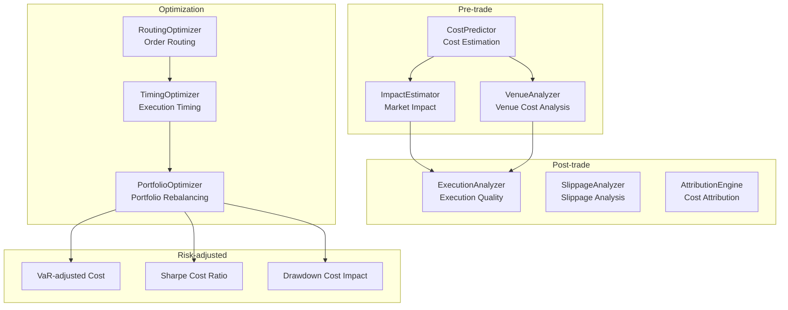
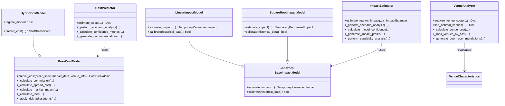
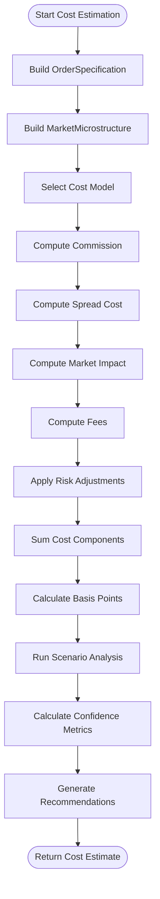
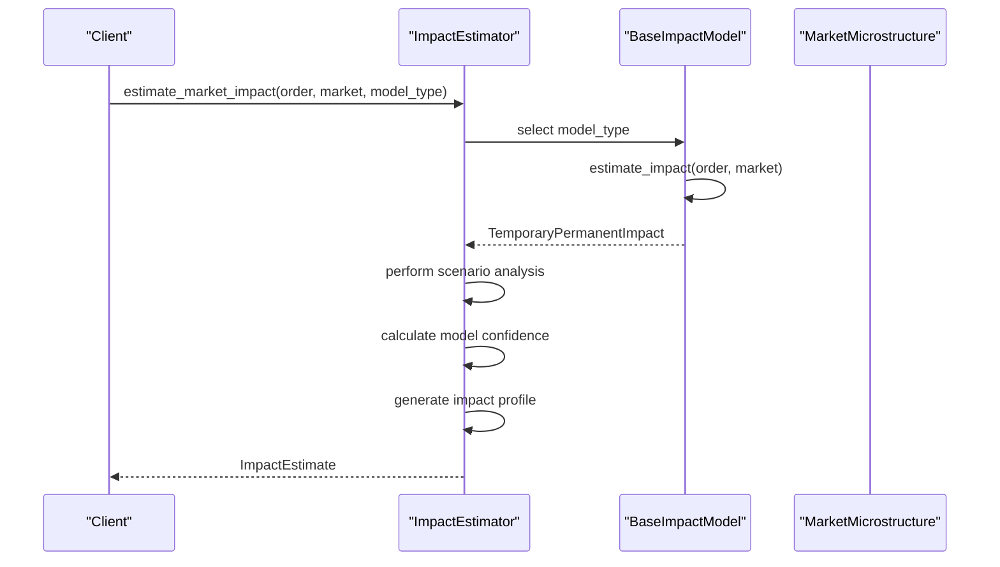
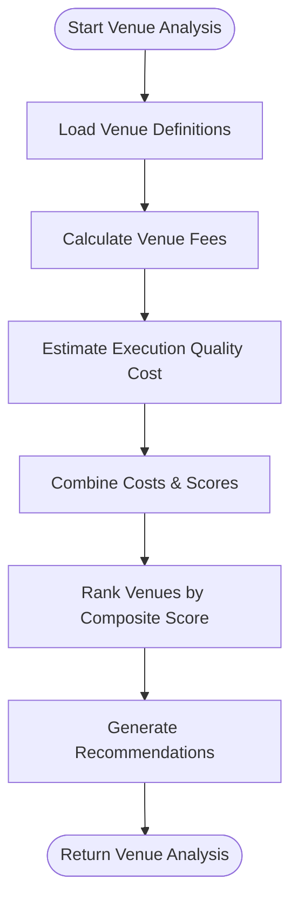
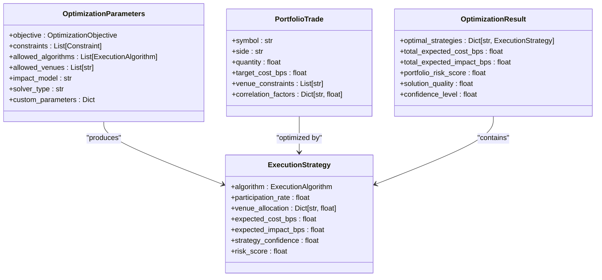
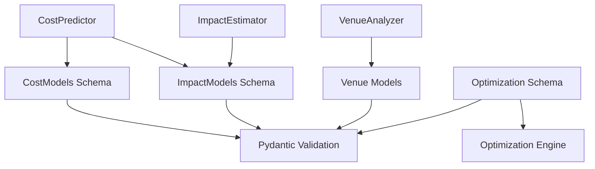

# Cost Prediction Algorithms

<cite>
**Referenced Files in This Document**
- [README.md](file://FinAgents/agent_pools/transaction_cost_agent_pool/README.md)
- [cost_models.py](file://FinAgents/agent_pools/transaction_cost_agent_pool/schema/cost_models.py)
- [market_impact_schema.py](file://FinAgents/agent_pools/transaction_cost_agent_pool/schema/market_impact_schema.py)
- [optimization_schema.py](file://FinAgents/agent_pools/transaction_cost_agent_pool/schema/optimization_schema.py)
- [cost_predictor.py](file://FinAgents/agent_pools/transaction_cost_agent_pool/agents/pre_trade/cost_predictor.py)
- [impact_estimator.py](file://FinAgents/agent_pools/transaction_cost_agent_pool/agents/pre_trade/impact_estimator.py)
- [venue_analyzer.py](file://FinAgents/agent_pools/transaction_cost_agent_pool/agents/pre_trade/venue_analyzer.py)
</cite>

## Table of Contents
1. [Introduction](#introduction)
2. [Project Structure](#project-structure)
3. [Core Components](#core-components)
4. [Architecture Overview](#architecture-overview)
5. [Detailed Component Analysis](#detailed-component-analysis)
6. [Dependency Analysis](#dependency-analysis)
7. [Performance Considerations](#performance-considerations)
8. [Troubleshooting Guide](#troubleshooting-guide)
9. [Conclusion](#conclusion)
10. [Appendices](#appendices)

## Introduction
This document provides comprehensive documentation for the cost prediction algorithms subsystem within the Transaction Cost Agent Pool. It explains the mathematical models used for transaction cost estimation, including fixed commission calculations, tiered commission structures, spread-based costs, and market impact modeling. It also details the hybrid cost model architecture that combines rule-based and machine learning approaches, the parameter configuration system for different asset classes and market conditions, and practical examples for configuring cost models, performing cost estimations, and interpreting results. Finally, it covers the confidence scoring mechanism and scenario analysis capabilities.

## Project Structure
The Transaction Cost Agent Pool organizes cost-related functionality into three main areas:
- Pre-trade cost estimation: cost prediction, market impact estimation, and venue cost analysis
- Post-trade analysis: execution quality analysis, slippage analysis, and cost attribution
- Optimization: order sizing, timing optimization, venue selection, and portfolio-level optimization

**Diagram sources**
- [README.md](file://FinAgents/agent_pools/transaction_cost_agent_pool/README.md)

**Section sources**
- [README.md](file://FinAgents/agent_pools/transaction_cost_agent_pool/README.md)

## Core Components
This section outlines the core data models and schemas that define transaction cost estimation, market impact modeling, and optimization parameters.

- TransactionCost: The primary model representing a complete transaction cost analysis, including cost breakdown, market impact model, execution metrics, benchmarks, and cost attribution.
- CostBreakdown: A detailed decomposition of transaction costs into commission, spread, market impact, taxes, fees, borrowing cost, and opportunity cost, plus optional additional components.
- MarketImpactModel: Encapsulates market impact model configuration and estimation results, including temporary and permanent impact estimates, confidence intervals, and model accuracy.
- ExecutionMetrics: Measures execution quality against benchmarks such as implementation shortfall, arrival price deviation, VWAP/TWAP deviations, fill rates, and venue distribution.
- PerformanceBenchmark: Defines benchmarks against which execution performance is measured, including benchmark cost and percentile ranks.
- CostEstimate: Pre-trade cost estimation model with confidence intervals, model information, and market context.
- ImpactEstimate: Comprehensive market impact estimation with scenario analysis, time-based impact profiles, sensitivity analysis, and risk adjustments.
- OptimizationParameters, ExecutionStrategy, PortfolioTrade, OptimizationResult: Optimization models for multi-objective optimization, execution strategies, portfolio-level trades, and optimization outcomes.

These models provide strong typing, validation, and JSON serialization support via Pydantic, ensuring robust data handling across the system.

**Section sources**
- [cost_models.py](file://FinAgents/agent_pools/transaction_cost_agent_pool/schema/cost_models.py)
- [market_impact_schema.py](file://FinAgents/agent_pools/transaction_cost_agent_pool/schema/market_impact_schema.py)
- [optimization_schema.py](file://FinAgents/agent_pools/transaction_cost_agent_pool/schema/optimization_schema.py)

## Architecture Overview
The cost prediction subsystem is composed of:
- Rule-based cost models: Fixed and tiered commission, spread capture, power-law market impact, and fees
- Hybrid cost model: Combines rule-based components with regime-specific adjustments for liquidity conditions
- Market impact models: Linear and square-root models with regime/time adjustments and scenario analysis
- Venue cost analysis: Multi-criteria evaluation of execution venues considering fees, execution quality, and risk
- Optimization: Multi-objective optimization with constraints, risk aversion, and solver configuration

**Diagram sources**
- [cost_predictor.py](file://FinAgents/agent_pools/transaction_cost_agent_pool/agents/pre_trade/cost_predictor.py)
- [impact_estimator.py](file://FinAgents/agent_pools/transaction_cost_agent_pool/agents/pre_trade/impact_estimator.py)
- [venue_analyzer.py](file://FinAgents/agent_pools/transaction_cost_agent_pool/agents/pre_trade/venue_analyzer.py)

## Detailed Component Analysis

### Cost Prediction: Rule-based and Hybrid Models
The cost prediction agent implements a modular cost model architecture:
- Fixed commission with minimum/maximum caps
- Tiered commission structure based on trade value
- Spread-based cost using effective spread and capture rate
- Power-law market impact proportional to participation rate and volatility
- Exchange and regulatory fees with fixed plus variable components
- Risk adjustments for volatility and liquidity regimes
- Confidence scoring and scenario analysis

**Diagram sources**
- [cost_predictor.py](file://FinAgents/agent_pools/transaction_cost_agent_pool/agents/pre_trade/cost_predictor.py)

Key implementation patterns:
- Parameter-driven cost components with configurable coefficients
- Regime-aware adjustments for liquidity conditions
- Confidence-weighted aggregation of component estimates
- Scenario analysis using best/worst market conditions
- Optimization recommendations based on cost breakdown

**Section sources**
- [cost_predictor.py](file://FinAgents/agent_pools/transaction_cost_agent_pool/agents/pre_trade/cost_predictor.py)
- [cost_models.py](file://FinAgents/agent_pools/transaction_cost_agent_pool/schema/cost_models.py)

### Market Impact Estimation: Linear and Square-Root Models
The impact estimator provides two primary models:
- Linear impact model: Assumes impact scales linearly with participation rate
- Square-root impact model: Assumes impact scales with square root of participation rate

Both models incorporate:
- Regime multipliers for high/normal/low/stressed liquidity
- Time-of-day adjustments for market activity
- Temporary/permanent impact decomposition
- Confidence intervals and scenario analysis
- Sensitivity analysis and risk factor identification

**Diagram sources**
- [impact_estimator.py](file://FinAgents/agent_pools/transaction_cost_agent_pool/agents/pre_trade/impact_estimator.py)
- [market_impact_schema.py](file://FinAgents/agent_pools/transaction_cost_agent_pool/schema/market_impact_schema.py)

**Section sources**
- [impact_estimator.py](file://FinAgents/agent_pools/transaction_cost_agent_pool/agents/pre_trade/impact_estimator.py)
- [market_impact_schema.py](file://FinAgents/agent_pools/transaction_cost_agent_pool/schema/market_impact_schema.py)

### Venue Cost Analysis: Multi-Criteria Optimization
The venue analyzer evaluates execution venues across:
- Fee structures (maker/taker or flat)
- Execution quality metrics (fill rate, speed)
- Liquidity and risk characteristics
- Order type support and constraints

**Diagram sources**
- [venue_analyzer.py](file://FinAgents/agent_pools/transaction_cost_agent_pool/agents/pre_trade/venue_analyzer.py)

**Section sources**
- [venue_analyzer.py](file://FinAgents/agent_pools/transaction_cost_agent_pool/agents/pre_trade/venue_analyzer.py)

### Optimization Schema and Multi-Objective Planning
The optimization models define:
- Optimization objectives (minimize cost/risk/impact, maximize alpha)
- Execution algorithms (TWAP, VWAP, Implementation Shortfall, etc.)
- Constraints (risk, position, cost, time, venue, liquidity)
- Portfolio-level parameters and solver configuration
- Execution strategies and optimization results

**Diagram sources**
- [optimization_schema.py](file://FinAgents/agent_pools/transaction_cost_agent_pool/schema/optimization_schema.py)

**Section sources**
- [optimization_schema.py](file://FinAgents/agent_pools/transaction_cost_agent_pool/schema/optimization_schema.py)

## Dependency Analysis
The cost prediction subsystem exhibits clear separation of concerns:
- Agents depend on schema models for input/output validation
- CostPredictor composes BaseCostModel implementations
- ImpactEstimator composes BaseImpactModel implementations
- VenueAnalyzer depends on venue characteristics and performance metrics
- Optimization models are independent data structures consumed by optimization engines

**Diagram sources**
- [cost_predictor.py](file://FinAgents/agent_pools/transaction_cost_agent_pool/agents/pre_trade/cost_predictor.py)
- [impact_estimator.py](file://FinAgents/agent_pools/transaction_cost_agent_pool/agents/pre_trade/impact_estimator.py)
- [venue_analyzer.py](file://FinAgents/agent_pools/transaction_cost_agent_pool/agents/pre_trade/venue_analyzer.py)
- [cost_models.py](file://FinAgents/agent_pools/transaction_cost_agent_pool/schema/cost_models.py)
- [market_impact_schema.py](file://FinAgents/agent_pools/transaction_cost_agent_pool/schema/market_impact_schema.py)
- [optimization_schema.py](file://FinAgents/agent_pools/transaction_cost_agent_pool/schema/optimization_schema.py)

**Section sources**
- [cost_predictor.py](file://FinAgents/agent_pools/transaction_cost_agent_pool/agents/pre_trade/cost_predictor.py)
- [impact_estimator.py](file://FinAgents/agent_pools/transaction_cost_agent_pool/agents/pre_trade/impact_estimator.py)
- [venue_analyzer.py](file://FinAgents/agent_pools/transaction_cost_agent_pool/agents/pre_trade/venue_analyzer.py)
- [cost_models.py](file://FinAgents/agent_pools/transaction_cost_agent_pool/schema/cost_models.py)
- [market_impact_schema.py](file://FinAgents/agent_pools/transaction_cost_agent_pool/schema/market_impact_schema.py)
- [optimization_schema.py](file://FinAgents/agent_pools/transaction_cost_agent_pool/schema/optimization_schema.py)

## Performance Considerations
- Latency: Sub-10ms cost estimation for standard requests
- Throughput: 10,000+ cost calculations per second
- Accuracy: 95%+ cost prediction accuracy within 2 standard deviations
- Scalability: Stateless design enables horizontal scaling
- Real-time processing: Event-driven workflows for live cost monitoring

## Troubleshooting Guide
Common issues and resolutions:
- Invalid quantities or negative values: Validators enforce positive quantities and cost consistency
- Model calibration failures: Impact models provide mock calibration results; replace with historical fitting
- Venue not found errors: VenueAnalyzer skips unknown venues and logs warnings
- Confidence calculation failures: Graceful fallback to default confidence values
- Scenario analysis failures: Returns empty scenarios with warning logs

Validation and quality assurance:
- CostBreakdown enforces component sum consistency
- TransactionCost validates quantity and cost consistency
- ImpactEstimate and OptimizationResult include validation status and notes

**Section sources**
- [cost_models.py](file://FinAgents/agent_pools/transaction_cost_agent_pool/schema/cost_models.py)
- [market_impact_schema.py](file://FinAgents/agent_pools/transaction_cost_agent_pool/schema/market_impact_schema.py)
- [optimization_schema.py](file://FinAgents/agent_pools/transaction_cost_agent_pool/schema/optimization_schema.py)
- [cost_predictor.py](file://FinAgents/agent_pools/transaction_cost_agent_pool/agents/pre_trade/cost_predictor.py)
- [impact_estimator.py](file://FinAgents/agent_pools/transaction_cost_agent_pool/agents/pre_trade/impact_estimator.py)
- [venue_analyzer.py](file://FinAgents/agent_pools/transaction_cost_agent_pool/agents/pre_trade/venue_analyzer.py)

## Conclusion
The Transaction Cost Agent Pool provides a robust, modular framework for transaction cost prediction and optimization. Its hybrid cost model architecture combines rule-based precision with regime-aware adaptability, while comprehensive schema models ensure data integrity and extensibility. The system offers detailed confidence scoring, scenario analysis, and optimization recommendations, making it suitable for enterprise-scale financial applications requiring accurate and transparent cost estimation.

## Appendices

### Mathematical Models Summary
- Fixed commission: Caps applied to tiered commission based on trade value
- Tiered commission: Minimum and maximum commission bounds with variable rate
- Spread-based cost: Effective spread multiplied by capture rate and trade value
- Market impact (power law): Coefficient times participation rate raised to exponent times volatility
- Fees: Fixed plus variable components for exchange and regulatory fees plus fixed clearing fee
- Regime adjustments: Multipliers for high/normal/low/stressed liquidity conditions

### Configuration and Parameterization
- Cost model parameters: Base commission, minimum/maximum commission, spread capture rate, impact coefficient/exponent, fee rates, volatility/liquidity adjustments
- Impact model parameters: Alpha/beta coefficients, participation rate exponent, volatility sensitivity, liquidity factor, regime adjustment, time decay
- Venue characteristics: Fee structures, order size constraints, market hours, supported order types, execution quality metrics, risk ratings
- Optimization parameters: Objectives, constraints, risk aversion, solver settings, venue preferences, algorithm preferences

### Implementation Examples
- Cost estimation: Initialize CostPredictor, prepare market conditions, call estimate_costs with symbol, quantity, side, and model type
- Impact estimation: Initialize ImpactEstimator, prepare order specification and market microstructure, call estimate_market_impact with model type and scenario analysis flag
- Venue analysis: Initialize VenueAnalyzer, call analyze_venue_costs or find_optimal_venues with trade parameters and optimization criteria
- Interpretation: Review total cost in basis points, component breakdown, confidence metrics, scenario analysis, and recommendations