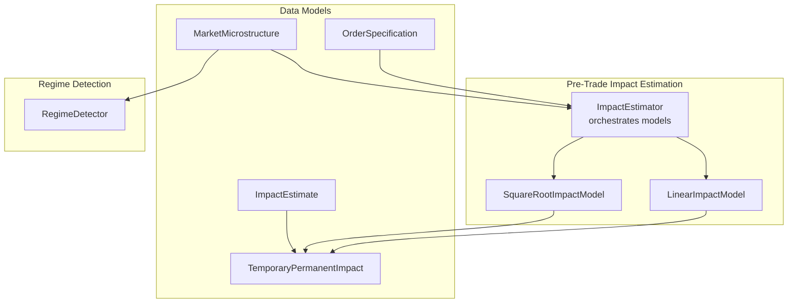
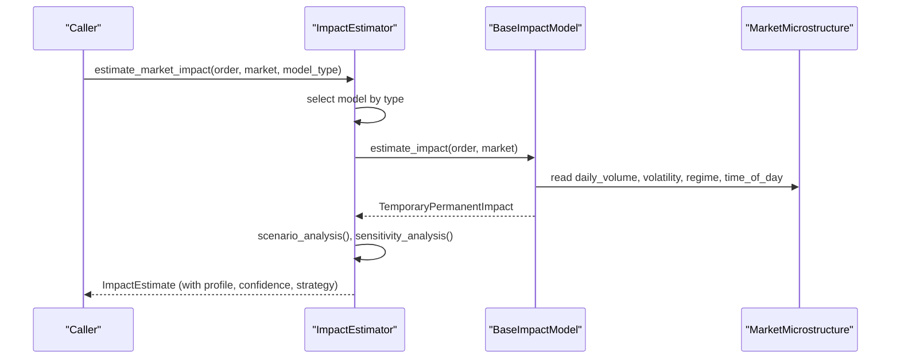
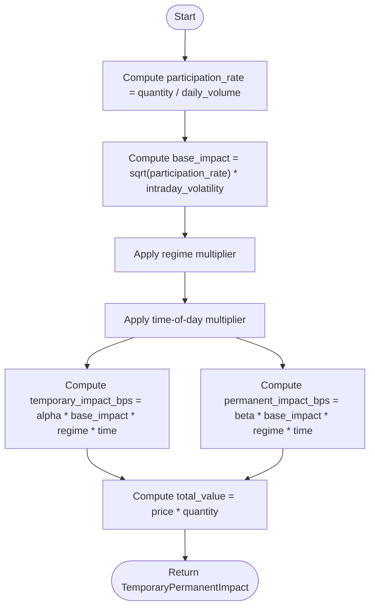
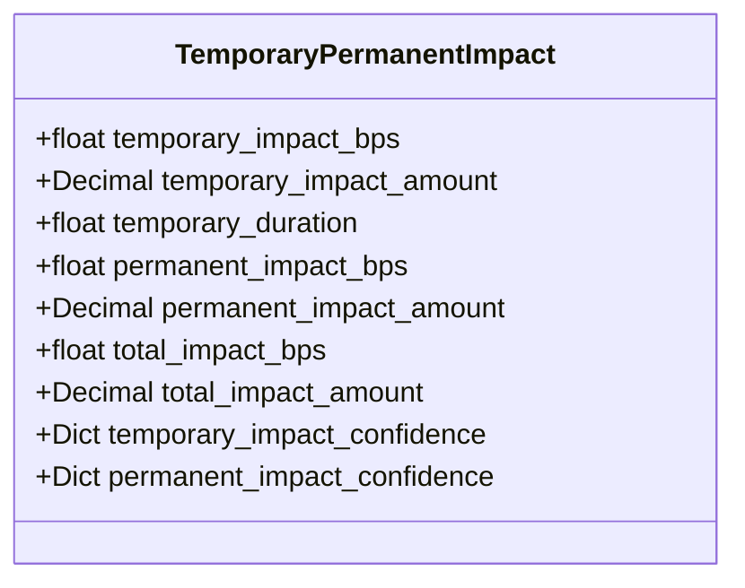
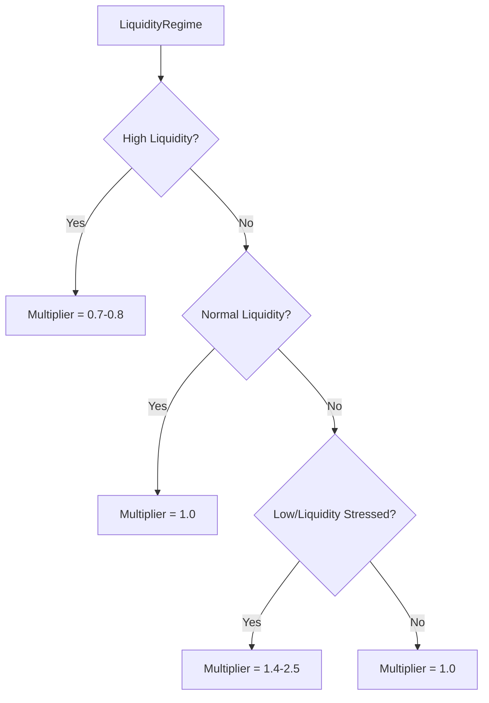
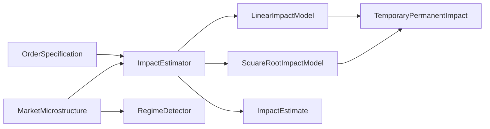
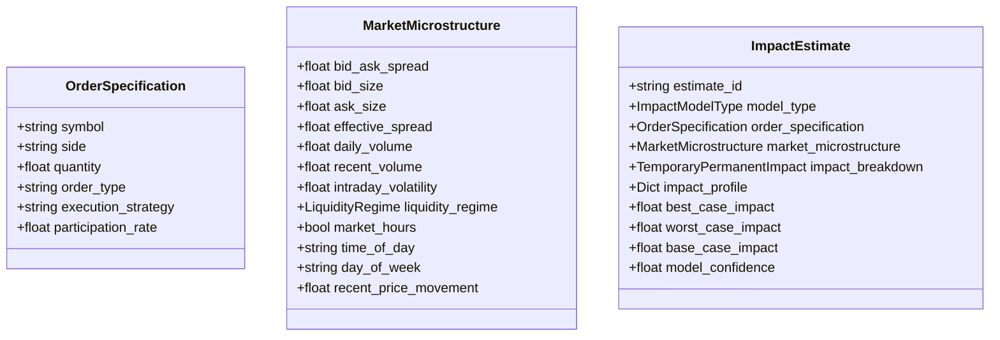

# Market Impact Estimation

<cite>
**Referenced Files in This Document**
- [impact_estimator.py](file://FinAgents/agent_pools/transaction_cost_agent_pool/agents/pre_trade/impact_estimator.py)
- [market_impact_schema.py](file://FinAgents/agent_pools/transaction_cost_agent_pool/schema/market_impact_schema.py)
- [cost_models.py](file://FinAgents/agent_pools/transaction_cost_agent_pool/schema/cost_models.py)
- [regime_detector.py](file://backend/market/regime_detector.py)
- [transaction_cost_model.py](file://backend/risk/transaction_cost_model.py)
- [timing_optimizer.py](file://FinAgents/agent_pools/transaction_cost_agent_pool/agents/optimization/timing_optimizer.py)
</cite>

## Table of Contents
1. [Introduction](#introduction)
2. [Project Structure](#project-structure)
3. [Core Components](#core-components)
4. [Architecture Overview](#architecture-overview)
5. [Detailed Component Analysis](#detailed-component-analysis)
6. [Dependency Analysis](#dependency-analysis)
7. [Performance Considerations](#performance-considerations)
8. [Troubleshooting Guide](#troubleshooting-guide)
9. [Conclusion](#conclusion)
10. [Appendices](#appendices)

## Introduction
This document explains market impact estimation techniques implemented in the system, focusing on the power law and square-root models for calculating market impact costs based on participation rates and order size relative to daily volume. It details the relationship between order magnitude and price movement effects, intraday volatility considerations, and how liquidity regime detection influences impact predictions. Practical examples illustrate impact estimation under varying order sizes and market conditions, and guidance is provided on interpreting impact costs and incorporating them into trading decisions.

## Project Structure
The market impact estimation capability spans three main areas:
- Pre-trade impact estimation agents that compute temporary and permanent impact using multiple models
- Data models that define the structure of market microstructure, order specifications, and impact estimates
- Market regime detection that informs liquidity conditions and adjusts impact predictions

**Diagram sources**
- [impact_estimator.py:325-460](file://FinAgents/agent_pools/transaction_cost_agent_pool/agents/pre_trade/impact_estimator.py#L325-L460)
- [market_impact_schema.py:45-122](file://FinAgents/agent_pools/transaction_cost_agent_pool/schema/market_impact_schema.py#L45-L122)
- [regime_detector.py:101-266](file://backend/market/regime_detector.py#L101-L266)

**Section sources**
- [impact_estimator.py:1-100](file://FinAgents/agent_pools/transaction_cost_agent_pool/agents/pre_trade/impact_estimator.py#L1-L100)
- [market_impact_schema.py:1-60](file://FinAgents/agent_pools/transaction_cost_agent_pool/schema/market_impact_schema.py#L1-L60)

## Core Components
- ImpactEstimator: Orchestrates multiple impact models, performs scenario and sensitivity analyses, generates time-based impact profiles, and recommends execution strategies.
- LinearImpactModel and SquareRootImpactModel: Implement two core impact formulations—linear in participation rate and square-root in participation rate—incorporating intraday volatility, liquidity regime, and time-of-day adjustments.
- MarketMicrostructure and OrderSpecification: Provide the contextual data required for impact estimation, including daily volume, intraday volatility, liquidity regime, and timing factors.
- ImpactEstimate and TemporaryPermanentImpact: Define the structured output of impact estimation, including temporary and permanent components, confidence intervals, and time horizons.

**Section sources**
- [impact_estimator.py:105-324](file://FinAgents/agent_pools/transaction_cost_agent_pool/agents/pre_trade/impact_estimator.py#L105-L324)
- [market_impact_schema.py:45-158](file://FinAgents/agent_pools/transaction_cost_agent_pool/schema/market_impact_schema.py#L45-L158)

## Architecture Overview
The impact estimation pipeline integrates order and market context with model-specific computations to produce comprehensive impact estimates with confidence and scenario analysis.

**Diagram sources**
- [impact_estimator.py:370-460](file://FinAgents/agent_pools/transaction_cost_agent_pool/agents/pre_trade/impact_estimator.py#L370-L460)
- [impact_estimator.py:221-283](file://FinAgents/agent_pools/transaction_cost_agent_pool/agents/pre_trade/impact_estimator.py#L221-L283)

## Detailed Component Analysis

### Power Law Model for Market Impact Costs
The power law formulation relates market impact to the order size relative to daily volume raised to an exponent, modulated by intraday volatility. This is implemented conceptually in the cost predictor agent and aligns with the square-root model’s participation-rate dependence.

Key elements:
- Participation rate: order quantity divided by daily volume
- Impact scaling: proportional to (participation_rate ^ exponent) × intraday_volatility
- Amount conversion: multiply by total value (price × quantity)

Practical implications:
- Larger orders (higher participation rate) incur disproportionately higher impact due to the exponent
- Higher intraday volatility amplifies impact costs

Integration points:
- Used in pre-trade cost prediction and as a conceptual basis for square-root impact models

**Section sources**
- [cost_predictor.py:225-256](file://FinAgents/agent_pools/transaction_cost_agent_pool/agents/pre_trade/cost_predictor.py#L225-L256)

### Square-Root Impact Model
The square-root model captures the canonical relationship where impact grows proportionally to the square root of the participation rate, reflecting diminishing marginal impact as order size increases.

Core computation:
- Participation rate = order quantity / daily volume
- Base impact = sqrt(participation_rate) × intraday_volatility
- Temporary and permanent impacts derived from base impact with alpha and beta coefficients
- Regime multiplier and time-of-day multiplier adjust for liquidity conditions and intraday patterns

**Diagram sources**
- [impact_estimator.py:221-283](file://FinAgents/agent_pools/transaction_cost_agent_pool/agents/pre_trade/impact_estimator.py#L221-L283)

**Section sources**
- [impact_estimator.py:210-324](file://FinAgents/agent_pools/transaction_cost_agent_pool/agents/pre_trade/impact_estimator.py#L210-L324)

### Linear Impact Model
The linear model assumes a direct proportionality between impact and participation rate, suitable for smaller orders and liquid markets.

Highlights:
- Base impact = participation_rate × intraday_volatility
- Temporary and permanent impacts computed similarly to square-root model with different coefficients
- Regime multipliers vary by liquidity regime

**Section sources**
- [impact_estimator.py:105-209](file://FinAgents/agent_pools/transaction_cost_agent_pool/agents/pre_trade/impact_estimator.py#L105-L209)

### Temporary vs Permanent Impact Decomposition
Both models decompose impact into:
- Temporary impact: recovers over time; modeled with decay duration
- Permanent impact: reflects price discovery; persists long-term
- Total impact equals the sum of temporary and permanent components

**Diagram sources**
- [market_impact_schema.py:123-164](file://FinAgents/agent_pools/transaction_cost_agent_pool/schema/market_impact_schema.py#L123-L164)

**Section sources**
- [market_impact_schema.py:123-164](file://FinAgents/agent_pools/transaction_cost_agent_pool/schema/market_impact_schema.py#L123-L164)

### Intraday Volatility and Time Effects
Models incorporate:
- Intraday volatility: multiplies base impact
- Time-of-day adjustments: higher impact during market open/close
- Decay time estimation: reflects how quickly temporary impact dissipates

**Section sources**
- [impact_estimator.py:310-323](file://FinAgents/agent_pools/transaction_cost_agent_pool/agents/pre_trade/impact_estimator.py#L310-L323)

### Liquidity Regime Integration
ImpactEstimator reads the current liquidity regime and applies multipliers:
- High liquidity: reduces impact
- Normal liquidity: baseline
- Low liquidity and stressed liquidity: increase impact

**Diagram sources**
- [impact_estimator.py:194-202](file://FinAgents/agent_pools/transaction_cost_agent_pool/agents/pre_trade/impact_estimator.py#L194-L202)
- [impact_estimator.py:300-308](file://FinAgents/agent_pools/transaction_cost_agent_pool/agents/pre_trade/impact_estimator.py#L300-L308)

**Section sources**
- [impact_estimator.py:194-202](file://FinAgents/agent_pools/transaction_cost_agent_pool/agents/pre_trade/impact_estimator.py#L194-L202)
- [impact_estimator.py:300-308](file://FinAgents/agent_pools/transaction_cost_agent_pool/agents/pre_trade/impact_estimator.py#L300-L308)

### Market Regime Detector Influence
While the impact estimator uses a liquidity regime enum, the broader RegimeDetector class classifies market regimes (e.g., bull, bear, high/low volatility) and provides confidence and recommendations. These insights inform whether to expect elevated volatility or liquidity stress, indirectly guiding interpretation of impact estimates.

**Section sources**
- [regime_detector.py:57-71](file://backend/market/regime_detector.py#L57-L71)
- [regime_detector.py:160-266](file://backend/market/regime_detector.py#L160-L266)

### Impact Estimation Examples
Below are example scenarios illustrating how impact varies with order size and market conditions. Replace placeholder values with actual market data to compute estimates.

- Small order in normal liquidity:
  - Daily volume: 75,000,000
  - Order quantity: 50,000
  - Intraday volatility: 0.25
  - Liquidity regime: Normal
  - Time of day: Midday
  - Expected: Lower participation rate → modest temporary and permanent impact

- Large order in stressed liquidity:
  - Daily volume: 75,000,000
  - Order quantity: 20,000,000
  - Intraday volatility: 0.30
  - Liquidity regime: Stressed
  - Time of day: Close
  - Expected: High participation rate and adverse regime/time → elevated total impact

- High-volatility environment:
  - Same order size as above
  - Intraday volatility: 0.40
  - Liquidity regime: Normal
  - Expected: Elevated impact due to higher volatility multiplier

Interpretation tips:
- Compare base-case impact to best/worst scenarios to assess downside risk
- Use time-based impact profile to anticipate recovery of temporary impact
- Incorporate confidence intervals to gauge estimation reliability

**Section sources**
- [impact_estimator.py:462-491](file://FinAgents/agent_pools/transaction_cost_agent_pool/agents/pre_trade/impact_estimator.py#L462-L491)
- [impact_estimator.py:525-556](file://FinAgents/agent_pools/transaction_cost_agent_pool/agents/pre_trade/impact_estimator.py#L525-L556)

### Integration with Execution Decisions
- Strategy recommendation: Based on participation rate, the estimator suggests conservative market orders for small participation, TWAP/VWAP strategies for moderate participation, and implementation shortfall strategies for large orders.
- Timing optimizer: Considers intraday volatility and market impact patterns to prioritize optimal execution windows.

**Section sources**
- [impact_estimator.py:624-645](file://FinAgents/agent_pools/transaction_cost_agent_pool/agents/pre_trade/impact_estimator.py#L624-L645)
- [timing_optimizer.py:313-338](file://FinAgents/agent_pools/transaction_cost_agent_pool/agents/optimization/timing_optimizer.py#L313-L338)

## Dependency Analysis
The impact estimation system relies on:
- OrderSpecification and MarketMicrostructure for input context
- BaseImpactModel subclasses for computation
- ImpactEstimate for structured output
- RegimeDetector for macro-level market regime classification

**Diagram sources**
- [impact_estimator.py:325-460](file://FinAgents/agent_pools/transaction_cost_agent_pool/agents/pre_trade/impact_estimator.py#L325-L460)
- [market_impact_schema.py:45-122](file://FinAgents/agent_pools/transaction_cost_agent_pool/schema/market_impact_schema.py#L45-L122)
- [regime_detector.py:101-266](file://backend/market/regime_detector.py#L101-L266)

**Section sources**
- [impact_estimator.py:325-460](file://FinAgents/agent_pools/transaction_cost_agent_pool/agents/pre_trade/impact_estimator.py#L325-L460)
- [market_impact_schema.py:165-233](file://FinAgents/agent_pools/transaction_cost_agent_pool/schema/market_impact_schema.py#L165-L233)
- [regime_detector.py:101-266](file://backend/market/regime_detector.py#L101-L266)

## Performance Considerations
- Computational efficiency: Square-root model introduces a square-root term and time-of-day adjustments; linear model is simpler and faster.
- Confidence and scenario analysis: Adds overhead but improves robustness; disable for high-frequency, low-latency contexts.
- Regime multipliers: Applying multipliers is constant-time; ensure regime classification updates are cached if called frequently.

## Troubleshooting Guide
Common issues and resolutions:
- Invalid participation rate or zero daily volume: Ensure daily_volume is positive; validate order quantity and daily volume inputs.
- Excessively high impact estimates: Check intraday_volatility and liquidity regime; confirm time-of-day multiplier is appropriate.
- Model confidence anomalies: Review model calibration_r2 and market hours flag; adjust base confidence accordingly.
- Unexpected strategy recommendations: Verify participation rate thresholds and order side; confirm market hours and regime flags.

**Section sources**
- [impact_estimator.py:492-524](file://FinAgents/agent_pools/transaction_cost_agent_pool/agents/pre_trade/impact_estimator.py#L492-L524)
- [impact_estimator.py:593-622](file://FinAgents/agent_pools/transaction_cost_agent_pool/agents/pre_trade/impact_estimator.py#L593-L622)

## Conclusion
The system provides robust, multi-model market impact estimation grounded in participation rate and intraday volatility, with regime-aware adjustments and time-of-day considerations. By combining temporary and permanent impact decomposition, scenario analysis, and execution strategy recommendations, traders can make informed decisions that incorporate realistic impact costs into their trading plans.

## Appendices

### Data Models Overview

**Diagram sources**
- [market_impact_schema.py:45-122](file://FinAgents/agent_pools/transaction_cost_agent_pool/schema/market_impact_schema.py#L45-L122)
- [market_impact_schema.py:165-233](file://FinAgents/agent_pools/transaction_cost_agent_pool/schema/market_impact_schema.py#L165-L233)