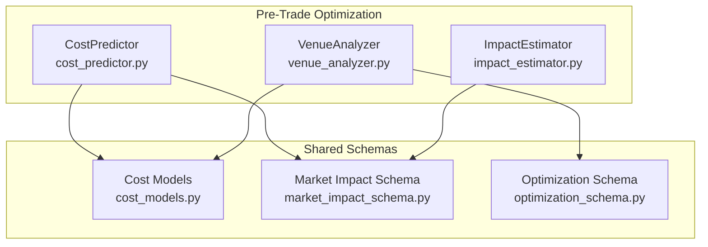
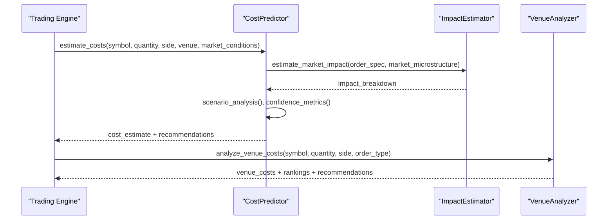
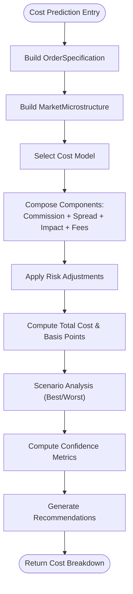
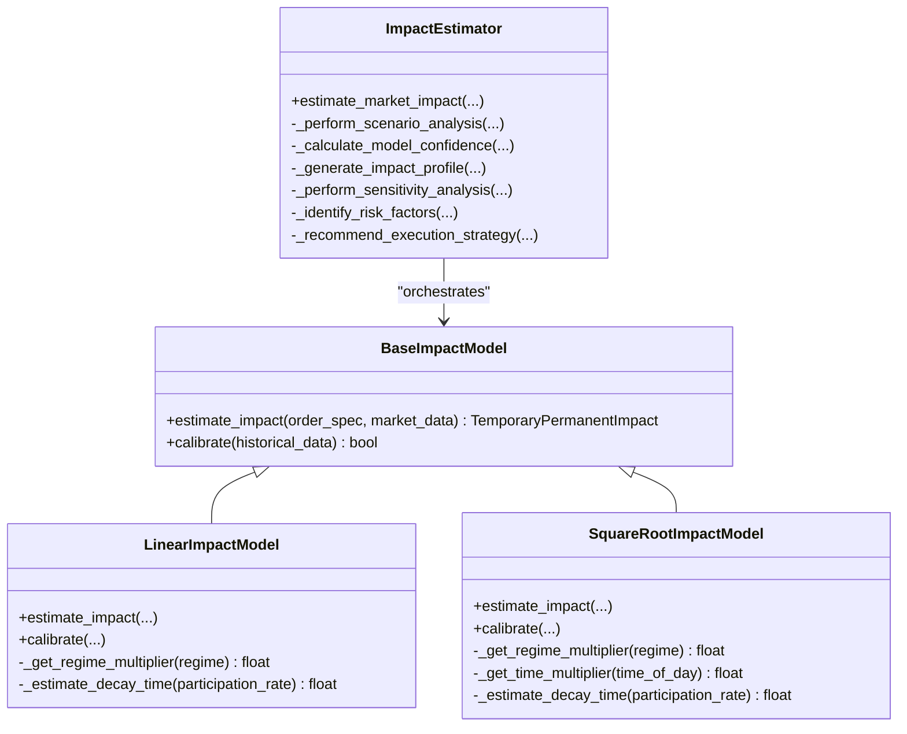
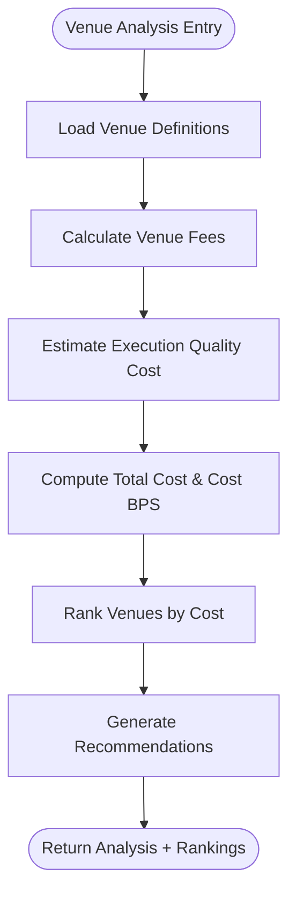
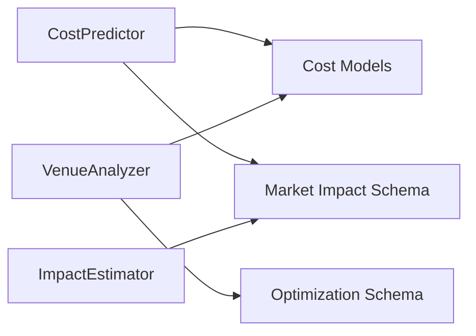

# Pre-Trade Optimization

<cite>
**Referenced Files in This Document**
- [cost_predictor.py](file://FinAgents/agent_pools/transaction_cost_agent_pool/agents/pre_trade/cost_predictor.py)
- [impact_estimator.py](file://FinAgents/agent_pools/transaction_cost_agent_pool/agents/pre_trade/impact_estimator.py)
- [venue_analyzer.py](file://FinAgents/agent_pools/transaction_cost_agent_pool/agents/pre_trade/venue_analyzer.py)
- [cost_models.py](file://FinAgents/agent_pools/transaction_cost_agent_pool/schema/cost_models.py)
- [market_impact_schema.py](file://FinAgents/agent_pools/transaction_cost_agent_pool/schema/market_impact_schema.py)
- [optimization_schema.py](file://FinAgents/agent_pools/transaction_cost_agent_pool/schema/optimization_schema.py)
- [README.md](file://FinAgents/agent_pools/transaction_cost_agent_pool/README.md)
</cite>

## Table of Contents
1. [Introduction](#introduction)
2. [Project Structure](#project-structure)
3. [Core Components](#core-components)
4. [Architecture Overview](#architecture-overview)
5. [Detailed Component Analysis](#detailed-component-analysis)
6. [Dependency Analysis](#dependency-analysis)
7. [Performance Considerations](#performance-considerations)
8. [Troubleshooting Guide](#troubleshooting-guide)
9. [Conclusion](#conclusion)
10. [Appendices](#appendices)

## Introduction
This document describes the pre-trade optimization subsystem responsible for transaction cost prediction, market impact estimation, and venue analysis to support optimal order routing. It covers:
- Cost prediction algorithms: commission, spread, market impact, and fees
- Market impact models: linear, square-root, and regime-aware formulations
- Venue analysis for multi-venue cost comparison and routing recommendations
- Configuration patterns for different asset classes and market regimes
- Real-time estimation patterns and integration with trading engines

## Project Structure
The pre-trade optimization subsystem resides in the Transaction Cost Agent Pool and is composed of three primary pre-trade agents and shared schemas:
- CostPredictor: multi-component cost prediction with scenario analysis and recommendations
- ImpactEstimator: market impact modeling with temporary/permanent impact decomposition
- VenueAnalyzer: multi-venue cost comparison and routing recommendations
- Shared schemas define typed models for cost breakdowns, market impact, and optimization parameters

**Diagram sources**
- [cost_predictor.py:409-793](file://FinAgents/agent_pools/transaction_cost_agent_pool/agents/pre_trade/cost_predictor.py#L409-L793)
- [impact_estimator.py:325-663](file://FinAgents/agent_pools/transaction_cost_agent_pool/agents/pre_trade/impact_estimator.py#L325-L663)
- [venue_analyzer.py:123-732](file://FinAgents/agent_pools/transaction_cost_agent_pool/agents/pre_trade/venue_analyzer.py#L123-L732)
- [cost_models.py:66-266](file://FinAgents/agent_pools/transaction_cost_agent_pool/schema/cost_models.py#L66-L266)
- [market_impact_schema.py:45-232](file://FinAgents/agent_pools/transaction_cost_agent_pool/schema/market_impact_schema.py#L45-L232)
- [optimization_schema.py:88-380](file://FinAgents/agent_pools/transaction_cost_agent_pool/schema/optimization_schema.py#L88-L380)

**Section sources**
- [README.md:13-84](file://FinAgents/agent_pools/transaction_cost_agent_pool/README.md#L13-L84)

## Core Components
- CostPredictor
  - Implements multi-component cost modeling: commission, spread, market impact, and fees
  - Provides scenario analysis (best/worst cases) and confidence metrics
  - Offers optimization recommendations based on cost breakdown
- ImpactEstimator
  - Estimates temporary and permanent market impact using linear and square-root models
  - Incorporates regime-aware adjustments and time-of-day effects
  - Generates time-based impact profiles and sensitivity analysis
- VenueAnalyzer
  - Compares venue costs across exchanges, dark pools, ECNs, and ATS venues
  - Ranks venues by cost, speed, and risk-adjusted quality
  - Recommends optimal venues based on composite scoring and multi-criteria optimization

**Section sources**
- [cost_predictor.py:409-793](file://FinAgents/agent_pools/transaction_cost_agent_pool/agents/pre_trade/cost_predictor.py#L409-L793)
- [impact_estimator.py:325-663](file://FinAgents/agent_pools/transaction_cost_agent_pool/agents/pre_trade/impact_estimator.py#L325-L663)
- [venue_analyzer.py:123-732](file://FinAgents/agent_pools/transaction_cost_agent_pool/agents/pre_trade/venue_analyzer.py#L123-L732)

## Architecture Overview
The pre-trade optimization subsystem integrates three agents around shared schemas. CostPredictor orchestrates cost models and generates recommendations. ImpactEstimator focuses on market impact decomposition. VenueAnalyzer evaluates venues and provides routing guidance.

**Diagram sources**
- [cost_predictor.py:467-587](file://FinAgents/agent_pools/transaction_cost_agent_pool/agents/pre_trade/cost_predictor.py#L467-L587)
- [impact_estimator.py:370-460](file://FinAgents/agent_pools/transaction_cost_agent_pool/agents/pre_trade/impact_estimator.py#L370-L460)
- [venue_analyzer.py:234-300](file://FinAgents/agent_pools/transaction_cost_agent_pool/agents/pre_trade/venue_analyzer.py#L234-L300)

## Detailed Component Analysis

### Cost Prediction Algorithms
CostPredictor implements a hybrid cost model with risk adjustments and scenario analysis:
- Commission: tiered fixed commission with venue multipliers
- Spread: effective spread capture weighted by capture rate and multipliers
- Market Impact: power-law formulation dependent on participation rate and volatility
- Fees: exchange, regulatory, and clearing fees
- Risk adjustments: volatility and liquidity regime multipliers
- Confidence metrics: weighted component confidences with data quality adjustments

**Diagram sources**
- [cost_predictor.py:100-154](file://FinAgents/agent_pools/transaction_cost_agent_pool/agents/pre_trade/cost_predictor.py#L100-L154)
- [cost_predictor.py:467-587](file://FinAgents/agent_pools/transaction_cost_agent_pool/agents/pre_trade/cost_predictor.py#L467-L587)

**Section sources**
- [cost_predictor.py:85-407](file://FinAgents/agent_pools/transaction_cost_agent_pool/agents/pre_trade/cost_predictor.py#L85-L407)
- [cost_models.py:66-115](file://FinAgents/agent_pools/transaction_cost_agent_pool/schema/cost_models.py#L66-L115)

### Market Impact Models
ImpactEstimator provides two models:
- Linear Impact Model: assumes linear impact in participation rate
- Square-Root Impact Model: accounts for non-linear effects for larger orders
- Regime-aware multipliers and time-of-day adjustments
- Temporary vs permanent impact decomposition with confidence intervals
- Sensitivity analysis and execution strategy recommendations

**Diagram sources**
- [impact_estimator.py:60-103](file://FinAgents/agent_pools/transaction_cost_agent_pool/agents/pre_trade/impact_estimator.py#L60-L103)
- [impact_estimator.py:105-209](file://FinAgents/agent_pools/transaction_cost_agent_pool/agents/pre_trade/impact_estimator.py#L105-L209)
- [impact_estimator.py:210-324](file://FinAgents/agent_pools/transaction_cost_agent_pool/agents/pre_trade/impact_estimator.py#L210-L324)
- [impact_estimator.py:325-663](file://FinAgents/agent_pools/transaction_cost_agent_pool/agents/pre_trade/impact_estimator.py#L325-L663)

**Section sources**
- [impact_estimator.py:105-324](file://FinAgents/agent_pools/transaction_cost_agent_pool/agents/pre_trade/impact_estimator.py#L105-L324)
- [market_impact_schema.py:123-164](file://FinAgents/agent_pools/transaction_cost_agent_pool/schema/market_impact_schema.py#L123-L164)

### Venue Analysis and Routing
VenueAnalyzer compares costs across venues considering:
- Fee structures (maker/taker or flat)
- Minimum/maximum order sizes
- Execution quality metrics (fill rate, speed)
- Risk factors (size constraints, liquidity tiers, credit/op risk)
- Composite scoring for multi-criteria optimization

**Diagram sources**
- [venue_analyzer.py:234-300](file://FinAgents/agent_pools/transaction_cost_agent_pool/agents/pre_trade/venue_analyzer.py#L234-L300)
- [venue_analyzer.py:302-411](file://FinAgents/agent_pools/transaction_cost_agent_pool/agents/pre_trade/venue_analyzer.py#L302-L411)
- [venue_analyzer.py:455-550](file://FinAgents/agent_pools/transaction_cost_agent_pool/agents/pre_trade/venue_analyzer.py#L455-L550)

**Section sources**
- [venue_analyzer.py:123-732](file://FinAgents/agent_pools/transaction_cost_agent_pool/agents/pre_trade/venue_analyzer.py#L123-L732)
- [optimization_schema.py:88-154](file://FinAgents/agent_pools/transaction_cost_agent_pool/schema/optimization_schema.py#L88-L154)

### Data Models and Schemas
Shared schemas define:
- CostBreakdown and CostComponent for detailed cost decomposition
- MarketMicrostructure and TemporaryPermanentImpact for impact modeling
- OptimizationParameters and ExecutionStrategy for routing optimization

```mermaid
erDiagram
ORDER_SPECIFICATION {
string symbol
string side
float quantity
string order_type
string execution_strategy
float participation_rate
}
MARKET_MICROSTRUCTURE {
float bid_ask_spread
float bid_size
float ask_size
float effective_spread
float daily_volume
float recent_volume
float intraday_volatility
enum liquidity_regime
boolean market_hours
string time_of_day
string day_of_week
float recent_price_movement
}
TEMPORARY_PERMANENT_IMPACT {
float temporary_impact_bps
decimal temporary_impact_amount
float temporary_duration
float permanent_impact_bps
decimal permanent_impact_amount
float total_impact_bps
decimal total_impact_amount
}
COST_COMPONENT {
string component_type
decimal amount
enum currency
float basis_points
string description
string calculation_method
float confidence_level
}
COST_BREAKDOWN {
decimal total_cost
float total_cost_bps
enum currency
}
ORDER_SPECIFICATION ||--|| MARKET_MICROSTRUCTURE : "analyzed_by"
ORDER_SPECIFICATION ||--|| TEMPORARY_PERMANENT_IMPACT : "estimated_by"
COST_BREAKDOWN ||--|| COST_COMPONENT : "composed_of"
```

**Diagram sources**
- [market_impact_schema.py:45-122](file://FinAgents/agent_pools/transaction_cost_agent_pool/schema/market_impact_schema.py#L45-L122)
- [market_impact_schema.py:123-164](file://FinAgents/agent_pools/transaction_cost_agent_pool/schema/market_impact_schema.py#L123-L164)
- [cost_models.py:66-115](file://FinAgents/agent_pools/transaction_cost_agent_pool/schema/cost_models.py#L66-L115)

**Section sources**
- [cost_models.py:66-266](file://FinAgents/agent_pools/transaction_cost_agent_pool/schema/cost_models.py#L66-L266)
- [market_impact_schema.py:45-232](file://FinAgents/agent_pools/transaction_cost_agent_pool/schema/market_impact_schema.py#L45-L232)

## Dependency Analysis
The agents depend on shared schemas for type safety and consistent data exchange. CostPredictor depends on MarketMicrostructure and OrderSpecification for cost modeling. ImpactEstimator uses the same microstructure and order models for impact estimation. VenueAnalyzer relies on cost models and optimization schemas for scoring and recommendations.

**Diagram sources**
- [cost_predictor.py:30-43](file://FinAgents/agent_pools/transaction_cost_agent_pool/agents/pre_trade/cost_predictor.py#L30-L43)
- [impact_estimator.py:29-38](file://FinAgents/agent_pools/transaction_cost_agent_pool/agents/pre_trade/impact_estimator.py#L29-L38)
- [venue_analyzer.py:29-31](file://FinAgents/agent_pools/transaction_cost_agent_pool/agents/pre_trade/venue_analyzer.py#L29-L31)

**Section sources**
- [cost_predictor.py:30-43](file://FinAgents/agent_pools/transaction_cost_agent_pool/agents/pre_trade/cost_predictor.py#L30-L43)
- [impact_estimator.py:29-38](file://FinAgents/agent_pools/transaction_cost_agent_pool/agents/pre_trade/impact_estimator.py#L29-L38)
- [venue_analyzer.py:29-31](file://FinAgents/agent_pools/transaction_cost_agent_pool/agents/pre_trade/venue_analyzer.py#L29-L31)

## Performance Considerations
- CostPredictor performs scenario analysis and confidence computations; keep market data fresh to minimize prediction errors.
- ImpactEstimator’s square-root model scales better for large orders; linear model is efficient for small orders.
- VenueAnalyzer ranks venues by composite scores; ensure venue definitions and performance metrics are up-to-date.
- Use regime-aware models during stressed liquidity; adjust confidence metrics accordingly.

[No sources needed since this section provides general guidance]

## Troubleshooting Guide
Common issues and resolutions:
- Cost prediction failures: validate order quantity and market data fields; check venue info presence for multipliers.
- Impact estimation errors: confirm market microstructure inputs (daily volume, volatility); ensure liquidity regime is set.
- Venue analysis failures: verify venue definitions and supported order types; check risk factor counts for constraints.
- Confidence metric anomalies: review component confidences and data quality weights; adjust model parameters.

**Section sources**
- [cost_predictor.py:151-153](file://FinAgents/agent_pools/transaction_cost_agent_pool/agents/pre_trade/cost_predictor.py#L151-L153)
- [impact_estimator.py:173-175](file://FinAgents/agent_pools/transaction_cost_agent_pool/agents/pre_trade/impact_estimator.py#L173-L175)
- [venue_analyzer.py:374-376](file://FinAgents/agent_pools/transaction_cost_agent_pool/agents/pre_trade/venue_analyzer.py#L374-L376)

## Conclusion
The pre-trade optimization subsystem provides a robust foundation for transaction cost prediction, market impact estimation, and venue analysis. By leveraging shared schemas and modular agents, it enables real-time cost estimation and routing decisions tailored to asset classes and market conditions.

[No sources needed since this section summarizes without analyzing specific files]

## Appendices

### Configuration Examples
- Cost model parameters: adjust base commission, spread capture rate, impact coefficients, and volatility/liquidity adjustments.
- Venue configurations: define maker/taker fees, flat fees, min/max sizes, and execution quality metrics.
- Optimization parameters: set objective weights, constraints, venue preferences, and solver settings.

**Section sources**
- [cost_predictor.py:56-83](file://FinAgents/agent_pools/transaction_cost_agent_pool/agents/pre_trade/cost_predictor.py#L56-L83)
- [venue_analyzer.py:153-232](file://FinAgents/agent_pools/transaction_cost_agent_pool/agents/pre_trade/venue_analyzer.py#L153-L232)
- [optimization_schema.py:88-154](file://FinAgents/agent_pools/transaction_cost_agent_pool/schema/optimization_schema.py#L88-L154)

### Implementation Patterns for Real-Time Estimation
- Integrate CostPredictor for pre-trade cost forecasts with confidence intervals.
- Use ImpactEstimator to estimate temporary and permanent impact and recommend execution strategies.
- Apply VenueAnalyzer to compare venues and select optimal routing based on composite scores.
- Periodically calibrate impact models using historical data and update regime multipliers.

**Section sources**
- [cost_predictor.py:467-587](file://FinAgents/agent_pools/transaction_cost_agent_pool/agents/pre_trade/cost_predictor.py#L467-L587)
- [impact_estimator.py:370-460](file://FinAgents/agent_pools/transaction_cost_agent_pool/agents/pre_trade/impact_estimator.py#L370-L460)
- [venue_analyzer.py:552-641](file://FinAgents/agent_pools/transaction_cost_agent_pool/agents/pre_trade/venue_analyzer.py#L552-L641)