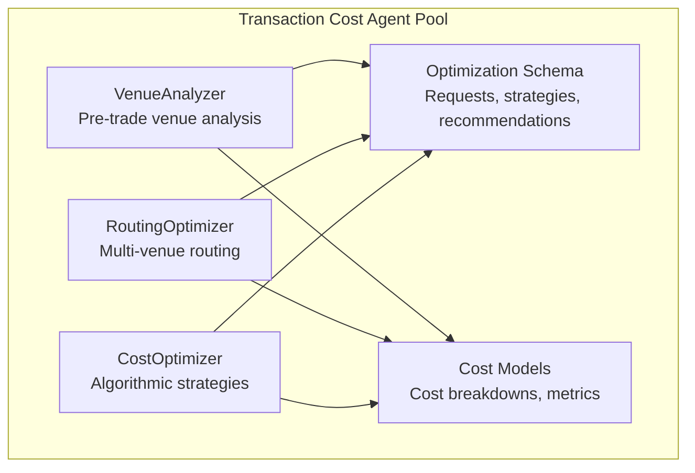
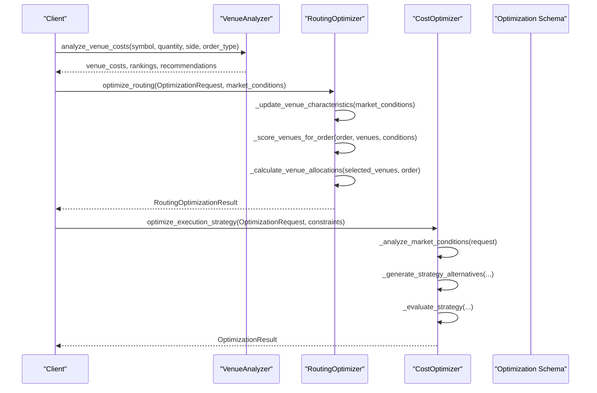
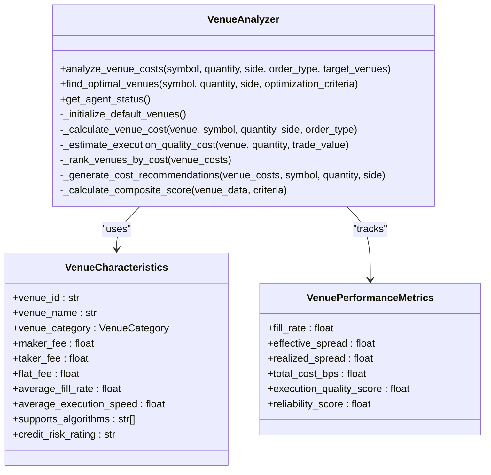
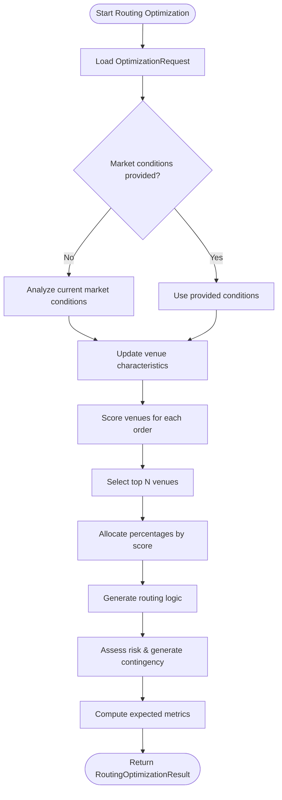
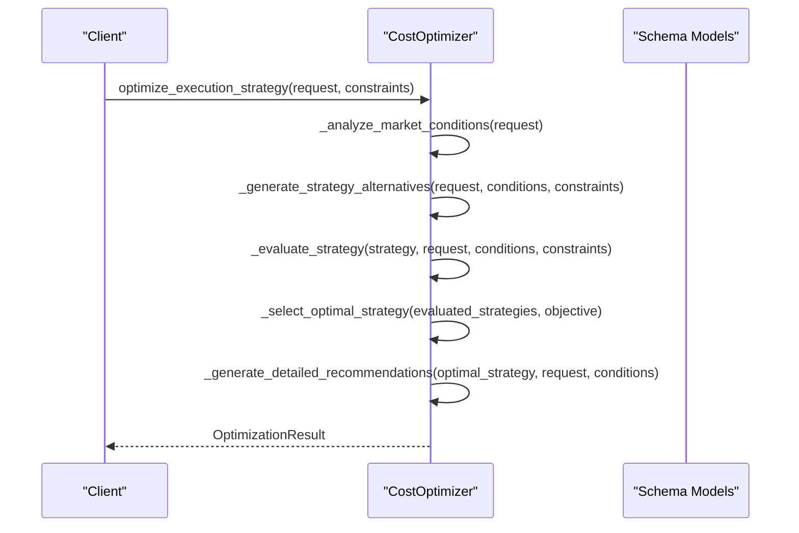
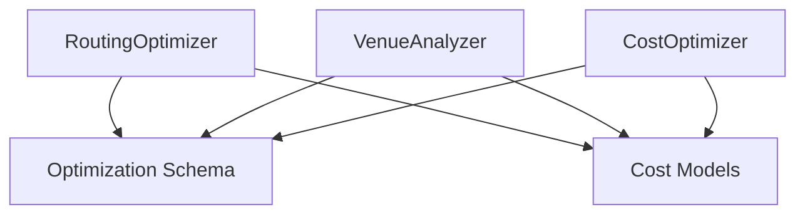

# Venue Analysis and Routing

<cite>
**Referenced Files in This Document**
- [routing_optimizer.py](file://FinAgents/agent_pools/transaction_cost_agent_pool/agents/optimization/routing_optimizer.py)
- [venue_analyzer.py](file://FinAgents/agent_pools/transaction_cost_agent_pool/agents/pre_trade/venue_analyzer.py)
- [cost_optimizer.py](file://FinAgents/agent_pools/transaction_cost_agent_pool/agents/optimization/cost_optimizer.py)
- [optimization_schema.py](file://FinAgents/agent_pools/transaction_cost_agent_pool/schema/optimization_schema.py)
- [cost_models.py](file://FinAgents/agent_pools/transaction_cost_agent_pool/schema/cost_models.py)
</cite>

## Table of Contents
1. [Introduction](#introduction)
2. [Project Structure](#project-structure)
3. [Core Components](#core-components)
4. [Architecture Overview](#architecture-overview)
5. [Detailed Component Analysis](#detailed-component-analysis)
6. [Dependency Analysis](#dependency-analysis)
7. [Performance Considerations](#performance-considerations)
8. [Troubleshooting Guide](#troubleshooting-guide)
9. [Conclusion](#conclusion)
10. [Appendices](#appendices)

## Introduction
This document explains the venue analysis and optimal routing capabilities implemented in the transaction cost agent pool. It covers how the system evaluates trading venues (exchanges, dark pools, ECNs, and alternative venues), the criteria used for venue selection (commission structures, fee schedules, liquidity, execution quality), and the routing optimization algorithms that combine multiple factors simultaneously. It also provides examples across asset classes and trading scenarios, describes integration with real-time venue data, and offers guidance for configuring venue preferences and interpreting routing recommendations.

## Project Structure
The venue analysis and routing functionality resides in the transaction cost agent pool under FinAgents. The key modules are:
- Pre-trade venue analysis: VenueAnalyzer for cost and performance profiling
- Routing optimization: RoutingOptimizer for multi-venue allocation and dynamic routing
- Cost optimization: CostOptimizer for algorithmic strategies and execution timing
- Shared schemas: Data models for optimization requests, strategies, and cost components

**Diagram sources**
- [routing_optimizer.py:80-115](file://FinAgents/agent_pools/transaction_cost_agent_pool/agents/optimization/routing_optimizer.py#L80-L115)
- [venue_analyzer.py:123-151](file://FinAgents/agent_pools/transaction_cost_agent_pool/agents/pre_trade/venue_analyzer.py#L123-L151)
- [cost_optimizer.py:65-102](file://FinAgents/agent_pools/transaction_cost_agent_pool/agents/optimization/cost_optimizer.py#L65-L102)
- [optimization_schema.py:430-499](file://FinAgents/agent_pools/transaction_cost_agent_pool/schema/optimization_schema.py#L430-L499)
- [cost_models.py:227-267](file://FinAgents/agent_pools/transaction_cost_agent_pool/schema/cost_models.py#L227-L267)

**Section sources**
- [routing_optimizer.py:80-115](file://FinAgents/agent_pools/transaction_cost_agent_pool/agents/optimization/routing_optimizer.py#L80-L115)
- [venue_analyzer.py:123-151](file://FinAgents/agent_pools/transaction_cost_agent_pool/agents/pre_trade/venue_analyzer.py#L123-L151)
- [cost_optimizer.py:65-102](file://FinAgents/agent_pools/transaction_cost_agent_pool/agents/optimization/cost_optimizer.py#L65-L102)
- [optimization_schema.py:430-499](file://FinAgents/agent_pools/transaction_cost_agent_pool/schema/optimization_schema.py#L430-L499)
- [cost_models.py:227-267](file://FinAgents/agent_pools/transaction_cost_agent_pool/schema/cost_models.py#L227-L267)

## Core Components
- VenueAnalyzer: Performs multi-criteria venue analysis including cost calculation, execution quality metrics, risk assessment, and multi-criteria optimization with configurable weights.
- RoutingOptimizer: Computes venue allocations across exchanges, ECNs, and dark pools, scoring venues by cost, fill rate, speed, liquidity, and adverse selection while adapting to real-time market conditions.
- CostOptimizer: Generates algorithmic execution strategies (TWAP, VWAP, POV, Implementation Shortfall) with dynamic adaptation to market regimes and constraints.
- Optimization Schema: Defines request/response models for optimization, including orders, strategies, and recommendations.
- Cost Models: Provides cost breakdowns, market impact models, execution metrics, and performance benchmarks.

**Section sources**
- [venue_analyzer.py:123-151](file://FinAgents/agent_pools/transaction_cost_agent_pool/agents/pre_trade/venue_analyzer.py#L123-L151)
- [routing_optimizer.py:80-115](file://FinAgents/agent_pools/transaction_cost_agent_pool/agents/optimization/routing_optimizer.py#L80-L115)
- [cost_optimizer.py:65-102](file://FinAgents/agent_pools/transaction_cost_agent_pool/agents/optimization/cost_optimizer.py#L65-L102)
- [optimization_schema.py:430-499](file://FinAgents/agent_pools/transaction_cost_agent_pool/schema/optimization_schema.py#L430-L499)
- [cost_models.py:227-267](file://FinAgents/agent_pools/transaction_cost_agent_pool/schema/cost_models.py#L227-L267)

## Architecture Overview
The system integrates three complementary modules:
- Pre-trade venue analysis: Builds a comprehensive understanding of venue characteristics, costs, and risks.
- Routing optimization: Uses venue profiles to compute optimal allocations and routing logic, incorporating real-time market conditions.
- Strategy optimization: Recommends algorithmic execution methods tailored to market regimes and constraints.

**Diagram sources**
- [routing_optimizer.py:212-282](file://FinAgents/agent_pools/transaction_cost_agent_pool/agents/optimization/routing_optimizer.py#L212-L282)
- [venue_analyzer.py:234-301](file://FinAgents/agent_pools/transaction_cost_agent_pool/agents/pre_trade/venue_analyzer.py#L234-L301)
- [cost_optimizer.py:103-175](file://FinAgents/agent_pools/transaction_cost_agent_pool/agents/optimization/cost_optimizer.py#L103-L175)
- [optimization_schema.py:430-499](file://FinAgents/agent_pools/transaction_cost_agent_pool/schema/optimization_schema.py#L430-L499)

## Detailed Component Analysis

### VenueAnalyzer: Multi-Criteria Venue Evaluation
VenueAnalyzer constructs venue profiles and performs cost and performance analysis:
- VenueCharacteristics: Captures fees (maker/taker/flat), order size constraints, execution capabilities, and performance metrics.
- VenuePerformanceMetrics: Tracks fill rate, execution speed, spreads, and quality scores.
- Cost calculation: Estimates total cost including fees and execution quality adjustments, with risk factor identification.
- Ranking and recommendations: Ranks venues by total cost and generates actionable recommendations (lowest cost, fastest execution, lowest risk).
- Multi-criteria optimization: Scores venues by configurable weights across cost, execution quality, speed, and risk.

**Diagram sources**
- [venue_analyzer.py:123-151](file://FinAgents/agent_pools/transaction_cost_agent_pool/agents/pre_trade/venue_analyzer.py#L123-L151)
- [venue_analyzer.py:48-122](file://FinAgents/agent_pools/transaction_cost_agent_pool/agents/pre_trade/venue_analyzer.py#L48-L122)

**Section sources**
- [venue_analyzer.py:153-233](file://FinAgents/agent_pools/transaction_cost_agent_pool/agents/pre_trade/venue_analyzer.py#L153-L233)
- [venue_analyzer.py:234-301](file://FinAgents/agent_pools/transaction_cost_agent_pool/agents/pre_trade/venue_analyzer.py#L234-L301)
- [venue_analyzer.py:302-412](file://FinAgents/agent_pools/transaction_cost_agent_pool/agents/pre_trade/venue_analyzer.py#L302-L412)
- [venue_analyzer.py:455-551](file://FinAgents/agent_pools/transaction_cost_agent_pool/agents/pre_trade/venue_analyzer.py#L455-L551)
- [venue_analyzer.py:552-642](file://FinAgents/agent_pools/transaction_cost_agent_pool/agents/pre_trade/venue_analyzer.py#L552-L642)
- [venue_analyzer.py:643-712](file://FinAgents/agent_pools/transaction_cost_agent_pool/agents/pre_trade/venue_analyzer.py#L643-L712)

### RoutingOptimizer: Multi-Venue Allocation and Dynamic Routing
RoutingOptimizer computes optimal routing across venues considering:
- Venue universe: Built-in profiles for exchanges, ECNs, and dark pools with typical cost, fill rate, speed, liquidity, and adverse selection.
- Market condition updates: Adjusts venue characteristics based on volatility, liquidity stress, time-of-day, and venue performance adjustments.
- Scoring and allocation: Scores venues by cost, fill rate, speed, liquidity, and adverse selection; allocates percentages respecting minimum allocation and concentration limits.
- Risk assessment and contingency: Evaluates concentration and venue diversity; generates contingency plans for routing failures.
- Monitoring requirements: Adds venue-specific monitoring needs (e.g., dark pool liquidity).

**Diagram sources**
- [routing_optimizer.py:212-282](file://FinAgents/agent_pools/transaction_cost_agent_pool/agents/optimization/routing_optimizer.py#L212-L282)
- [routing_optimizer.py:301-351](file://FinAgents/agent_pools/transaction_cost_agent_pool/agents/optimization/routing_optimizer.py#L301-L351)
- [routing_optimizer.py:353-398](file://FinAgents/agent_pools/transaction_cost_agent_pool/agents/optimization/routing_optimizer.py#L353-L398)
- [routing_optimizer.py:399-448](file://FinAgents/agent_pools/transaction_cost_agent_pool/agents/optimization/routing_optimizer.py#L399-L448)
- [routing_optimizer.py:475-504](file://FinAgents/agent_pools/transaction_cost_agent_pool/agents/optimization/routing_optimizer.py#L475-L504)
- [routing_optimizer.py:506-527](file://FinAgents/agent_pools/transaction_cost_agent_pool/agents/optimization/routing_optimizer.py#L506-L527)
- [routing_optimizer.py:529-579](file://FinAgents/agent_pools/transaction_cost_agent_pool/agents/optimization/routing_optimizer.py#L529-L579)
- [routing_optimizer.py:581-634](file://FinAgents/agent_pools/transaction_cost_agent_pool/agents/optimization/routing_optimizer.py#L581-L634)
- [routing_optimizer.py:635-694](file://FinAgents/agent_pools/transaction_cost_agent_pool/agents/optimization/routing_optimizer.py#L635-L694)
- [routing_optimizer.py:695-717](file://FinAgents/agent_pools/transaction_cost_agent_pool/agents/optimization/routing_optimizer.py#L695-L717)
- [routing_optimizer.py:718-769](file://FinAgents/agent_pools/transaction_cost_agent_pool/agents/optimization/routing_optimizer.py#L718-L769)

**Section sources**
- [routing_optimizer.py:116-211](file://FinAgents/agent_pools/transaction_cost_agent_pool/agents/optimization/routing_optimizer.py#L116-L211)
- [routing_optimizer.py:283-299](file://FinAgents/agent_pools/transaction_cost_agent_pool/agents/optimization/routing_optimizer.py#L283-L299)
- [routing_optimizer.py:301-351](file://FinAgents/agent_pools/transaction_cost_agent_pool/agents/optimization/routing_optimizer.py#L301-L351)
- [routing_optimizer.py:353-398](file://FinAgents/agent_pools/transaction_cost_agent_pool/agents/optimization/routing_optimizer.py#L353-L398)
- [routing_optimizer.py:399-448](file://FinAgents/agent_pools/transaction_cost_agent_pool/agents/optimization/routing_optimizer.py#L399-L448)
- [routing_optimizer.py:475-504](file://FinAgents/agent_pools/transaction_cost_agent_pool/agents/optimization/routing_optimizer.py#L475-L504)
- [routing_optimizer.py:506-579](file://FinAgents/agent_pools/transaction_cost_agent_pool/agents/optimization/routing_optimizer.py#L506-L579)
- [routing_optimizer.py:581-634](file://FinAgents/agent_pools/transaction_cost_agent_pool/agents/optimization/routing_optimizer.py#L581-L634)
- [routing_optimizer.py:635-694](file://FinAgents/agent_pools/transaction_cost_agent_pool/agents/optimization/routing_optimizer.py#L635-L694)
- [routing_optimizer.py:695-769](file://FinAgents/agent_pools/transaction_cost_agent_pool/agents/optimization/routing_optimizer.py#L695-L769)

### CostOptimizer: Algorithmic Strategy Selection
CostOptimizer selects optimal execution strategies considering:
- Market regime detection: Volatility, liquidity, time-of-day, and symbol-specific factors.
- Strategy universe: TWAP, VWAP, POV, Implementation Shortfall, and adaptive strategies.
- Evaluation: Expected cost, risk, and market impact with confidence scoring.
- Constraints: Allowed venues, order types, and performance limits.
- Recommendations: Detailed execution recommendations with confidence and monitoring notes.

**Diagram sources**
- [cost_optimizer.py:103-175](file://FinAgents/agent_pools/transaction_cost_agent_pool/agents/optimization/cost_optimizer.py#L103-L175)
- [optimization_schema.py:430-499](file://FinAgents/agent_pools/transaction_cost_agent_pool/schema/optimization_schema.py#L430-L499)

**Section sources**
- [cost_optimizer.py:176-205](file://FinAgents/agent_pools/transaction_cost_agent_pool/agents/optimization/cost_optimizer.py#L176-L205)
- [cost_optimizer.py:207-302](file://FinAgents/agent_pools/transaction_cost_agent_pool/agents/optimization/cost_optimizer.py#L207-L302)
- [cost_optimizer.py:304-351](file://FinAgents/agent_pools/transaction_cost_agent_pool/agents/optimization/cost_optimizer.py#L304-L351)
- [cost_optimizer.py:353-404](file://FinAgents/agent_pools/transaction_cost_agent_pool/agents/optimization/cost_optimizer.py#L353-L404)
- [cost_optimizer.py:405-435](file://FinAgents/agent_pools/transaction_cost_agent_pool/agents/optimization/cost_optimizer.py#L405-L435)
- [cost_optimizer.py:437-453](file://FinAgents/agent_pools/transaction_cost_agent_pool/agents/optimization/cost_optimizer.py#L437-L453)
- [cost_optimizer.py:455-481](file://FinAgents/agent_pools/transaction_cost_agent_pool/agents/optimization/cost_optimizer.py#L455-L481)
- [cost_optimizer.py:483-514](file://FinAgents/agent_pools/transaction_cost_agent_pool/agents/optimization/cost_optimizer.py#L483-L514)
- [cost_optimizer.py:516-577](file://FinAgents/agent_pools/transaction_cost_agent_pool/agents/optimization/cost_optimizer.py#L516-L577)
- [cost_optimizer.py:578-634](file://FinAgents/agent_pools/transaction_cost_agent_pool/agents/optimization/cost_optimizer.py#L578-L634)

### Venue Analysis Criteria and Examples
- Commission structures: Maker/taker fees, flat fees, minimum/maximum caps; calculated into total cost and cost basis points.
- Fee schedules: Venue-specific fee schedules applied to estimated trade value; execution quality adjustments for fill rate, speed, and liquidity.
- Liquidity provision: Venue market share, liquidity score, and typical fill rate inform suitability for order sizes.
- Execution quality: Expected fill rate, execution speed, and risk factors (size constraints, credit risk, operational risk).
- Examples:
  - Equities: Prefer exchanges for small orders, ECNs for medium orders, dark pools for large orders; adjust for volatility and liquidity regimes.
  - Cryptocurrencies: Consider venue availability, liquidity tiers, and adverse selection risk; adapt allocations dynamically.
  - Fixed income: Factor yield impact and market impact; balance cost vs. timing risk.

**Section sources**
- [venue_analyzer.py:302-377](file://FinAgents/agent_pools/transaction_cost_agent_pool/agents/pre_trade/venue_analyzer.py#L302-L377)
- [venue_analyzer.py:378-412](file://FinAgents/agent_pools/transaction_cost_agent_pool/agents/pre_trade/venue_analyzer.py#L378-L412)
- [venue_analyzer.py:413-454](file://FinAgents/agent_pools/transaction_cost_agent_pool/agents/pre_trade/venue_analyzer.py#L413-L454)
- [venue_analyzer.py:483-551](file://FinAgents/agent_pools/transaction_cost_agent_pool/agents/pre_trade/venue_analyzer.py#L483-L551)
- [routing_optimizer.py:450-474](file://FinAgents/agent_pools/transaction_cost_agent_pool/agents/optimization/routing_optimizer.py#L450-L474)

### Integration with Real-Time Venue Data and Dynamic Adaptation
- Real-time conditions: Market volatility, liquidity stress, time-of-day effects, and venue performance adjustments influence venue characteristics.
- Venue outages: Outaged venues are excluded from consideration.
- Dynamic routing: RoutingOptimizer updates venue scores and allocations based on current conditions; adapts to adverse selection risk and venue performance.

**Section sources**
- [routing_optimizer.py:283-299](file://FinAgents/agent_pools/transaction_cost_agent_pool/agents/optimization/routing_optimizer.py#L283-L299)
- [routing_optimizer.py:301-351](file://FinAgents/agent_pools/transaction_cost_agent_pool/agents/optimization/routing_optimizer.py#L301-L351)
- [routing_optimizer.py:335-348](file://FinAgents/agent_pools/transaction_cost_agent_pool/agents/optimization/routing_optimizer.py#L335-L348)

### Configuring Venue Preferences and Interpreting Recommendations
- Venue preferences: Configure via optimization parameters (allowed venues, venue preferences) and agent-level settings (default venue universe).
- Interpret routing recommendations:
  - Primary and secondary venues with allocation percentages.
  - Expected cost, fill rate, and execution time.
  - Routing logic and contingency plans.
  - Risk assessment and monitoring requirements.
- CostOptimizer recommendations:
  - Recommended algorithm and venue.
  - Slice size and expected cost.
  - Confidence level and implementation timeline.

**Section sources**
- [optimization_schema.py:88-155](file://FinAgents/agent_pools/transaction_cost_agent_pool/schema/optimization_schema.py#L88-L155)
- [routing_optimizer.py:506-527](file://FinAgents/agent_pools/transaction_cost_agent_pool/agents/optimization/routing_optimizer.py#L506-L527)
- [routing_optimizer.py:529-579](file://FinAgents/agent_pools/transaction_cost_agent_pool/agents/optimization/routing_optimizer.py#L529-L579)
- [cost_optimizer.py:405-435](file://FinAgents/agent_pools/transaction_cost_agent_pool/agents/optimization/cost_optimizer.py#L405-L435)

## Dependency Analysis
The modules depend on shared schemas for consistent data exchange:
- OptimizationRequest and related models define the input/output contracts for routing and cost optimization.
- Cost models provide standardized cost breakdowns and metrics for post-trade analysis and attribution.

**Diagram sources**
- [routing_optimizer.py:16-22](file://FinAgents/agent_pools/transaction_cost_agent_pool/agents/optimization/routing_optimizer.py#L16-L22)
- [venue_analyzer.py:19-27](file://FinAgents/agent_pools/transaction_cost_agent_pool/agents/pre_trade/venue_analyzer.py#L19-L27)
- [cost_optimizer.py:17-23](file://FinAgents/agent_pools/transaction_cost_agent_pool/agents/optimization/cost_optimizer.py#L17-L23)
- [optimization_schema.py:430-499](file://FinAgents/agent_pools/transaction_cost_agent_pool/schema/optimization_schema.py#L430-L499)
- [cost_models.py:227-267](file://FinAgents/agent_pools/transaction_cost_agent_pool/schema/cost_models.py#L227-L267)

**Section sources**
- [optimization_schema.py:430-499](file://FinAgents/agent_pools/transaction_cost_agent_pool/schema/optimization_schema.py#L430-L499)
- [cost_models.py:227-267](file://FinAgents/agent_pools/transaction_cost_agent_pool/schema/cost_models.py#L227-L267)

## Performance Considerations
- Venue universe size: Larger universes increase scoring and allocation computations; tune max venues per order and minimum allocation thresholds.
- Real-time updates: Frequent market condition updates improve relevance but add overhead; adjust routing frequency to balance responsiveness and performance.
- Risk controls: Concentration and diversity constraints prevent extreme allocations; ensure thresholds align with execution capacity.
- Strategy evaluation: Strategy alternativeness and constraint filtering reduce search space; configure allowed algorithms and order types appropriately.

[No sources needed since this section provides general guidance]

## Troubleshooting Guide
- Venue not found: VenueAnalyzer skips unknown venues and logs warnings; verify venue IDs and initialization.
- Cost calculation errors: VenueAnalyzer raises exceptions on calculation failures; check fee structures and order constraints.
- Routing failures: RoutingOptimizer logs errors and re-raises; validate optimization request and market conditions.
- Strategy selection: CostOptimizer filters strategies by constraints; review constraints and allowed algorithms.

**Section sources**
- [venue_analyzer.py:260-262](file://FinAgents/agent_pools/transaction_cost_agent_pool/agents/pre_trade/venue_analyzer.py#L260-L262)
- [venue_analyzer.py:298-300](file://FinAgents/agent_pools/transaction_cost_agent_pool/agents/pre_trade/venue_analyzer.py#L298-L300)
- [routing_optimizer.py:279-281](file://FinAgents/agent_pools/transaction_cost_agent_pool/agents/optimization/routing_optimizer.py#L279-L281)
- [cost_optimizer.py:172-174](file://FinAgents/agent_pools/transaction_cost_agent_pool/agents/optimization/cost_optimizer.py#L172-L174)

## Conclusion
The venue analysis and routing system combines pre-trade venue profiling, dynamic routing optimization, and algorithmic strategy selection to minimize transaction costs and improve execution quality. By integrating real-time market conditions, applying multi-criteria scoring, and generating actionable recommendations, the system supports informed decision-making across diverse asset classes and trading scenarios.

[No sources needed since this section summarizes without analyzing specific files]

## Appendices

### Appendix A: Venue Categories and Types
- Venue categories: Exchange, dark pool, ECN, market maker, crossing network, ATS.
- Venue types (routing): Exchange, dark pool, ECN, market maker, crossing network.

**Section sources**
- [venue_analyzer.py:32-40](file://FinAgents/agent_pools/transaction_cost_agent_pool/agents/pre_trade/venue_analyzer.py#L32-L40)
- [routing_optimizer.py:25-32](file://FinAgents/agent_pools/transaction_cost_agent_pool/agents/optimization/routing_optimizer.py#L25-L32)

### Appendix B: Optimization Objectives and Constraints
- Objectives: Minimize cost, risk, market impact; maximize alpha; minimize tracking error.
- Constraints: Risk limits, position limits, cost limits, time limits, venue constraints, liquidity constraints.

**Section sources**
- [optimization_schema.py:23-31](file://FinAgents/agent_pools/transaction_cost_agent_pool/schema/optimization_schema.py#L23-L31)
- [optimization_schema.py:42-50](file://FinAgents/agent_pools/transaction_cost_agent_pool/schema/optimization_schema.py#L42-L50)

### Appendix C: Execution Algorithms
- Algorithms: TWAP, VWAP, Implementation Shortfall, Arrival Price, Percent of Volume, Iceberg, Smart Order Router.

**Section sources**
- [optimization_schema.py:32-41](file://FinAgents/agent_pools/transaction_cost_agent_pool/schema/optimization_schema.py#L32-L41)