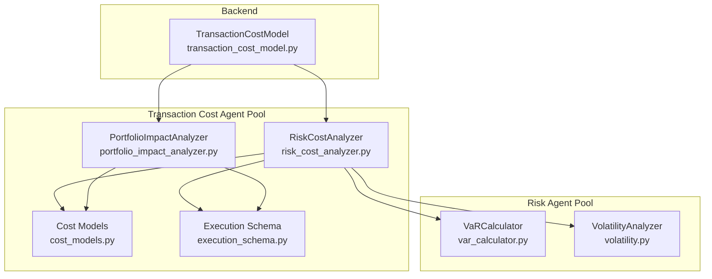
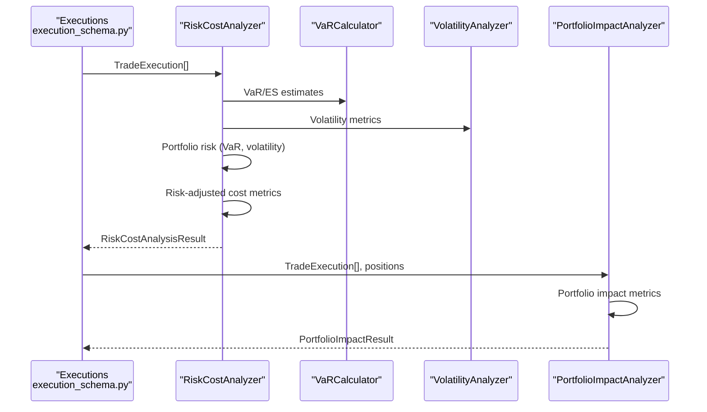
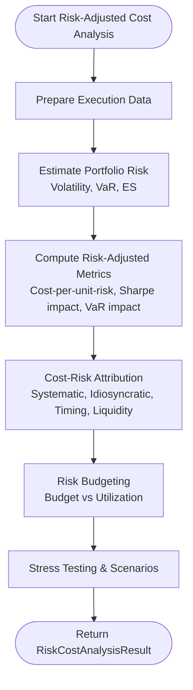
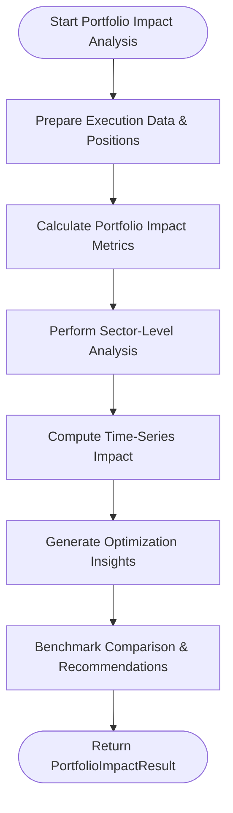
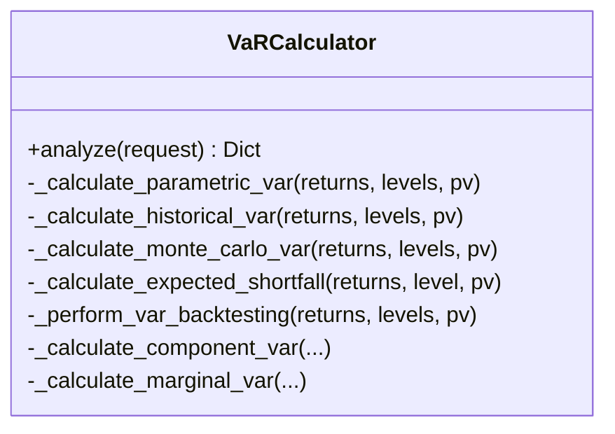
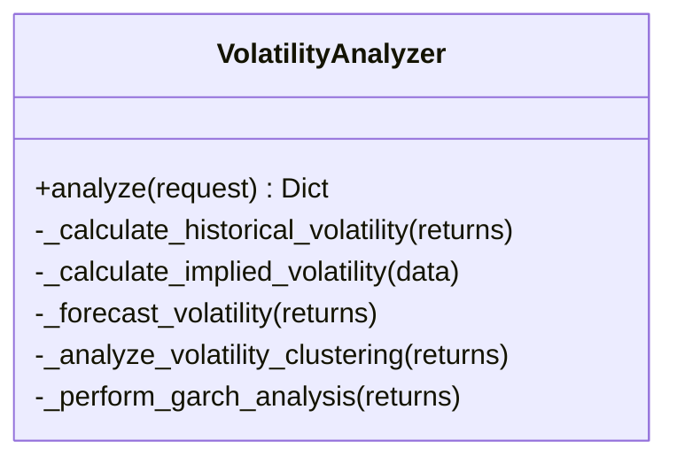
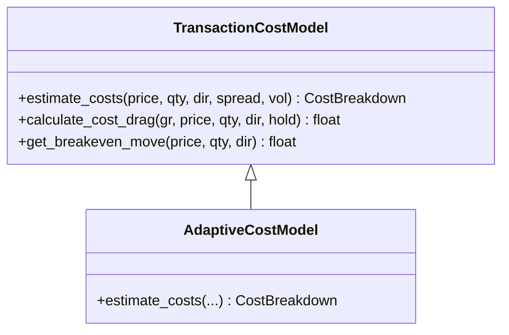
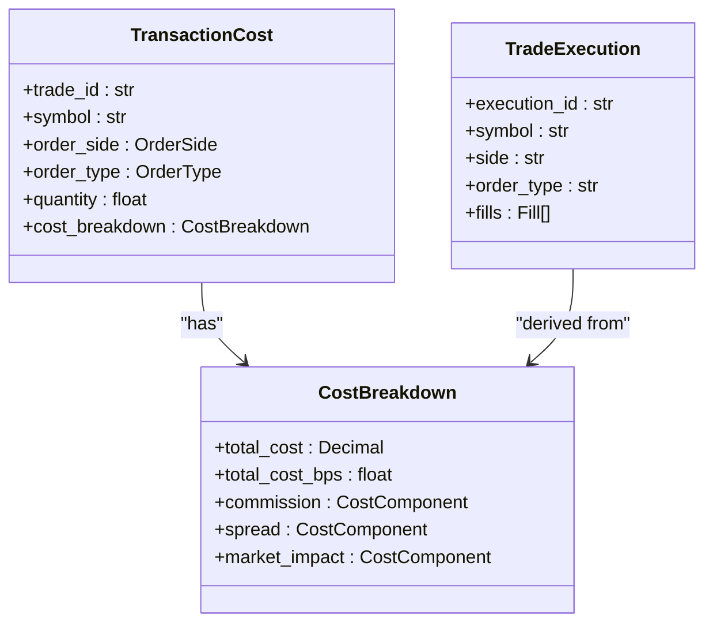
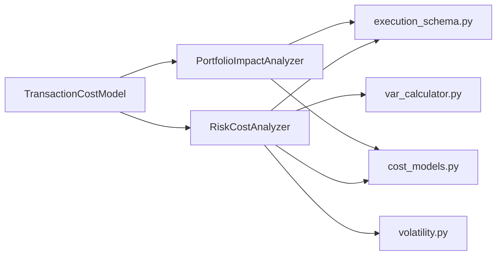

# Risk-Adjusted Costs

<cite>
**Referenced Files in This Document**
- [risk_cost_analyzer.py](file://FinAgents/agent_pools/transaction_cost_agent_pool/agents/risk_adjusted/risk_cost_analyzer.py)
- [portfolio_impact_analyzer.py](file://FinAgents/agent_pools/transaction_cost_agent_pool/agents/risk_adjusted/portfolio_impact_analyzer.py)
- [cost_models.py](file://FinAgents/agent_pools/transaction_cost_agent_pool/schema/cost_models.py)
- [execution_schema.py](file://FinAgents/agent_pools/transaction_cost_agent_pool/schema/execution_schema.py)
- [var_calculator.py](file://FinAgents/agent_pools/risk_agent_pool/agents/var_calculator.py)
- [volatility.py](file://FinAgents/agent_pools/risk_agent_pool/agents/volatility.py)
- [transaction_cost_model.py](file://backend/risk/transaction_cost_model.py)
- [README.md](file://FinAgents/agent_pools/risk_agent_pool/README.md)
</cite>

## Table of Contents
1. [Introduction](#introduction)
2. [Project Structure](#project-structure)
3. [Core Components](#core-components)
4. [Architecture Overview](#architecture-overview)
5. [Detailed Component Analysis](#detailed-component-analysis)
6. [Dependency Analysis](#dependency-analysis)
7. [Performance Considerations](#performance-considerations)
8. [Troubleshooting Guide](#troubleshooting-guide)
9. [Conclusion](#conclusion)
10. [Appendices](#appendices)

## Introduction
This document describes the risk-adjusted cost analysis subsystem, focusing on integrating Value at Risk (VaR) with transaction costs to produce risk-adjusted performance metrics. It explains portfolio impact analysis for systemic risk considerations, details risk cost analyzers incorporating volatility, correlation, and market regime factors, and provides configuration patterns for different risk models and confidence levels. It also outlines implementation examples for regulatory compliance reporting and risk-adjusted benchmarking.

## Project Structure
The risk-adjusted cost subsystem spans two primary areas:
- Transaction cost agent pool risk-adjusted analyzers: risk-adjusted cost analysis and portfolio impact analysis
- Risk agent pool VaR and volatility agents: foundational risk metrics and scenario modeling
- Backend transaction cost model: realistic pre-trade and post-trade cost estimation
- Shared schemas: strongly typed models for cost breakdowns, execution reports, and risk metrics

**Diagram sources**
- [risk_cost_analyzer.py:61-177](file://FinAgents/agent_pools/transaction_cost_agent_pool/agents/risk_adjusted/risk_cost_analyzer.py#L61-L177)
- [portfolio_impact_analyzer.py:83-218](file://FinAgents/agent_pools/transaction_cost_agent_pool/agents/risk_adjusted/portfolio_impact_analyzer.py#L83-L218)
- [cost_models.py:227-266](file://FinAgents/agent_pools/transaction_cost_agent_pool/schema/cost_models.py#L227-L266)
- [execution_schema.py:79-129](file://FinAgents/agent_pools/transaction_cost_agent_pool/schema/execution_schema.py#L79-L129)
- [var_calculator.py:26-136](file://FinAgents/agent_pools/risk_agent_pool/agents/var_calculator.py#L26-L136)
- [volatility.py:25-97](file://FinAgents/agent_pools/risk_agent_pool/agents/volatility.py#L25-L97)
- [transaction_cost_model.py:43-150](file://backend/risk/transaction_cost_model.py#L43-L150)

**Section sources**
- [risk_cost_analyzer.py:61-177](file://FinAgents/agent_pools/transaction_cost_agent_pool/agents/risk_adjusted/risk_cost_analyzer.py#L61-L177)
- [portfolio_impact_analyzer.py:83-218](file://FinAgents/agent_pools/transaction_cost_agent_pool/agents/risk_adjusted/portfolio_impact_analyzer.py#L83-L218)
- [cost_models.py:227-266](file://FinAgents/agent_pools/transaction_cost_agent_pool/schema/cost_models.py#L227-L266)
- [execution_schema.py:79-129](file://FinAgents/agent_pools/transaction_cost_agent_pool/schema/execution_schema.py#L79-L129)
- [var_calculator.py:26-136](file://FinAgents/agent_pools/risk_agent_pool/agents/var_calculator.py#L26-L136)
- [volatility.py:25-97](file://FinAgents/agent_pools/risk_agent_pool/agents/volatility.py#L25-L97)
- [transaction_cost_model.py:43-150](file://backend/risk/transaction_cost_model.py#L43-L150)

## Core Components
- RiskCostAnalyzer: Computes risk-adjusted cost metrics, cost-risk attribution, risk budgeting, and stress/scenario analysis using VaR and volatility.
- PortfolioImpactAnalyzer: Measures portfolio-level cost impacts, sector-level cost analysis, time-series impact, and optimization insights.
- VaRCalculator: Provides VaR and Expected Shortfall via parametric, historical, and Monte Carlo methods; supports backtesting and component/marginal VaR.
- VolatilityAnalyzer: Historical, implied, GARCH-based volatility, clustering, and regime forecasting.
- TransactionCostModel: Pre-trade and post-trade cost estimation including commission, slippage, market impact, and regulatory fees.
- Shared schemas: Strongly typed models for cost breakdowns, execution reports, and performance benchmarks.

**Section sources**
- [risk_cost_analyzer.py:61-177](file://FinAgents/agent_pools/transaction_cost_agent_pool/agents/risk_adjusted/risk_cost_analyzer.py#L61-L177)
- [portfolio_impact_analyzer.py:83-218](file://FinAgents/agent_pools/transaction_cost_agent_pool/agents/risk_adjusted/portfolio_impact_analyzer.py#L83-L218)
- [var_calculator.py:26-136](file://FinAgents/agent_pools/risk_agent_pool/agents/var_calculator.py#L26-L136)
- [volatility.py:25-97](file://FinAgents/agent_pools/risk_agent_pool/agents/volatility.py#L25-L97)
- [transaction_cost_model.py:43-150](file://backend/risk/transaction_cost_model.py#L43-L150)
- [cost_models.py:227-266](file://FinAgents/agent_pools/transaction_cost_agent_pool/schema/cost_models.py#L227-L266)
- [execution_schema.py:79-129](file://FinAgents/agent_pools/transaction_cost_agent_pool/schema/execution_schema.py#L79-L129)

## Architecture Overview
The subsystem integrates transaction cost analysis with risk metrics:
- RiskCostAnalyzer consumes execution data and portfolio positions, computes portfolio risk (volatility, VaR, Expected Shortfall), and derives risk-adjusted cost metrics.
- PortfolioImpactAnalyzer ingests executions and positions to quantify cost drag, Sharpe impact, and sector-level contributions.
- VaRCalculator and VolatilityAnalyzer supply VaR and volatility estimates used by RiskCostAnalyzer.
- TransactionCostModel provides realistic cost estimates for pre/post trade planning.
- Shared schemas define consistent data models across components.

**Diagram sources**
- [risk_cost_analyzer.py:94-177](file://FinAgents/agent_pools/transaction_cost_agent_pool/agents/risk_adjusted/risk_cost_analyzer.py#L94-L177)
- [portfolio_impact_analyzer.py:138-218](file://FinAgents/agent_pools/transaction_cost_agent_pool/agents/risk_adjusted/portfolio_impact_analyzer.py#L138-L218)
- [var_calculator.py:42-136](file://FinAgents/agent_pools/risk_agent_pool/agents/var_calculator.py#L42-L136)
- [volatility.py:39-97](file://FinAgents/agent_pools/risk_agent_pool/agents/volatility.py#L39-L97)
- [execution_schema.py:79-129](file://FinAgents/agent_pools/transaction_cost_agent_pool/schema/execution_schema.py#L79-L129)

## Detailed Component Analysis

### RiskCostAnalyzer
Responsibilities:
- Risk-adjusted cost metrics: cost per unit risk, risk-adjusted cost bps, cost-volatility ratio, risk contribution, Sharpe impact, VaR/Expected Shortfall impact.
- Cost-risk attribution: systematic, idiosyncratic, timing, liquidity, and execution risk components.
- Risk budgeting: set budget, utilization, remaining budget, efficiency, and symbol-level recommendations.
- Stress testing and scenario analysis: probabilistic cost and risk impacts across market regimes.
- Confidence-aware metrics and scaling by portfolio volatility.

Key processing logic:
- Portfolio risk estimation from positions and market data (volatility, VaR, Expected Shortfall).
- Risk-adjusted cost computation scaling by portfolio volatility.
- VaR and Expected Shortfall impacts derived from total cost and risk thresholds.
- Cost-risk attribution distributed across risk categories with timing and liquidity proxies.
- Risk budgeting compares realized cost to budget and suggests adjustments.

**Diagram sources**
- [risk_cost_analyzer.py:94-177](file://FinAgents/agent_pools/transaction_cost_agent_pool/agents/risk_adjusted/risk_cost_analyzer.py#L94-L177)
- [risk_cost_analyzer.py:221-276](file://FinAgents/agent_pools/transaction_cost_agent_pool/agents/risk_adjusted/risk_cost_analyzer.py#L221-L276)
- [risk_cost_analyzer.py:278-357](file://FinAgents/agent_pools/transaction_cost_agent_pool/agents/risk_adjusted/risk_cost_analyzer.py#L278-L357)
- [risk_cost_analyzer.py:359-406](file://FinAgents/agent_pools/transaction_cost_agent_pool/agents/risk_adjusted/risk_cost_analyzer.py#L359-L406)
- [risk_cost_analyzer.py:408-462](file://FinAgents/agent_pools/transaction_cost_agent_pool/agents/risk_adjusted/risk_cost_analyzer.py#L408-L462)
- [risk_cost_analyzer.py:524-618](file://FinAgents/agent_pools/transaction_cost_agent_pool/agents/risk_adjusted/risk_cost_analyzer.py#L524-L618)

**Section sources**
- [risk_cost_analyzer.py:61-177](file://FinAgents/agent_pools/transaction_cost_agent_pool/agents/risk_adjusted/risk_cost_analyzer.py#L61-L177)
- [risk_cost_analyzer.py:221-276](file://FinAgents/agent_pools/transaction_cost_agent_pool/agents/risk_adjusted/risk_cost_analyzer.py#L221-L276)
- [risk_cost_analyzer.py:278-357](file://FinAgents/agent_pools/transaction_cost_agent_pool/agents/risk_adjusted/risk_cost_analyzer.py#L278-L357)
- [risk_cost_analyzer.py:359-406](file://FinAgents/agent_pools/transaction_cost_agent_pool/agents/risk_adjusted/risk_cost_analyzer.py#L359-L406)
- [risk_cost_analyzer.py:408-462](file://FinAgents/agent_pools/transaction_cost_agent_pool/agents/risk_adjusted/risk_cost_analyzer.py#L408-L462)
- [risk_cost_analyzer.py:524-618](file://FinAgents/agent_pools/transaction_cost_agent_pool/agents/risk_adjusted/risk_cost_analyzer.py#L524-L618)

### PortfolioImpactAnalyzer
Responsibilities:
- Portfolio-level cost impact: total cost drag, annualized cost drag, Sharpe impact, alpha impact, tracking error impact, information ratio impact, cost efficiency ratio, net performance impact.
- Sector-level analysis: cost bps by sector, cost as pct of sector value, relative cost efficiency, sector weight, and portfolio impact.
- Time-series impact: daily cost drag, cumulative impact, cost volatility, and performance attribution.
- Optimization insights: rebalancing frequency recommendation, cost-efficient threshold, optimal trade size distribution, cost budget allocation, and risk-adjusted cost targets.
- Benchmark comparison and recommendations.

**Diagram sources**
- [portfolio_impact_analyzer.py:138-218](file://FinAgents/agent_pools/transaction_cost_agent_pool/agents/risk_adjusted/portfolio_impact_analyzer.py#L138-L218)
- [portfolio_impact_analyzer.py:256-331](file://FinAgents/agent_pools/transaction_cost_agent_pool/agents/risk_adjusted/portfolio_impact_analyzer.py#L256-L331)
- [portfolio_impact_analyzer.py:361-419](file://FinAgents/agent_pools/transaction_cost_agent_pool/agents/risk_adjusted/portfolio_impact_analyzer.py#L361-L419)
- [portfolio_impact_analyzer.py:421-465](file://FinAgents/agent_pools/transaction_cost_agent_pool/agents/risk_adjusted/portfolio_impact_analyzer.py#L421-L465)
- [portfolio_impact_analyzer.py:467-520](file://FinAgents/agent_pools/transaction_cost_agent_pool/agents/risk_adjusted/portfolio_impact_analyzer.py#L467-L520)
- [portfolio_impact_analyzer.py:522-550](file://FinAgents/agent_pools/transaction_cost_agent_pool/agents/risk_adjusted/portfolio_impact_analyzer.py#L522-L550)
- [portfolio_impact_analyzer.py:552-619](file://FinAgents/agent_pools/transaction_cost_agent_pool/agents/risk_adjusted/portfolio_impact_analyzer.py#L552-L619)

**Section sources**
- [portfolio_impact_analyzer.py:83-218](file://FinAgents/agent_pools/transaction_cost_agent_pool/agents/risk_adjusted/portfolio_impact_analyzer.py#L83-L218)
- [portfolio_impact_analyzer.py:256-331](file://FinAgents/agent_pools/transaction_cost_agent_pool/agents/risk_adjusted/portfolio_impact_analyzer.py#L256-L331)
- [portfolio_impact_analyzer.py:361-419](file://FinAgents/agent_pools/transaction_cost_agent_pool/agents/risk_adjusted/portfolio_impact_analyzer.py#L361-L419)
- [portfolio_impact_analyzer.py:421-465](file://FinAgents/agent_pools/transaction_cost_agent_pool/agents/risk_adjusted/portfolio_impact_analyzer.py#L421-L465)
- [portfolio_impact_analyzer.py:467-520](file://FinAgents/agent_pools/transaction_cost_agent_pool/agents/risk_adjusted/portfolio_impact_analyzer.py#L467-L520)
- [portfolio_impact_analyzer.py:522-619](file://FinAgents/agent_pools/transaction_cost_agent_pool/agents/risk_adjusted/portfolio_impact_analyzer.py#L522-L619)

### VaRCalculator
Responsibilities:
- VaR via parametric (normal/t-distribution/Cornish–Fisher), historical (standard and age-weighted), and Monte Carlo (normal/t-distribution/Filtered Historical Simulation).
- Expected Shortfall (historical, parametric, t-distribution).
- Backtesting (Kupiec, independence, conditional coverage), loss function tests, and Basel traffic light.
- Component and marginal VaR for portfolio positions.

**Diagram sources**
- [var_calculator.py:26-136](file://FinAgents/agent_pools/risk_agent_pool/agents/var_calculator.py#L26-L136)
- [var_calculator.py:180-356](file://FinAgents/agent_pools/risk_agent_pool/agents/var_calculator.py#L180-L356)
- [var_calculator.py:398-442](file://FinAgents/agent_pools/risk_agent_pool/agents/var_calculator.py#L398-L442)
- [var_calculator.py:444-553](file://FinAgents/agent_pools/risk_agent_pool/agents/var_calculator.py#L444-L553)
- [var_calculator.py:667-779](file://FinAgents/agent_pools/risk_agent_pool/agents/var_calculator.py#L667-L779)

**Section sources**
- [var_calculator.py:26-136](file://FinAgents/agent_pools/risk_agent_pool/agents/var_calculator.py#L26-L136)
- [var_calculator.py:180-356](file://FinAgents/agent_pools/risk_agent_pool/agents/var_calculator.py#L180-L356)
- [var_calculator.py:398-442](file://FinAgents/agent_pools/risk_agent_pool/agents/var_calculator.py#L398-L442)
- [var_calculator.py:444-553](file://FinAgents/agent_pools/risk_agent_pool/agents/var_calculator.py#L444-L553)
- [var_calculator.py:667-779](file://FinAgents/agent_pools/risk_agent_pool/agents/var_calculator.py#L667-L779)

### VolatilityAnalyzer
Responsibilities:
- Historical volatility estimators (simple, Parkinson, Rogers–Satchell).
- Implied volatility metrics and skew/term structure.
- Volatility forecasting (MA, EWMA, mean reversion, GARCH).
- Volatility clustering (ARCH LM test), persistence, Hurst exponent.
- GARCH diagnostics (Ljung–Box, Jarque–Bera), multi-step forecasts.

**Diagram sources**
- [volatility.py:25-97](file://FinAgents/agent_pools/risk_agent_pool/agents/volatility.py#L25-L97)
- [volatility.py:121-167](file://FinAgents/agent_pools/risk_agent_pool/agents/volatility.py#L121-L167)
- [volatility.py:169-212](file://FinAgents/agent_pools/risk_agent_pool/agents/volatility.py#L169-L212)
- [volatility.py:214-265](file://FinAgents/agent_pools/risk_agent_pool/agents/volatility.py#L214-L265)
- [volatility.py:327-380](file://FinAgents/agent_pools/risk_agent_pool/agents/volatility.py#L327-L380)
- [volatility.py:529-559](file://FinAgents/agent_pools/risk_agent_pool/agents/volatility.py#L529-L559)

**Section sources**
- [volatility.py:25-97](file://FinAgents/agent_pools/risk_agent_pool/agents/volatility.py#L25-L97)
- [volatility.py:121-167](file://FinAgents/agent_pools/risk_agent_pool/agents/volatility.py#L121-L167)
- [volatility.py:169-212](file://FinAgents/agent_pools/risk_agent_pool/agents/volatility.py#L169-L212)
- [volatility.py:214-265](file://FinAgents/agent_pools/risk_agent_pool/agents/volatility.py#L214-L265)
- [volatility.py:327-380](file://FinAgents/agent_pools/risk_agent_pool/agents/volatility.py#L327-L380)
- [volatility.py:529-559](file://FinAgents/agent_pools/risk_agent_pool/agents/volatility.py#L529-L559)

### TransactionCostModel
Responsibilities:
- Pre-trade cost estimation: commission, slippage, market impact, regulatory fees.
- Post-trade cost drag calculation and breakeven move estimation.
- Adaptive model adjusts costs by volatility regimes.

**Diagram sources**
- [transaction_cost_model.py:43-150](file://backend/risk/transaction_cost_model.py#L43-L150)
- [transaction_cost_model.py:210-266](file://backend/risk/transaction_cost_model.py#L210-L266)

**Section sources**
- [transaction_cost_model.py:43-150](file://backend/risk/transaction_cost_model.py#L43-L150)
- [transaction_cost_model.py:210-266](file://backend/risk/transaction_cost_model.py#L210-L266)

### Shared Schemas
- CostBreakdown, MarketImpactModel, ExecutionMetrics, PerformanceBenchmark, CostAttribute, TransactionCost, CostEstimate: consistent models for cost analysis and execution quality.
- TradeExecution, QualityMetrics, BenchmarkComparison, ExecutionReport: execution analysis and benchmarking.

**Diagram sources**
- [cost_models.py:87-114](file://FinAgents/agent_pools/transaction_cost_agent_pool/schema/cost_models.py#L87-L114)
- [cost_models.py:227-266](file://FinAgents/agent_pools/transaction_cost_agent_pool/schema/cost_models.py#L227-L266)
- [execution_schema.py:79-129](file://FinAgents/agent_pools/transaction_cost_agent_pool/schema/execution_schema.py#L79-L129)

**Section sources**
- [cost_models.py:87-114](file://FinAgents/agent_pools/transaction_cost_agent_pool/schema/cost_models.py#L87-L114)
- [cost_models.py:227-266](file://FinAgents/agent_pools/transaction_cost_agent_pool/schema/cost_models.py#L227-L266)
- [execution_schema.py:79-129](file://FinAgents/agent_pools/transaction_cost_agent_pool/schema/execution_schema.py#L79-L129)

## Dependency Analysis
- RiskCostAnalyzer depends on:
  - Execution schema for input data
  - VaRCalculator and VolatilityAnalyzer for VaR/ES and volatility
  - Cost models for consistent cost representation
- PortfolioImpactAnalyzer depends on:
  - Execution schema and cost models
  - Historical returns for volatility estimation
- TransactionCostModel provides cost estimates used by both analyzers.

**Diagram sources**
- [risk_cost_analyzer.py:16-17](file://FinAgents/agent_pools/transaction_cost_agent_pool/agents/risk_adjusted/risk_cost_analyzer.py#L16-L17)
- [portfolio_impact_analyzer.py:16-17](file://FinAgents/agent_pools/transaction_cost_agent_pool/agents/risk_adjusted/portfolio_impact_analyzer.py#L16-L17)
- [var_calculator.py](file://FinAgents/agent_pools/risk_agent_pool/agents/var_calculator.py#L23)
- [volatility.py](file://FinAgents/agent_pools/risk_agent_pool/agents/volatility.py#L22)
- [transaction_cost_model.py:17-21](file://backend/risk/transaction_cost_model.py#L17-L21)

**Section sources**
- [risk_cost_analyzer.py:16-17](file://FinAgents/agent_pools/transaction_cost_agent_pool/agents/risk_adjusted/risk_cost_analyzer.py#L16-L17)
- [portfolio_impact_analyzer.py:16-17](file://FinAgents/agent_pools/transaction_cost_agent_pool/agents/risk_adjusted/portfolio_impact_analyzer.py#L16-L17)
- [var_calculator.py](file://FinAgents/agent_pools/risk_agent_pool/agents/var_calculator.py#L23)
- [volatility.py](file://FinAgents/agent_pools/risk_agent_pool/agents/volatility.py#L22)
- [transaction_cost_model.py:17-21](file://backend/risk/transaction_cost_model.py#L17-L21)

## Performance Considerations
- Asynchronous analysis enables non-blocking execution for concurrent risk calculations.
- Caching and memory bridge integration support repeated analyses and historical comparisons.
- Efficient numerical routines for VaR/ES and volatility reduce computational overhead.
- Confidence-aware metrics and scenario modeling enable robust decision-making under uncertainty.

[No sources needed since this section provides general guidance]

## Troubleshooting Guide
Common issues and resolutions:
- Missing or invalid execution data: ensure TradeExecution objects include required fields (execution_id, symbol, side, quantity, executed_price, total_cost).
- Insufficient historical returns: PortfolioImpactAnalyzer defaults to 15% annual volatility; provide returns for accurate estimates.
- VaR backtesting insufficient data: require at least 250 observations for meaningful backtests.
- Cost model configuration: adjust commission, slippage, and market impact parameters for realistic cost drag.

**Section sources**
- [execution_schema.py:79-129](file://FinAgents/agent_pools/transaction_cost_agent_pool/schema/execution_schema.py#L79-L129)
- [portfolio_impact_analyzer.py:292-299](file://FinAgents/agent_pools/transaction_cost_agent_pool/agents/risk_adjusted/portfolio_impact_analyzer.py#L292-L299)
- [var_calculator.py:444-455](file://FinAgents/agent_pools/risk_agent_pool/agents/var_calculator.py#L444-L455)

## Conclusion
The risk-adjusted cost subsystem integrates transaction cost analysis with VaR and volatility to deliver risk-adjusted performance metrics, cost-risk attribution, and scenario-driven insights. It supports portfolio impact analysis, risk budgeting, and optimization recommendations, while leveraging shared schemas and modular risk agents for extensibility and compliance readiness.

[No sources needed since this section summarizes without analyzing specific files]

## Appendices

### Configuration Patterns for Risk Models and Confidence Levels
- RiskCostAnalyzer configuration keys:
  - confidence_levels: list of confidence levels (e.g., [0.95, 0.99])
  - risk_free_rate: risk-free rate for Sharpe impact
  - lookback_days: lookback window for risk estimation
  - stress_scenarios: scenario names for stress testing
- VaRCalculator configuration keys:
  - confidence_levels: list of confidence levels
  - var_methods: methods to include (parametric, historical, monte_carlo)
  - monte_carlo_simulations: number of simulations
  - historical_window: lookback window for historical VaR
- VolatilityAnalyzer configuration keys:
  - volatility_windows: time windows for historical volatility
  - garch_params: omega, alpha, beta for GARCH
- PortfolioImpactAnalyzer configuration keys:
  - analysis_horizon_days: analysis horizon (default 252)
  - risk_free_rate, benchmark_return: for Sharpe and benchmark comparisons
  - rebalancing_cost_threshold, optimal_trade_sizes: optimization parameters

**Section sources**
- [risk_cost_analyzer.py:73-93](file://FinAgents/agent_pools/transaction_cost_agent_pool/agents/risk_adjusted/risk_cost_analyzer.py#L73-L93)
- [var_calculator.py:31-41](file://FinAgents/agent_pools/risk_agent_pool/agents/var_calculator.py#L31-L41)
- [volatility.py:30-38](file://FinAgents/agent_pools/risk_agent_pool/agents/volatility.py#L30-L38)
- [portfolio_impact_analyzer.py:95-121](file://FinAgents/agent_pools/transaction_cost_agent_pool/agents/risk_adjusted/portfolio_impact_analyzer.py#L95-L121)

### Regulatory Compliance Reporting and Risk-Adjusted Benchmarking
- VaR backtesting and Basel traffic light provide model validation for regulatory compliance.
- RiskCostAnalyzer’s stress testing and scenario analysis support scenario-based reporting.
- PortfolioImpactAnalyzer’s benchmark comparison offers risk-adjusted benchmarking against industry averages.

**Section sources**
- [var_calculator.py:444-553](file://FinAgents/agent_pools/risk_agent_pool/agents/var_calculator.py#L444-L553)
- [risk_cost_analyzer.py:524-618](file://FinAgents/agent_pools/transaction_cost_agent_pool/agents/risk_adjusted/risk_cost_analyzer.py#L524-L618)
- [portfolio_impact_analyzer.py:522-550](file://FinAgents/agent_pools/transaction_cost_agent_pool/agents/risk_adjusted/portfolio_impact_analyzer.py#L522-L550)
- [README.md:237-282](file://FinAgents/agent_pools/risk_agent_pool/README.md#L237-L282)