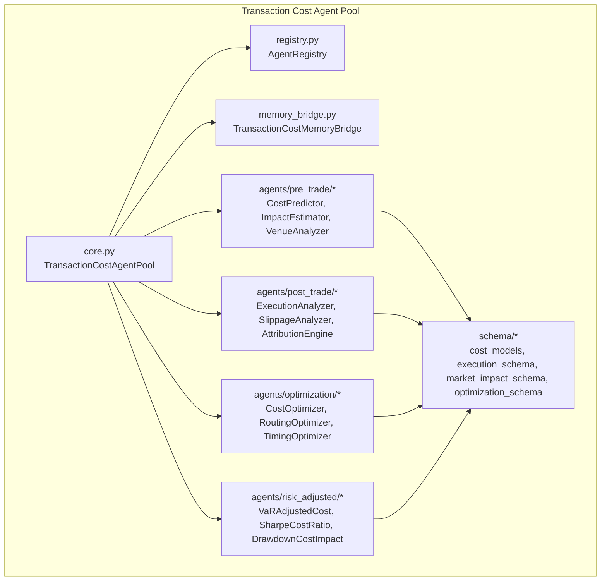
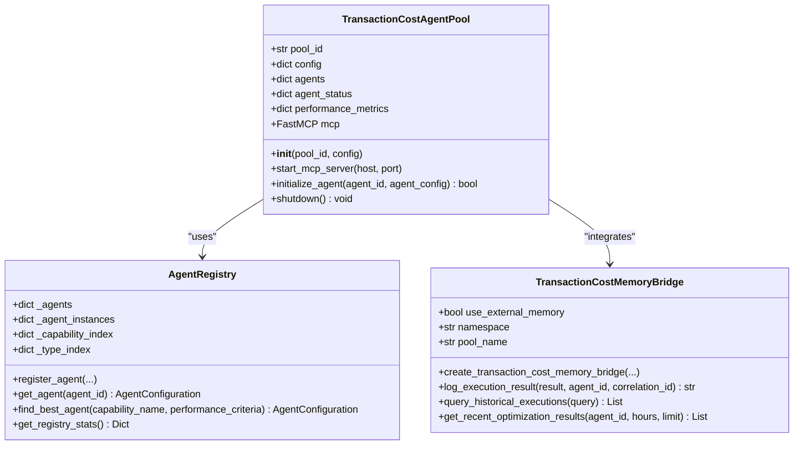
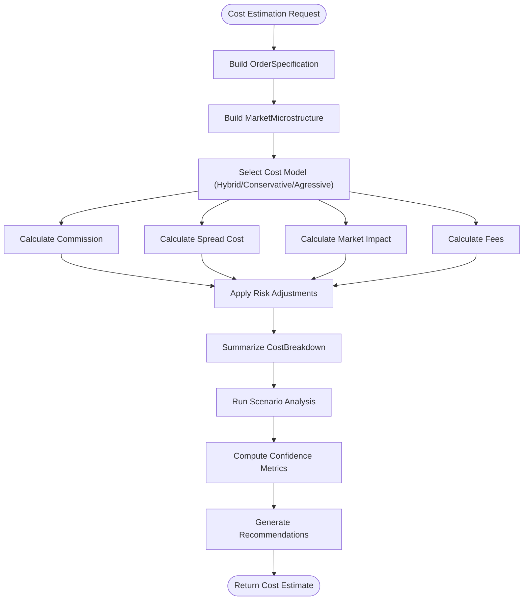
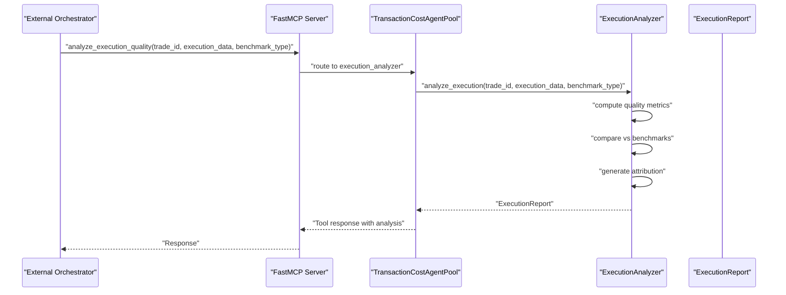
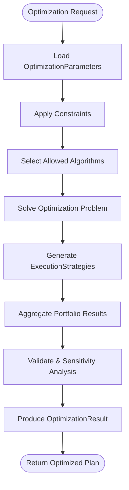
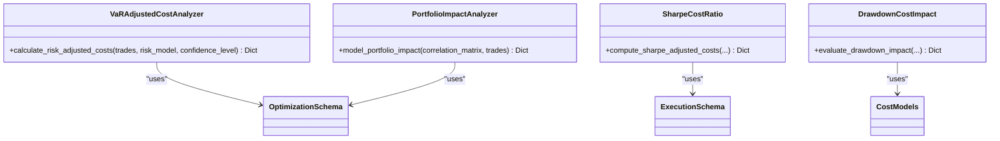
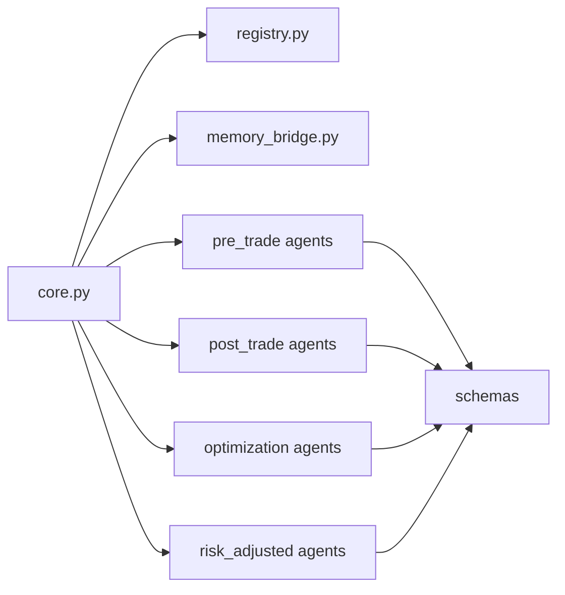

# Transaction Cost Agent Pool

<cite>
**Referenced Files in This Document**
- [README.md](file://FinAgents/agent_pools/transaction_cost_agent_pool/README.md)
- [__init__.py](file://FinAgents/agent_pools/transaction_cost_agent_pool/__init__.py)
- [core.py](file://FinAgents/agent_pools/transaction_cost_agent_pool/core.py)
- [memory_bridge.py](file://FinAgents/agent_pools/transaction_cost_agent_pool/memory_bridge.py)
- [registry.py](file://FinAgents/agent_pools/transaction_cost_agent_pool/registry.py)
- [cost_models.py](file://FinAgents/agent_pools/transaction_cost_agent_pool/schema/cost_models.py)
- [execution_schema.py](file://FinAgents/agent_pools/transaction_cost_agent_pool/schema/execution_schema.py)
- [market_impact_schema.py](file://FinAgents/agent_pools/transaction_cost_agent_pool/schema/market_impact_schema.py)
- [optimization_schema.py](file://FinAgents/agent_pools/transaction_cost_agent_pool/schema/optimization_schema.py)
- [cost_predictor.py](file://FinAgents/agent_pools/transaction_cost_agent_pool/agents/pre_trade/cost_predictor.py)
</cite>

## Table of Contents
1. [Introduction](#introduction)
2. [Project Structure](#project-structure)
3. [Core Components](#core-components)
4. [Architecture Overview](#architecture-overview)
5. [Detailed Component Analysis](#detailed-component-analysis)
6. [Dependency Analysis](#dependency-analysis)
7. [Performance Considerations](#performance-considerations)
8. [Troubleshooting Guide](#troubleshooting-guide)
9. [Conclusion](#conclusion)
10. [Appendices](#appendices)

## Introduction
The Transaction Cost Agent Pool is an enterprise-grade module within the FinAgent-Orchestration ecosystem that provides comprehensive transaction cost analysis and optimization across asset classes and venues. It enables pre-trade cost prediction, market impact estimation, venue analysis, post-trade execution analysis, and optimization across timing, routing, and size allocation. The system integrates with memory systems, supports real-time analytics, and exposes MCP tools for orchestration and monitoring.

## Project Structure
The Transaction Cost Agent Pool organizes functionality into:
- Core orchestration and MCP tooling
- Agent registry and lifecycle management
- Memory bridge for persistent storage and event logging
- Pre-trade cost estimation, market impact modeling, and venue analysis
- Post-trade execution analysis, slippage measurement, and performance attribution
- Optimization agents for timing, routing, and portfolio-level strategies
- Risk-adjusted cost analysis integrating VaR and volatility adjustments
- Data schemas for cost models, execution quality, market impact, and optimization



**Diagram sources**
- [core.py:64-120](file://FinAgents/agent_pools/transaction_cost_agent_pool/core.py#L64-L120)
- [registry.py:96-120](file://FinAgents/agent_pools/transaction_cost_agent_pool/registry.py#L96-L120)
- [memory_bridge.py:94-145](file://FinAgents/agent_pools/transaction_cost_agent_pool/memory_bridge.py#L94-L145)
- [cost_models.py:227-267](file://FinAgents/agent_pools/transaction_cost_agent_pool/schema/cost_models.py#L227-L267)
- [execution_schema.py:208-267](file://FinAgents/agent_pools/transaction_cost_agent_pool/schema/execution_schema.py#L208-L267)
- [market_impact_schema.py:165-233](file://FinAgents/agent_pools/transaction_cost_agent_pool/schema/market_impact_schema.py#L165-L233)
- [optimization_schema.py:260-342](file://FinAgents/agent_pools/transaction_cost_agent_pool/schema/optimization_schema.py#L260-L342)

**Section sources**
- [README.md:25-84](file://FinAgents/agent_pools/transaction_cost_agent_pool/README.md#L25-L84)
- [__init__.py:24-107](file://FinAgents/agent_pools/transaction_cost_agent_pool/__init__.py#L24-L107)

## Core Components
- TransactionCostAgentPool: Central orchestrator exposing MCP tools for cost estimation, execution analysis, portfolio optimization, and risk-adjusted cost calculations. It manages agent lifecycle, performance metrics, and integrates with memory systems.
- AgentRegistry: Manages registration, discovery, and capability-based selection of agents across categories (pre-trade, post-trade, optimization, risk-adjusted).
- TransactionCostMemoryBridge: Dual-memory integration enabling cost model persistence, historical execution storage, optimization result caching, and unified event logging via External Memory Agent.
- Pre-trade agents: CostPredictor (multi-component cost modeling), ImpactEstimator (market impact), VenueAnalyzer (venue cost analysis).
- Post-trade agents: ExecutionAnalyzer (quality metrics), SlippageAnalyzer (slippage measurement), AttributionEngine (cost attribution).
- Optimization agents: CostOptimizer, RoutingOptimizer, TimingOptimizer for minimizing transaction costs.
- Risk-adjusted agents: VaR-adjusted cost analysis, Sharpe ratio adjustments, and drawdown impact analysis.
- Schemas: Strongly-typed models for transaction costs, execution quality, market impact, and optimization parameters.

**Section sources**
- [core.py:64-120](file://FinAgents/agent_pools/transaction_cost_agent_pool/core.py#L64-L120)
- [registry.py:96-120](file://FinAgents/agent_pools/transaction_cost_agent_pool/registry.py#L96-L120)
- [memory_bridge.py:94-145](file://FinAgents/agent_pools/transaction_cost_agent_pool/memory_bridge.py#L94-L145)
- [cost_models.py:227-267](file://FinAgents/agent_pools/transaction_cost_agent_pool/schema/cost_models.py#L227-L267)
- [execution_schema.py:208-267](file://FinAgents/agent_pools/transaction_cost_agent_pool/schema/execution_schema.py#L208-L267)
- [market_impact_schema.py:165-233](file://FinAgents/agent_pools/transaction_cost_agent_pool/schema/market_impact_schema.py#L165-L233)
- [optimization_schema.py:260-342](file://FinAgents/agent_pools/transaction_cost_agent_pool/schema/optimization_schema.py#L260-L342)

## Architecture Overview
The Transaction Cost Agent Pool follows a microservices-style architecture with:
- Stateless agent implementations for horizontal scalability
- Event-driven processing for asynchronous workflows
- Pluggable cost models and optimization algorithms
- Unified MCP tooling for external orchestration
- Integrated memory bridge for persistence and auditing

```mermaid
sequenceDiagram
participant Client as "External Orchestrator"
participant MCP as "FastMCP Server"
participant Pool as "TransactionCostAgentPool"
participant Pre as "Pre-trade Agents"
participant Post as "Post-trade Agents"
participant Opt as "Optimization Agents"
participant Risk as "Risk-adjusted Agents"
Client->>MCP : "estimate_transaction_cost(...)"
MCP->>Pool : "route to cost_predictor"
Pool->>Pre : "CostPredictor.estimate_costs(...)"
Pre-->>Pool : "CostBreakdown + confidence"
Pool-->>MCP : "Tool response with cost estimate"
MCP-->>Client : "Response"
Client->>MCP : "analyze_execution_quality(...)"
MCP->>Pool : "route to execution_analyzer"
Pool->>Post : "ExecutionAnalyzer.analyze_execution(...)"
Post-->>Pool : "Quality metrics + attribution"
Pool-->>MCP : "Tool response with analysis"
MCP-->>Client : "Response"
Client->>MCP : "optimize_portfolio_execution(...)"
MCP->>Pool : "route to portfolio_optimizer"
Pool->>Opt : "PortfolioOptimizer.optimize_execution(...)"
Opt-->>Pool : "Optimized execution plan"
Pool-->>MCP : "Tool response with optimization"
MCP-->>Client : "Response"
Client->>MCP : "calculate_risk_adjusted_costs(...)"
MCP->>Pool : "route to var_adjusted_cost"
Pool->>Risk : "VaRAdjustedCostAnalyzer.calculate_risk_adjusted_costs(...)"
Risk-->>Pool : "Risk-adjusted cost analysis"
Pool-->>MCP : "Tool response with risk-adjusted metrics"
MCP-->>Client : "Response"
```

**Diagram sources**
- [core.py:159-414](file://FinAgents/agent_pools/transaction_cost_agent_pool/core.py#L159-L414)

## Detailed Component Analysis

### TransactionCostAgentPool Orchestration
- Exposes MCP tools for cost estimation, execution analysis, portfolio optimization, and risk-adjusted cost calculations.
- Routes requests to appropriate agents based on category and availability.
- Tracks performance metrics and maintains agent status.
- Integrates with External Memory Agent for event logging and historical queries.



**Diagram sources**
- [core.py:64-120](file://FinAgents/agent_pools/transaction_cost_agent_pool/core.py#L64-L120)
- [registry.py:96-120](file://FinAgents/agent_pools/transaction_cost_agent_pool/registry.py#L96-L120)
- [memory_bridge.py:94-145](file://FinAgents/agent_pools/transaction_cost_agent_pool/memory_bridge.py#L94-L145)

**Section sources**
- [core.py:159-414](file://FinAgents/agent_pools/transaction_cost_agent_pool/core.py#L159-L414)
- [registry.py:130-196](file://FinAgents/agent_pools/transaction_cost_agent_pool/registry.py#L130-L196)
- [memory_bridge.py:185-319](file://FinAgents/agent_pools/transaction_cost_agent_pool/memory_bridge.py#L185-L319)

### Pre-trade Cost Prediction and Market Impact
- CostPredictor: Multi-component cost modeling (commission, spread, market impact, fees) with hybrid models, scenario analysis, confidence metrics, and optimization recommendations.
- MarketImpactModel: Supports temporary/permanent impact decomposition, time-horizon profiles, and regime-based modeling.
- VenueAnalyzer: Evaluates venue-specific cost structures and routing efficiency.



**Diagram sources**
- [cost_predictor.py:467-588](file://FinAgents/agent_pools/transaction_cost_agent_pool/agents/pre_trade/cost_predictor.py#L467-L588)
- [market_impact_schema.py:165-233](file://FinAgents/agent_pools/transaction_cost_agent_pool/schema/market_impact_schema.py#L165-L233)
- [cost_models.py:87-115](file://FinAgents/agent_pools/transaction_cost_agent_pool/schema/cost_models.py#L87-L115)

**Section sources**
- [cost_predictor.py:409-793](file://FinAgents/agent_pools/transaction_cost_agent_pool/agents/pre_trade/cost_predictor.py#L409-L793)
- [market_impact_schema.py:165-233](file://FinAgents/agent_pools/transaction_cost_agent_pool/schema/market_impact_schema.py#L165-L233)
- [cost_models.py:87-115](file://FinAgents/agent_pools/transaction_cost_agent_pool/schema/cost_models.py#L87-L115)

### Post-trade Execution Analysis and Slippage Measurement
- ExecutionAnalyzer: Computes implementation shortfall, arrival price deviation, VWAP/TWAP deviations, fill rates, and venue distribution.
- SlippageAnalyzer: Measures realized slippage against benchmarks and identifies contributing factors.
- AttributionEngine: Performs cost attribution to identify optimization opportunities.



**Diagram sources**
- [core.py:231-291](file://FinAgents/agent_pools/transaction_cost_agent_pool/core.py#L231-L291)
- [execution_schema.py:208-267](file://FinAgents/agent_pools/transaction_cost_agent_pool/schema/execution_schema.py#L208-L267)

**Section sources**
- [execution_schema.py:130-175](file://FinAgents/agent_pools/transaction_cost_agent_pool/schema/execution_schema.py#L130-L175)
- [execution_schema.py:208-267](file://FinAgents/agent_pools/transaction_cost_agent_pool/schema/execution_schema.py#L208-L267)

### Optimization Algorithms for Timing, Routing, and Size Allocation
- OptimizationParameters: Defines objectives (minimize cost/risk/impact), constraints (risk, position, cost, time, venue, liquidity), algorithms (TWAP, VWAP, iceberg, smart order router), and solver settings.
- ExecutionStrategy: Specifies algorithm, venue allocation, timing distribution, order sizing, and expected outcomes.
- OptimizationResult: Captures optimal strategies, portfolio-level results, constraint analysis, sensitivity, and recommendations.



**Diagram sources**
- [optimization_schema.py:88-155](file://FinAgents/agent_pools/transaction_cost_agent_pool/schema/optimization_schema.py#L88-L155)
- [optimization_schema.py:156-200](file://FinAgents/agent_pools/transaction_cost_agent_pool/schema/optimization_schema.py#L156-L200)
- [optimization_schema.py:260-342](file://FinAgents/agent_pools/transaction_cost_agent_pool/schema/optimization_schema.py#L260-L342)

**Section sources**
- [optimization_schema.py:23-58](file://FinAgents/agent_pools/transaction_cost_agent_pool/schema/optimization_schema.py#L23-L58)
- [optimization_schema.py:88-155](file://FinAgents/agent_pools/transaction_cost_agent_pool/schema/optimization_schema.py#L88-L155)
- [optimization_schema.py:156-200](file://FinAgents/agent_pools/transaction_cost_agent_pool/schema/optimization_schema.py#L156-L200)
- [optimization_schema.py:260-342](file://FinAgents/agent_pools/transaction_cost_agent_pool/schema/optimization_schema.py#L260-L342)

### Risk-adjusted Cost Analysis and Portfolio Impact Modeling
- VaR-adjusted cost analysis incorporates Value-at-Risk and volatility adjustments into cost metrics.
- Sharpe-cost ratio adjusts performance attribution for risk.
- Drawdown impact analysis evaluates cost implications during adverse market regimes.
- Portfolio impact modeling considers asset correlations and diversification effects.



**Diagram sources**
- [optimization_schema.py:260-342](file://FinAgents/agent_pools/transaction_cost_agent_pool/schema/optimization_schema.py#L260-L342)
- [execution_schema.py:130-175](file://FinAgents/agent_pools/transaction_cost_agent_pool/schema/execution_schema.py#L130-L175)
- [cost_models.py:227-267](file://FinAgents/agent_pools/transaction_cost_agent_pool/schema/cost_models.py#L227-L267)

**Section sources**
- [optimization_schema.py:260-342](file://FinAgents/agent_pools/transaction_cost_agent_pool/schema/optimization_schema.py#L260-L342)
- [execution_schema.py:130-175](file://FinAgents/agent_pools/transaction_cost_agent_pool/schema/execution_schema.py#L130-L175)
- [cost_models.py:227-267](file://FinAgents/agent_pools/transaction_cost_agent_pool/schema/cost_models.py#L227-L267)

### Execution Analytics Dashboards and Monitoring
- Performance monitoring tracks request counts, response times, error rates, and agent performance.
- Memory bridge provides historical execution queries, optimization result retrieval, and statistics.
- MCP tools expose status and health checks for integration and observability.

**Section sources**
- [core.py:470-536](file://FinAgents/agent_pools/transaction_cost_agent_pool/core.py#L470-L536)
- [memory_bridge.py:495-543](file://FinAgents/agent_pools/transaction_cost_agent_pool/memory_bridge.py#L495-L543)
- [core.py:415-469](file://FinAgents/agent_pools/transaction_cost_agent_pool/core.py#L415-L469)

## Dependency Analysis
The Transaction Cost Agent Pool exhibits:
- Low coupling between agents and the orchestrator via MCP tooling
- Cohesive schemas that unify data models across pre/post-trade and optimization
- External memory agent integration for persistence and auditing
- Agent registry enabling dynamic discovery and capability-based selection



**Diagram sources**
- [core.py:64-120](file://FinAgents/agent_pools/transaction_cost_agent_pool/core.py#L64-L120)
- [registry.py:96-120](file://FinAgents/agent_pools/transaction_cost_agent_pool/registry.py#L96-L120)
- [memory_bridge.py:94-145](file://FinAgents/agent_pools/transaction_cost_agent_pool/memory_bridge.py#L94-L145)
- [cost_models.py:227-267](file://FinAgents/agent_pools/transaction_cost_agent_pool/schema/cost_models.py#L227-L267)

**Section sources**
- [core.py:64-120](file://FinAgents/agent_pools/transaction_cost_agent_pool/core.py#L64-L120)
- [registry.py:96-120](file://FinAgents/agent_pools/transaction_cost_agent_pool/registry.py#L96-L120)
- [memory_bridge.py:94-145](file://FinAgents/agent_pools/transaction_cost_agent_pool/memory_bridge.py#L94-L145)

## Performance Considerations
- Sub-10ms cost estimation latency for standard requests
- Throughput exceeding 10,000 cost calculations per second
- Configurable model confidence and scenario analysis for robust decision-making
- Risk-adjusted models to mitigate downside cost impacts
- Venue selection and routing optimization to minimize market impact and fees

[No sources needed since this section provides general guidance]

## Troubleshooting Guide
Common issues and resolutions:
- Agent initialization failures: Verify agent registration and configuration; check logs for ImportError or missing dependencies.
- Memory bridge unavailability: Confirm External Memory Agent installation and storage path; fallback to legacy memory if configured.
- MCP server startup errors: Validate host/port settings and transport configuration; ensure permissions and firewall rules.
- Cost estimation errors: Review market conditions input, order specifications, and venue info; confirm model parameters and schema validation.
- Performance degradation: Monitor error rates and response times; adjust solver parameters and constraints; scale horizontally.

**Section sources**
- [core.py:537-554](file://FinAgents/agent_pools/transaction_cost_agent_pool/core.py#L537-L554)
- [memory_bridge.py:121-133](file://FinAgents/agent_pools/transaction_cost_agent_pool/memory_bridge.py#L121-L133)
- [registry.py:197-237](file://FinAgents/agent_pools/transaction_cost_agent_pool/registry.py#L197-L237)

## Conclusion
The Transaction Cost Agent Pool delivers a comprehensive, scalable platform for transaction cost analysis and optimization. Its modular architecture, strong schemas, and integrated memory system enable accurate pre-trade predictions, detailed post-trade analysis, and robust optimization across timing, routing, and size allocation. Risk-adjusted cost analysis and portfolio impact modeling further enhance decision-making, while MCP tools and monitoring facilitate seamless integration and observability.

## Appendices

### Configuration Examples
- Cost model configuration: Define linear/nonlinear impact models, feature sets, and trained model paths.
- Market venue configuration: Specify venue types, fee structures, and operational hours.
- Optimization parameters: Set objectives, constraints, algorithms, and solver settings.

**Section sources**
- [README.md:175-211](file://FinAgents/agent_pools/transaction_cost_agent_pool/README.md#L175-L211)

### Integration Patterns
- MCP tool integration: Use estimate_transaction_cost, analyze_execution_quality, optimize_portfolio_execution, and calculate_risk_adjusted_costs.
- Memory integration: Persist cost models, log execution results, and query historical data via TransactionCostMemoryBridge.
- Agent registry integration: Dynamically discover and select agents by capability and performance criteria.

**Section sources**
- [core.py:159-414](file://FinAgents/agent_pools/transaction_cost_agent_pool/core.py#L159-L414)
- [memory_bridge.py:185-319](file://FinAgents/agent_pools/transaction_cost_agent_pool/memory_bridge.py#L185-L319)
- [registry.py:276-316](file://FinAgents/agent_pools/transaction_cost_agent_pool/registry.py#L276-L316)