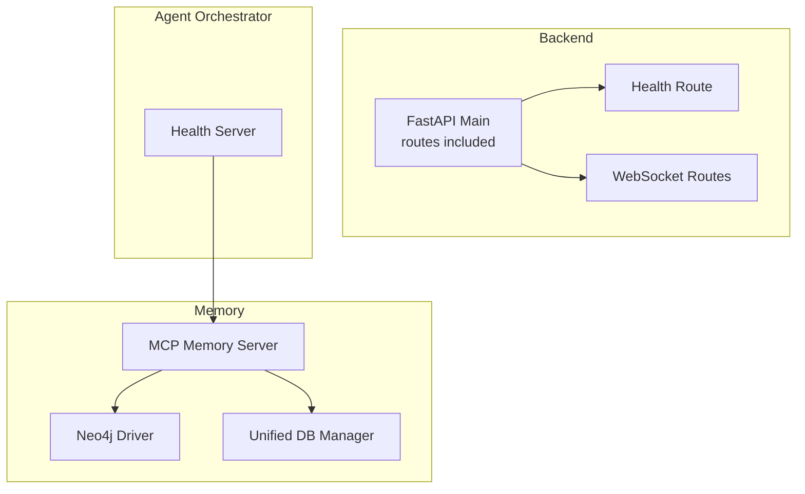
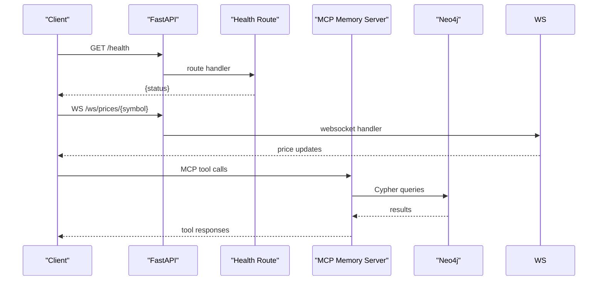
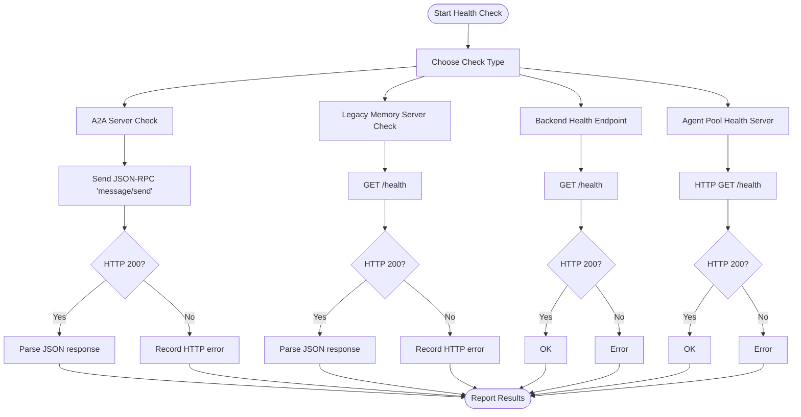
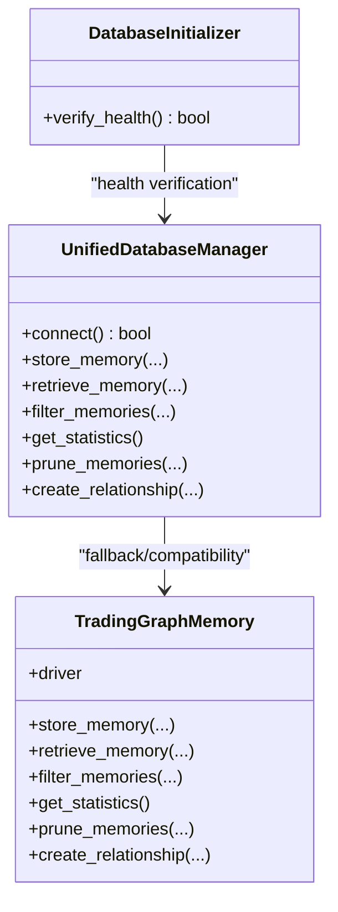
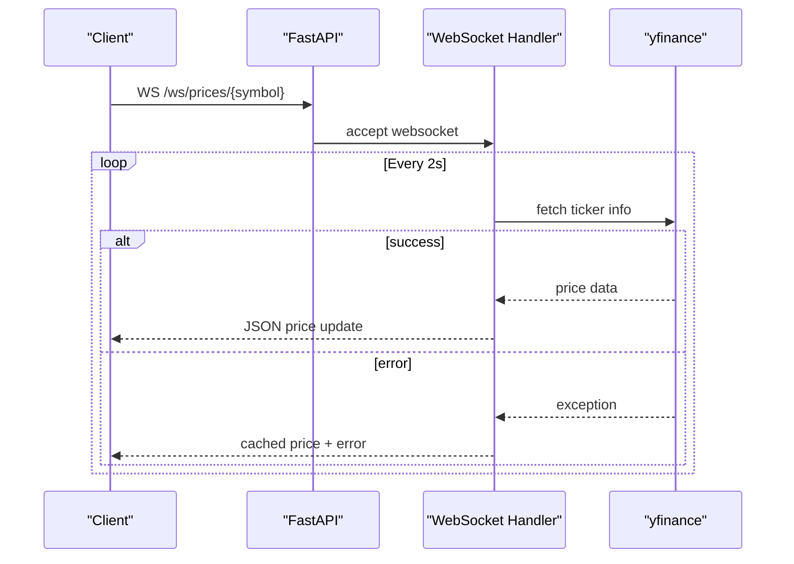
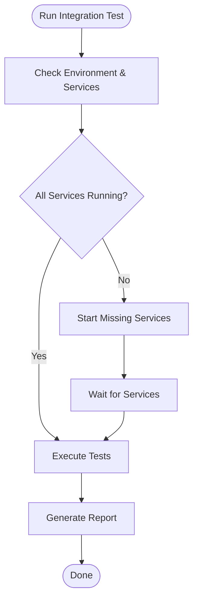
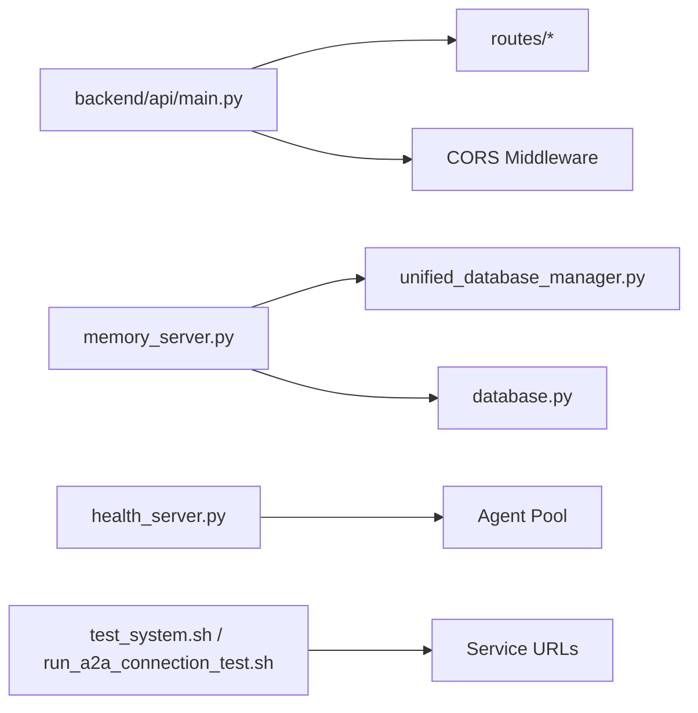

# Troubleshooting and FAQ

<cite>
**Referenced Files in This Document**
- [a2a_health_checker.py](file://FinAgents/memory/a2a_health_checker.py)
- [database.py](file://FinAgents/memory/database.py)
- [memory_server.py](file://FinAgents/memory/memory_server.py)
- [health.py](file://backend/routes/health.py)
- [ws_signals.py](file://backend/routes/ws_signals.py)
- [main.py](file://backend/api/main.py)
- [health_server.py](file://FinAgents/orchestrator/core/health_server.py)
- [restart_alpha_pool_with_sse_fix.sh](file://scripts/restart_alpha_pool_with_sse_fix.sh)
- [test_system.sh](file://FinAgents/memory/tests/test_system.sh)
- [run_a2a_connection_test.sh](file://tests/run_a2a_connection_test.sh)
- [unified_database_manager.py](file://FinAgents/memory/unified_database_manager.py)
- [database_initializer.py](file://FinAgents/memory/database_initializer.py)
</cite>

## Table of Contents
1. [Introduction](#introduction)
2. [Project Structure](#project-structure)
3. [Core Components](#core-components)
4. [Architecture Overview](#architecture-overview)
5. [Detailed Component Analysis](#detailed-component-analysis)
6. [Dependency Analysis](#dependency-analysis)
7. [Performance Considerations](#performance-considerations)
8. [Troubleshooting Guide](#troubleshooting-guide)
9. [Conclusion](#conclusion)
10. [Appendices](#appendices)

## Introduction
This document provides comprehensive troubleshooting and FAQ guidance for the Agentic Trading Application. It focuses on system health monitoring, connection troubleshooting between agent pools, memory system diagnostics, performance optimization, debugging procedures for API and WebSocket issues, database connectivity, diagnostic scripts, deployment and configuration issues, and integration challenges. It also answers frequently asked questions about system architecture, agent communication, and best practices for extending the platform.

## Project Structure
The application comprises:
- Backend API built with FastAPI, exposing health endpoints and WebSocket streams
- Memory subsystem with MCP server, Neo4j-backed storage, and optional real-time stream processing
- Agent pools orchestrated with health monitoring and SSE-based communication
- Scripts for deployment, restarts, and integration testing

**Diagram sources**
- [main.py:111-148](file://backend/api/main.py#L111-L148)
- [health.py:6-8](file://backend/routes/health.py#L6-L8)
- [ws_signals.py:22-141](file://backend/routes/ws_signals.py#L22-L141)
- [memory_server.py:209-214](file://FinAgents/memory/memory_server.py#L209-L214)
- [unified_database_manager.py:104-167](file://FinAgents/memory/unified_database_manager.py#L104-L167)
- [health_server.py:14-28](file://FinAgents/orchestrator/core/health_server.py#L14-L28)

**Section sources**
- [main.py:111-148](file://backend/api/main.py#L111-L148)
- [health.py:6-8](file://backend/routes/health.py#L6-L8)
- [ws_signals.py:22-141](file://backend/routes/ws_signals.py#L22-L141)
- [memory_server.py:209-214](file://FinAgents/memory/memory_server.py#L209-L214)
- [unified_database_manager.py:104-167](file://FinAgents/memory/unified_database_manager.py#L104-L167)
- [health_server.py:14-28](file://FinAgents/orchestrator/core/health_server.py#L14-L28)

## Core Components
- Health monitoring: dedicated health endpoints and servers for backend, memory, and agent pools
- Memory system: MCP server with Neo4j storage, unified database manager, and optional stream processing
- WebSocket streaming: real-time price and signal feeds
- Scripts: restart utilities, system tests, and integration tests

Key capabilities:
- Health checks for memory servers and agent pools
- A2A protocol health verification
- Database connectivity and index verification
- SSE-based agent pool monitoring
- Diagnostic scripts for environment setup and service status

**Section sources**
- [a2a_health_checker.py:34-119](file://FinAgents/memory/a2a_health_checker.py#L34-L119)
- [database.py:12-113](file://FinAgents/memory/database.py#L12-L113)
- [memory_server.py:209-214](file://FinAgents/memory/memory_server.py#L209-L214)
- [health_server.py:29-131](file://FinAgents/orchestrator/core/health_server.py#L29-L131)

## Architecture Overview
The system integrates backend APIs, memory services, and agent pools. Health endpoints and servers provide visibility into service status and MCP capabilities. Memory operations leverage Neo4j with optional intelligent indexing and real-time stream processing.

**Diagram sources**
- [health.py:6-8](file://backend/routes/health.py#L6-L8)
- [main.py:136-138](file://backend/api/main.py#L136-L138)
- [ws_signals.py:22-141](file://backend/routes/ws_signals.py#L22-L141)
- [memory_server.py:220-309](file://FinAgents/memory/memory_server.py#L220-L309)

## Detailed Component Analysis

### Health Monitoring and A2A Protocol Diagnostics
- A2A health checker validates A2A protocol endpoints and legacy health endpoints, capturing response times and error conditions
- Backend health endpoint confirms API availability
- Agent pool health server exposes health, MCP capabilities, and status endpoints
- Restart script applies SSE fixes and verifies service status

**Diagram sources**
- [a2a_health_checker.py:34-119](file://FinAgents/memory/a2a_health_checker.py#L34-L119)
- [health.py:6-8](file://backend/routes/health.py#L6-L8)
- [health_server.py:29-52](file://FinAgents/orchestrator/core/health_server.py#L29-L52)

**Section sources**
- [a2a_health_checker.py:34-119](file://FinAgents/memory/a2a_health_checker.py#L34-L119)
- [health.py:6-8](file://backend/routes/health.py#L6-L8)
- [health_server.py:29-131](file://FinAgents/orchestrator/core/health_server.py#L29-L131)
- [restart_alpha_pool_with_sse_fix.sh:1-37](file://scripts/restart_alpha_pool_with_sse_fix.sh#L1-L37)

### Memory System Diagnostics and Database Connectivity
- Memory server initializes unified or legacy components, sets up indexes, and exposes MCP tools
- Unified database manager encapsulates Neo4j operations, health checks, and maintenance
- Database initializer verifies connectivity, indexes, constraints, and memory counts

**Diagram sources**
- [unified_database_manager.py:104-167](file://FinAgents/memory/unified_database_manager.py#L104-L167)
- [database.py:12-113](file://FinAgents/memory/database.py#L12-L113)
- [database_initializer.py:344-369](file://FinAgents/memory/database_initializer.py#L344-L369)

**Section sources**
- [memory_server.py:82-204](file://FinAgents/memory/memory_server.py#L82-L204)
- [unified_database_manager.py:172-206](file://FinAgents/memory/unified_database_manager.py#L172-L206)
- [database.py:12-113](file://FinAgents/memory/database.py#L12-L113)
- [database_initializer.py:344-369](file://FinAgents/memory/database_initializer.py#L344-L369)

### WebSocket and API Debugging Procedures
- Backend API mounts health and WebSocket routes
- WebSocket handlers stream real-time price and signal data with error fallbacks
- Use backend health endpoint to confirm API readiness

**Diagram sources**
- [main.py:136-138](file://backend/api/main.py#L136-L138)
- [ws_signals.py:22-104](file://backend/routes/ws_signals.py#L22-L104)

**Section sources**
- [main.py:111-148](file://backend/api/main.py#L111-L148)
- [ws_signals.py:22-141](file://backend/routes/ws_signals.py#L22-L141)

### Integration and Deployment Scripts
- System test script orchestrates environment setup, service status checks, and test execution
- A2A connection test runner verifies service readiness and executes targeted tests
- Restart script applies SSE fixes and validates Alpha Agent Pool status

**Diagram sources**
- [test_system.sh:152-212](file://FinAgents/memory/tests/test_system.sh#L152-L212)
- [run_a2a_connection_test.sh:48-93](file://tests/run_a2a_connection_test.sh#L48-L93)

**Section sources**
- [test_system.sh:152-212](file://FinAgents/memory/tests/test_system.sh#L152-L212)
- [run_a2a_connection_test.sh:48-93](file://tests/run_a2a_connection_test.sh#L48-L93)
- [restart_alpha_pool_with_sse_fix.sh:1-37](file://scripts/restart_alpha_pool_with_sse_fix.sh#L1-L37)

## Dependency Analysis
- Backend depends on route registration and middleware configuration
- Memory server depends on unified database manager and optional stream processing components
- Health server depends on agent pool for MCP capability introspection
- Scripts depend on environment activation and service URLs

**Diagram sources**
- [main.py:118-138](file://backend/api/main.py#L118-L138)
- [memory_server.py:35-56](file://FinAgents/memory/memory_server.py#L35-L56)
- [health_server.py:17-28](file://FinAgents/orchestrator/core/health_server.py#L17-L28)
- [test_system.sh:188-211](file://FinAgents/memory/tests/test_system.sh#L188-L211)
- [run_a2a_connection_test.sh:53-80](file://tests/run_a2a_connection_test.sh#L53-L80)

**Section sources**
- [main.py:118-138](file://backend/api/main.py#L118-L138)
- [memory_server.py:35-56](file://FinAgents/memory/memory_server.py#L35-L56)
- [health_server.py:17-28](file://FinAgents/orchestrator/core/health_server.py#L17-L28)
- [test_system.sh:188-211](file://FinAgents/memory/tests/test_system.sh#L188-L211)
- [run_a2a_connection_test.sh:53-80](file://tests/run_a2a_connection_test.sh#L53-L80)

## Performance Considerations
- Optimize Neo4j connection pooling and timeouts in the unified database manager
- Use batch operations for memory ingestion to reduce overhead
- Monitor index usage and periodically rebuild indexes if fragmentation occurs
- Leverage real-time stream processing for high-frequency updates
- Tune WebSocket intervals and implement backpressure for heavy loads

[No sources needed since this section provides general guidance]

## Troubleshooting Guide

### System Health Monitoring
- Use backend health endpoint to confirm API readiness
- Use agent pool health server for MCP capabilities and status
- Use A2A health checker for A2A protocol validation

Common checks:
- Confirm API responds at /health
- Verify MCP tools list and transport type
- Validate A2A server health via JSON-RPC

**Section sources**
- [health.py:6-8](file://backend/routes/health.py#L6-L8)
- [health_server.py:29-131](file://FinAgents/orchestrator/core/health_server.py#L29-L131)
- [a2a_health_checker.py:34-119](file://FinAgents/memory/a2a_health_checker.py#L34-L119)

### Connection Troubleshooting Between Agent Pools
- Apply SSE fixes using the restart script and verify service status
- Ensure Alpha Agent Pool is reachable at configured port
- Validate A2A client initialization and coordinator startup

Actions:
- Stop existing processes, restart with SSE handling, and check logs
- Confirm Alpha Agent Pool is running and responding to health checks

**Section sources**
- [restart_alpha_pool_with_sse_fix.sh:1-37](file://scripts/restart_alpha_pool_with_sse_fix.sh#L1-L37)
- [run_a2a_connection_test.sh:48-93](file://tests/run_a2a_connection_test.sh#L48-L93)

### Memory System Diagnostics
- Verify Neo4j connectivity and indexes
- Check unified database manager health and statistics
- Validate relationship creation and pruning operations

Steps:
- Use database initializer to verify health
- Confirm indexes and constraints exist
- Test memory operations and statistics retrieval

**Section sources**
- [database_initializer.py:344-369](file://FinAgents/memory/database_initializer.py#L344-L369)
- [unified_database_manager.py:172-206](file://FinAgents/memory/unified_database_manager.py#L172-L206)
- [database.py:12-113](file://FinAgents/memory/database.py#L12-L113)

### Performance Optimization
- Adjust connection pool sizes and lifetimes in the unified database manager
- Use batch operations for high-throughput memory ingestion
- Monitor and maintain indexes for optimal query performance

Recommendations:
- Periodic pruning of old memories
- Use intelligent indexing and stream processing when available

**Section sources**
- [unified_database_manager.py:113-167](file://FinAgents/memory/unified_database_manager.py#L113-L167)
- [database.py:298-333](file://FinAgents/memory/database.py#L298-L333)

### API Issues
- Confirm CORS middleware configuration allows expected origins
- Validate route registration and endpoint availability
- Use backend health endpoint to verify service status

Checklist:
- Ensure routes are included in the FastAPI app
- Verify middleware is applied
- Confirm endpoint responses

**Section sources**
- [main.py:118-138](file://backend/api/main.py#L118-L138)
- [health.py:6-8](file://backend/routes/health.py#L6-L8)

### WebSocket Connection Problems
- Verify WebSocket endpoints are mounted under the WebSocket router
- Check for exceptions and implement fallbacks
- Validate symbol mapping and ticker availability

Resolution:
- Ensure symbol mapping for special indices
- Implement error fallback and retry logic
- Close sockets gracefully on exceptions

**Section sources**
- [main.py:136-138](file://backend/api/main.py#L136-L138)
- [ws_signals.py:22-141](file://backend/routes/ws_signals.py#L22-L141)

### Database Connectivity
- Confirm Neo4j credentials and URI
- Ensure indexes and constraints are created
- Test connectivity and health via database initializer

Procedures:
- Connect driver and run a simple query
- Verify indexes and constraints
- Check memory counts and node distributions

**Section sources**
- [database.py:12-113](file://FinAgents/memory/database.py#L12-L113)
- [database_initializer.py:344-369](file://FinAgents/memory/database_initializer.py#L344-L369)

### Diagnostic Scripts and Tools
- Use system test script to validate environment, services, and tests
- Run A2A connection test runner to verify service readiness
- Apply restart script for SSE-related fixes

Execution:
- Activate environment and run system tests
- Execute A2A connection tests with service checks
- Restart services with SSE fixes and verify status

**Section sources**
- [test_system.sh:152-212](file://FinAgents/memory/tests/test_system.sh#L152-L212)
- [run_a2a_connection_test.sh:48-93](file://tests/run_a2a_connection_test.sh#L48-L93)
- [restart_alpha_pool_with_sse_fix.sh:1-37](file://scripts/restart_alpha_pool_with_sse_fix.sh#L1-L37)

### Common Deployment Issues
- Environment setup: ensure conda environment is activated and dependencies installed
- Service status: verify all required services are running before tests
- Port conflicts: ensure ports are free and correctly configured

Remediation:
- Activate the correct conda environment
- Start missing services and wait for readiness
- Review port configurations and firewall rules

**Section sources**
- [test_system.sh:104-151](file://FinAgents/memory/tests/test_system.sh#L104-L151)
- [run_a2a_connection_test.sh:30-46](file://tests/run_a2a_connection_test.sh#L30-L46)

### Frequently Asked Questions

Q1: How does the A2A health checker differ from HTTP GET checks?
- The A2A health checker uses the proper A2A protocol with JSON-RPC messages, avoiding HTTP 405 errors typical of incorrect endpoints.

Q2: What is the difference between unified and legacy memory managers?
- The unified manager centralizes operations and integrates optional intelligent indexing and stream processing. The legacy manager provides direct Neo4j operations for compatibility.

Q3: How do I monitor agent pool health?
- Use the health server endpoints for health, MCP capabilities, and detailed status. Ensure the agent pool exposes MCP tools for introspection.

Q4: How do I troubleshoot WebSocket streams?
- Verify endpoint mounting, symbol mapping, and error fallbacks. Ensure ticker availability and handle exceptions gracefully.

Q5: How do I optimize memory operations?
- Use batch operations, maintain indexes, and prune old memories. Leverage intelligent indexing and stream processing when available.

Q6: How do I validate database health?
- Use the database initializer to verify connectivity, indexes, constraints, and memory counts. Run health checks and index validations.

Q7: How do I fix SSE-related Alpha Agent Pool issues?
- Apply the restart script with SSE fixes, stop existing processes, and verify service status and logs.

Q8: How do I integrate agent pools with the memory system?
- Ensure A2A client initialization and coordinator startup. Validate A2A protocol communication and health checks.

Q9: How do I extend the platform safely?
- Follow established patterns for MCP tools, maintain backward compatibility, and use the unified database manager for new features.

**Section sources**
- [a2a_health_checker.py:34-119](file://FinAgents/memory/a2a_health_checker.py#L34-L119)
- [memory_server.py:209-214](file://FinAgents/memory/memory_server.py#L209-L214)
- [health_server.py:29-131](file://FinAgents/orchestrator/core/health_server.py#L29-L131)
- [ws_signals.py:22-141](file://backend/routes/ws_signals.py#L22-L141)
- [unified_database_manager.py:104-167](file://FinAgents/memory/unified_database_manager.py#L104-L167)
- [database_initializer.py:344-369](file://FinAgents/memory/database_initializer.py#L344-L369)
- [restart_alpha_pool_with_sse_fix.sh:1-37](file://scripts/restart_alpha_pool_with_sse_fix.sh#L1-L37)

## Conclusion
This guide consolidates practical troubleshooting steps, diagnostic tools, and best practices for maintaining a healthy Agentic Trading Application. By leveraging health endpoints, A2A protocol checks, memory diagnostics, and deployment scripts, teams can quickly identify and resolve issues across APIs, WebSockets, databases, and agent communications.

[No sources needed since this section summarizes without analyzing specific files]

## Appendices

### Quick Reference: Key Endpoints and Scripts
- Backend health: GET /health
- WebSocket price feed: WS /ws/prices/{symbol}
- WebSocket signals: WS /ws/signals/{symbol}
- Agent pool health server: /health, /mcp/capabilities, /status
- A2A health check: A2A protocol JSON-RPC
- System tests: test_system.sh
- A2A connection tests: run_a2a_connection_test.sh
- Restart with SSE fixes: restart_alpha_pool_with_sse_fix.sh

**Section sources**
- [health.py:6-8](file://backend/routes/health.py#L6-L8)
- [ws_signals.py:22-141](file://backend/routes/ws_signals.py#L22-L141)
- [health_server.py:29-131](file://FinAgents/orchestrator/core/health_server.py#L29-L131)
- [a2a_health_checker.py:34-119](file://FinAgents/memory/a2a_health_checker.py#L34-L119)
- [test_system.sh:152-212](file://FinAgents/memory/tests/test_system.sh#L152-L212)
- [run_a2a_connection_test.sh:48-93](file://tests/run_a2a_connection_test.sh#L48-L93)
- [restart_alpha_pool_with_sse_fix.sh:1-37](file://scripts/restart_alpha_pool_with_sse_fix.sh#L1-L37)